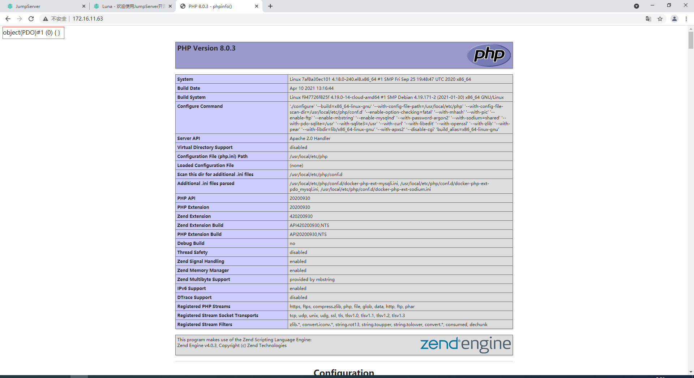
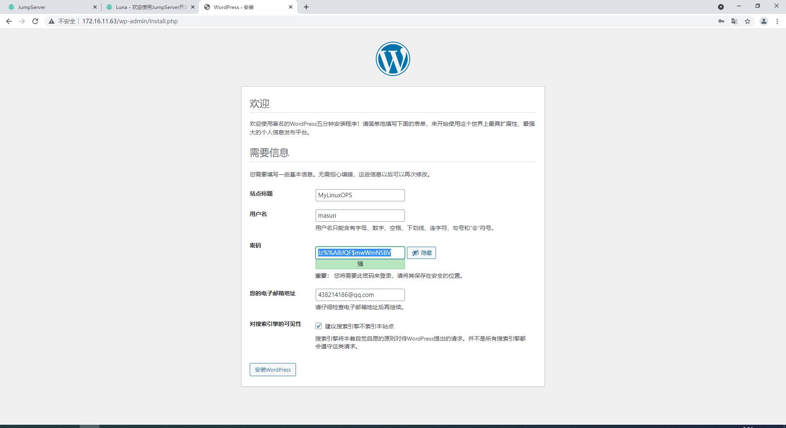
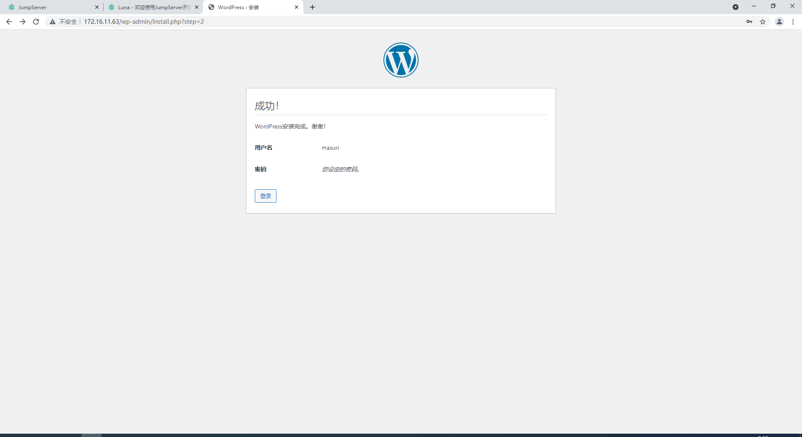
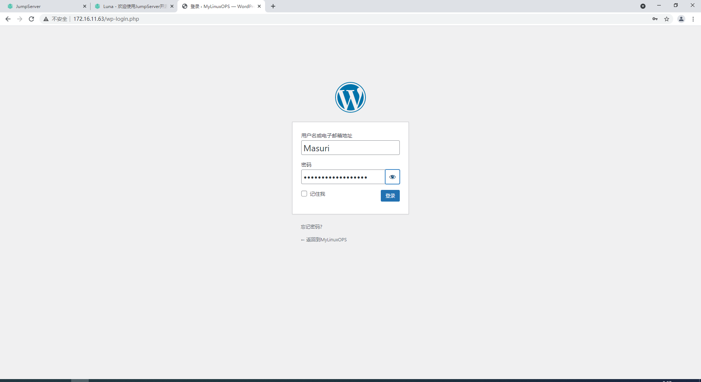
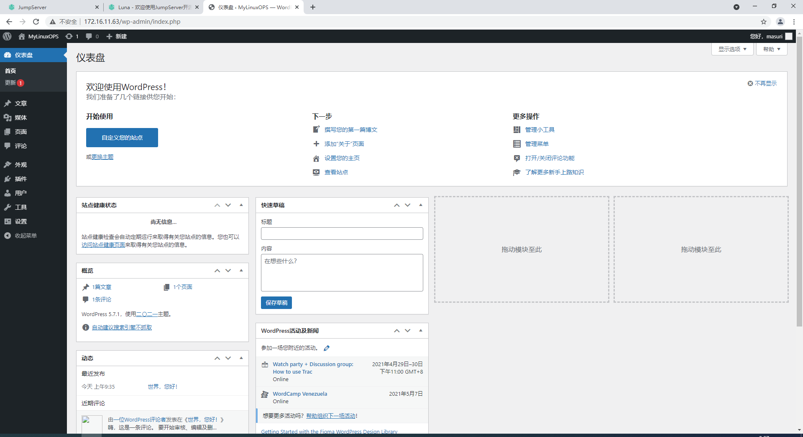

## `Docker`存储卷

`Docker`在运行时，是基于分层镜像联合挂载机制实现的，而这种分层构建镜像，联合挂载并在最上层实现读写层的时候，所有容器中生成的数据都被最上层的可写层所包含，而这个可写层，本身不属于镜像层属于容器，若是容器删了，可写层也将删除。如果要持久保存，则需要将其做成镜像，若要将其进行分发，则可以将其推送到仓库中。

所以我们不能将数据保存在容器的可写层上，通常可写层上只用来保存临时数据。我们需要容器内用来存放数据的目录与容器外的某个目录建立其关联关系，容器中进程所有写入到此目录内的数据都将保存到宿主机上。因此容器停止或删除后，或者再次创建出容器时，其依旧会与宿主机上的目录相关联，那么数据就不会丢失了。

如果此目录属于网络文件系统中的目录，那么即使宿主机挂了，那么数据依然不会丢失。在其他宿主机上再次创建出相同的容器并挂在，数据依旧可用。这种技术就叫做数据卷（`data volume`）

### 数据卷类型

`Docker`有两种类型的卷，每种类型都在容器中存在一个挂载点，但其在宿主机上的位置有所有不同；

* `Bind mount volume`
  * 在宿主机上的目录是用户指定的，容器中的目录也是用户指定的。
* `Docker-managed volue`
  * 容器中的目录是用户指定的，宿主机中的目录是由系统指定的生成在`/var/lib/docker/vfs/dir/<some volume ID>`

#### Docker管理卷实现

1. 创建容器并指定容器内的卷位置

```bash
# 使用-v选项，指定容器内的目录，并与宿主机上目录创建关联关系，容器运行时不能带--rm否则一旦退出数据卷也将被销毁，容器停止后再删除容器，其数据卷会被保留。
[root@CentOS8 ~]# docker run --name mbbox -it -v /data busybox
/ # ls
bin   data  dev   etc   home  proc  root  sys   tmp   usr   var

```

2. 查看宿主机上`/data`目录所关联的位置

```bash
[root@CentOS8 ~]# docker volume ls
DRIVER    VOLUME NAME
local     2c6cc96bea89bcaadb720efbc1e34663874368223f6e7eb515b3056b96e82657
local     13c7c5c87970e55e34edfbea16acfec4885d39a439499c276a5b5c5b0efd03b0

[root@CentOS8 ~]# docker inspect mbbox
        "Mounts": [
            {
                "Type": "volume",
                "Name": "13c7c5c87970e55e34edfbea16acfec4885d39a439499c276a5b5c5b0efd03b0",
                # 以下路径就是宿主机上被关联的目录路径
                "Source": "/var/lib/docker/volumes/13c7c5c87970e55e34edfbea16acfec4885d39a439499c276a5b5c5b0efd03b0/_data",
                "Destination": "/data",
                "Driver": "local",
                "Mode": "",
                "RW": true,
                "Propagation": ""
            }
        ],
# 可以使用-f指定字段名称来获取相关字段的值        
[root@CentOS8 v1]# docker inspect -f {{.Mounts}} mbbox
[{bind  /data/volume/v1 /my/data   true rprivate}]
```

3. 在宿主机上相关联的位置创建文件

```bash
[root@CentOS8 ~]# cd /var/lib/docker/volumes/13c7c5c87970e55e34edfbea16acfec4885d39a439499c276a5b5c5b0efd03b0/_data
[root@CentOS8 _data]# echo hello >> test.txt
```

4. 进入容器内进行查看

```bash
[root@CentOS8 _data]# docker attach mbbox
/ # cat /data/test.txt
hello
```

#### 绑定挂载卷

1. 在宿主机上创建一个目录，并生成文件

```bash
[root@CentOS8 ~]# mkdir /data/volume/v1 -p
[root@CentOS8 ~]# echo "<h1>hello world<\h1>" >> /data/volume/v1/index.html
```

2. 创建出容器，并指定容器外与容器内对应的目录关系

```bash
[root@CentOS8 ~]# docker run --name mbbox -it --rm -v /data/volume/v1:/mydata busybox /bin/sh
# 查看容器内指定目录/mydata中的内容
/ # cat /mydata/index.html
<h1>hello world<\h1>
/ # exit
```

3. 容器退出删除后，宿主机上目录内的内容依然存在

```bash
[root@CentOS8 ~]# cd /data/volume/v1/
[root@CentOS8 v1]# ls
index.html
```

#### 多容器间共享数据

1. 创建出第一个容器并挂载卷

```bash
[root@CentOS8 v1]# docker run --name mbbox --rm -it -v /data/volume/v1:/my/data busybox /bin/sh
/ # cat /my/data/index.html
<h1>hello world<\h1>
```

2. 创建第二个容器并挂载与第一个容器相同的卷

```bash
[root@CentOS8 v1]# docker run --name mbbox1 --rm -it --volumes-from mbbox busybox /bin/sh
/ # ls /my/data/
index.html
/ # cat /my/data/index.html
<h1>hello world<\h1>
/ #
```

### 容器化运行`wordpress`

1. 在宿主机上创建出`MySQL`的数据目录，以及`PHP`项目的数据目录

```bash
[root@CentOS8 /]# mkdir -p /data/volume/{db,html}
```

2. 创建出`php`容器并指定项目路径与本地数据目录的对应关系，开放80端口

```bash
[root@CentOS8 ~]# docker run --name apache-php -d -v /data/volume/html:/var/www/html -p 80:80 php:apache
```

3. 官方镜像默认没有安装`mysqli`和`pdo_mysql`模块，需要手动安装模块，重启容器。

```bash
[root@CentOS8 ~]# docker exec php /usr/local/bin/docker-php-ext-install mysqli pdo_mysql
[root@CentOS8 ~]# docker restart php
```

4. 创建出`MySQL`容器，指定数据目录与本地数据目录的对应关系。

```bash
[root@CentOS8 ~]# docker run --name db -d -v /data/volume/db:/var/lib/mysql -e MYSQL_ROOT_PASSWORD=masuri mysql:latest
```

5. 查询出`php`和`db`容器内的`IP`

```bash
# php容器ip=172.31.0.2
[root@CentOS8 ~]# docker inspect -f {{.NetworkSettings}} php
{{ ed65b06db1fe1904e47ba9d98f8ea632a67b9d267717e568702b933f9735b672 false  0 map[80/tcp:[{0.0.0.0 80} {:: 80}]] /var/run/docker/netns/ed65b06db1fe [] []} {f615f0719cbbc9133d3e721e874bcc9abee8d0643abbfb9d48ced74c5f361db1 172.31.0.1  0 172.31.0.2 16  02:42:ac:1f:00:02} map[bridge:0xc000174000]}

# db容器ip=172.31.0.3
[root@CentOS8 ~]# docker inspect -f {{.NetworkSettings}} db
{{ b9d56c4d94c741a6d72f3e9c8791d16d59c34c7aadb65890609c8e71f22b07b3 false  0 map[3306/tcp:[] 33060/tcp:[]] /var/run/docker/netns/b9d56c4d94c7 [] []} {821c35750cc1f23b924dabde31a9e5949a59bca511e3ecada80e7170ef7687b9172.31.0.1  0 172.31.0.3 16  02:42:ac:1f:00:03} map[bridge:0xc000176000]}
```

6. 在`db`中创建出`wordpress`的库，以及管理用户

```bash
[root@CentOS8 ~]# docker exec db mysql -uroot -pmasuri -e "CREATE DATABASE wordpress;"
mysql: [Warning] Using a password on the command line interface can be insecure.
[root@CentOS8 ~]# docker exec db mysql -uroot -pmasuri -e "CREATE USER wpuser@'172.31.0.2' IDENTIFIED BY '111111';"
mysql: [Warning] Using a password on the command line interface can be insecure.
[root@CentOS8 ~]# docker exec db mysql -uroot -pmasuri -e "GRANT ALL ON wordpress.* TO wpuser@'172.31.0.2';"
mysql: [Warning] Using a password on the command line interface can be insecure.
```

7. 测试数据库连接

```bash
[root@CentOS8 ~]# vim /data/volume/html/index.php
<?php
$dsn='mysql:host=172.31.0.3;dbname=wordpress';
$username='wpuser'; $passwd='111111';
$dbh=new PDO($dsn,$username,$passwd);
var_dump($dbh);
phpinfo();
?>
```



8. 部署`wordpress`代码，修改配置文件

```bash
[root@CentOS8 ~]# unzip latest-zh_CN.zip
[root@CentOS8 ~]# cp -a wordpress/. /data/volume/html/

# 复制出配置文件，并配置
[root@CentOS8 ~]# cp /data/volume/html/{wp-config-sample.php,wp-config.php}
[root@CentOS8 ~]# vim /data/volume/html/wp-config.php

// ** MySQL settings - You can get this info from your web host ** //
/** The name of the database for WordPress */
define( 'DB_NAME', 'wordpress' );

/** MySQL database username */
define( 'DB_USER', 'wpuser' );

/** MySQL database password */
define( 'DB_PASSWORD', '111111' );

/** MySQL hostname */
define( 'DB_HOST', '172.31.0.3' );

/** Database Charset to use in creating database tables. */
define( 'DB_CHARSET', 'utf8' );

/** The Database Collate type. Don't change this if in doubt. */
define( 'DB_COLLATE', '' );
```

9. 访问页面继续安装









