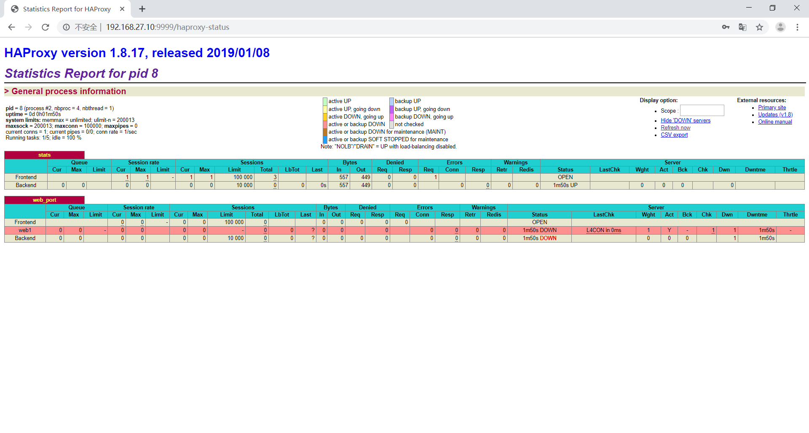

# docker的镜像与制作
## docker镜像的内核
从镜像大小上面来说，一个比较小的镜像只有十几MB，而内核文件需要一百多兆，因此镜像里面是没有内核的，镜像在被启动为容器后将直接使用宿主机的内核，而镜像本身则只提供相应的rootfs，即系统正常运行所必须的用户空间的文件系统，比如/dev/，/proc，/bin，/etc等目录，所以容器当中基本是没有/boot目录的，而/boot 当中保存的就是与内核相关的文件和目录。
由于容器启动和运行过程中是直接使用了宿主机的内核，所以没有直接调用过物理硬件，所以也不会涉及到硬件驱动，因此也用不上内核和驱动，另外有内核的那是虚拟机。
## docker镜像的制作
Docker制作镜像类似于虚拟机的镜像制作，即按照公司的实际业务务求将需要安装的软件、相关配置等基础环境配置完成，然后将其做成镜像，最后再批量从镜像批量生产实例，这样可以极大的简化相同环境的部署工作，Docker 的镜像制作分为手动制作和自动制作(基于 DockerFile)。
## 手动制作镜像
### 手动制作基于yum安装的nginx镜像
由于是基于基础镜像制作的镜像，所以需要先下载基础镜像
1.下载centos基础镜像
```bash
root@mylinuxops:~# docker pull centos
Using default tag: latest
latest: Pulling from library/centos
8ba884070f61: Pull complete 
Digest: sha256:a799dd8a2ded4a83484bbae769d97655392b3f86533ceb7dd96bbac929809f3c
Status: Downloaded newer image for centos:latest
```
2.启动容器并进入
```bash
root@mylinuxops:~# docker run -it centos bash
[root@806443b4db62 /]# 
```
3.yum安装nginx
```bash
[root@806443b4db62 /]# yum install epel-release -y
[root@806443b4db62 /]# yum install nginx -y
```
4.修改配置文件，关闭后台功能
```bash
[root@806443b4db62 /]# vi /etc/nginx/nginx.conf
daemon off;
```
5.修改首页文件
```bash
[root@806443b4db62 /]# echo "welcome to mylinuxops.com" > /usr/share/nginx/html/index.html 
```
6.另启一个终端，将容器提交为一个新的镜像
```bash
#执行docker ps 找到刚才运行的容器
root@mylinuxops:~# docker ps -a
CONTAINER ID        IMAGE               COMMAND             CREATED             STATUS              PORTS               NAMES
806443b4db62        centos              "bash"              9 minutes ago       Up 9 minutes                            nervous_ardinghelli
#将容器提交为新的镜像
root@mylinuxops:~# docker commit -a "438214186@qq.com" -m "yum install nginx" -c "CMD ["nginx"]" 806443b4db62 nginx:v1
sha256:7946e43749460308e610488b73d0cae68f25fd7844d721128ff27a67bf5b9849
#容器提交为新镜像使用docker commit命令
#相关参数
-a:填写镜像制作者的相关信息
-m:填写此容器了什么改变
-c:容器启动时在dockerfile内执行的命令
-p:暂停镜像
```
7.提交完毕后查看本地镜像
```bash
root@mylinuxops:~# docker images
REPOSITORY          TAG                 IMAGE ID            CREATED             SIZE
nginx               v1                  7946e4374946        4 minutes ago       405MB
centos              latest              9f38484d220f        3 months ago        202MB
```
8.启动制作好的nginx镜像，并进行测试
```bash
root@mylinuxops:~# docker run -d -p 80:80 nginx:v1 nginx
1db57e2236c1130dcfcbf1c93e0c9afb3e933238036667d860f177a5e65fe1b3
root@mylinuxops:~# curl 192.168.27.10
welcome to mylinuxops.com
```

## 基于Dockerfile制作镜像
DockerFile可以说是一种可以被Docker程序解释的脚本，DockerFile是由一条条的命令组成的，每条命令对应linux下面的一条命令，Docker程序将这些DockerFile指令再翻译成真正的linux命令，其有自己的书写方式和支持的命令，Docker程序读取DockerFile并根据指令生成Docker镜像，相比手动制作镜像的方式，DockerFile更能直观的展示镜像是怎么产生的，有了DockerFile，当后期有额外的需求时，只要在之前的DockerFile添加或者修改响应的命令即可重新生成新的Docke镜像，避免了重复手动制作镜像的麻烦。
### DockerFile制作yum版nginx镜像
1.先下载一个基础镜像
```bash
root@mylinuxops:~# docker pull centos
```
2.创建出Dockerfile的目录
```bash
root@mylinuxops:~# mkdir /opt/dockerfile/nginx-v1 -p
```
3.进入目录内创建Dockerfile文件
```bash
root@mylinuxops:~# cd /opt/dockerfile/nginx-v1/
root@mylinuxops:/opt/dockerfile/nginx-v1# vim Dockerfile
# nginx images
FROM centos:latest
MAINTAINER masuri 438214186@qq.com
RUN yum install epel-release -y && yum install nginx -y
# 保存退出，进行build做测试
```
4.进行镜像的制作
```bash
root@mylinuxops:/opt/dockerfile/nginx-v1# docker build -t nginx-v1 .
```
5.启动容器并进入容器验证nginx是否安装
```bash
root@mylinuxops:/opt/dockerfile/nginx-v1# docker run -it --rm nginx-v1
[root@9ca08f4568d0 /]# nginx -v       
nginx version: nginx/1.12.2
```
6.修改配置文件并提取出nginx配置文件
```bash
[root@06825037a42e /]# cd /etc/nginx/
[root@06825037a42e nginx]# vi /etc/nginx/nginx.conf     #修改配置文件
daemon off;         #关闭后台启动
[root@06825037a42e nginx]# sz nginx.conf        #提取配置文件
[root@06825037a42e nginx]# exit             #退出容器
```
6.继续编写dockerfile文件
```bash
root@mylinuxops:/opt/dockerfile/nginx-v1# vim Dockerfile 
# nginx images
FROM centos:latest
MAINTAINER masuri 438214186@qq.com
RUN yum install epel-release -y && yum install nginx -y
ADD nginx.conf /etc/nginx/nginx.conf
ADD code.tar.gz /usr/share/nginx/html/
EXPOSE 80 443
CMD ["nginx"]
```
7.创建出测试首页文件，并打包为代码包
```bash
root@mylinuxops:/opt/dockerfile/nginx-v1# echo "welcome to mylinuxops.com" > index.html
root@mylinuxops:/opt/dockerfile/nginx-v1# tar czvf code.tar.gz index.html 
index.html
```
8.将nginx的配置文件导入
```bash
root@mylinuxops:/opt/dockerfile/nginx-v1# ll
total 24
drwxr-xr-x 2 root root 4096 Jul  5 13:00 ./
drwxr-xr-x 3 root root 4096 Jul  5 12:34 ../
-rw-r--r-- 1 root root  145 Jul  5 13:00 code.tar.gz
-rw-r--r-- 1 root root  229 Jul  5 12:58 Dockerfile
-rw-r--r-- 1 root root   26 Jul  5 12:59 index.html
-rw-r--r-- 1 root root 2478 Jul  5 12:54 nginx.conf
```
9.再次打包镜像
```bash
root@mylinuxops:/opt/dockerfile/nginx-v1# docker build -t nginx-v1 .
```
10.启动容器测试镜像能否使用
```bash
root@mylinuxops:/opt/dockerfile/nginx-v1# docker run --rm -d -p 80:80 nginx-v1
a9fcb3d8907792f76f46f665f81370258d1d7c8c22bec5872f9ae1f44bd74ea0
root@mylinuxops:/opt/dockerfile/nginx-v1# curl 192.168.27.10
welcome to mylinuxops.com
```
基于yum的镜像制作完毕
### Dockerfile制作编译版本的nginx
1.准备工作，下载nginx源码包，下载centos基础镜像
```bash
root@mylinuxops:~# wget http://nginx.org/download/nginx-1.17.1.tar.gz
root@mylinuxops:~# docker pull centos
```
2.创建dockerfile目录结构
```bash
root@mylinuxops:~#  mkdir /opt/dockerfile/{web/{nginx,tomcat,jdk,apache},system/{centos,ubuntu,redhat}} -pv
#目录结构按照业务类型或系统类型进行划分，方便后期镜像较多时进行分类
```
3.修改下官方镜像的标签，将latest改为7.6.1810
```bash
root@mylinuxops:~# cd /opt/dockerfile/system/centos/
root@mylinuxops:/opt/dockerfile/system/centos# docker tag centos centos:7.6.1810
root@mylinuxops:/opt/dockerfile/system/centos# docker images
REPOSITORY          TAG                 IMAGE ID            CREATED             SIZE
centos              7.6.1810            9f38484d220f        3 months ago        202MB
centos              latest              9f38484d220f        3 months ago        202MB
```
4.对官方镜像进行修改，制作为带有基本命令的镜像
```bash
root@mylinuxops:/opt/dockerfile/system/centos# vim Dockerfile
# centos 
FROM centos:7.6.1810
MAINTAINER masuri 438214186@qq.com
RUN yum install vim iotop bc gcc gcc-c++ glibc glibc-devel pcre pcre-devel openssl openssl-devel zip unzip zlib-devel net-tools lrzsz tree ntpdate telnet lsof tcpdump wget libevent libevent-devel bc systemd-devel bash-completion traceroute bridge-utils -y
# 保存退出
```
5.重新构建镜像
```bash
root@mylinuxops:/opt/dockerfile/system/centos# docker build -t centos:tools .
# 重新构建后确认镜像已经生成
root@mylinuxops:/opt/dockerfile/system/centos# docker images
REPOSITORY          TAG                 IMAGE ID            CREATED             SIZE
centos              tools               4c18b4654352        20 seconds ago      507MB
centos              7.6.1810            9f38484d220f        3 months ago        202MB
centos              latest              9f38484d220f        3 months ago        202MB
```
6.基于带有基本命令的centos镜像编写编译安装nginx的dockerfile
```bash
root@mylinuxops:~# cd /opt/dockerfile/web/nginx/
root@mylinuxops:/opt/dockerfile/web/nginx# vim Dockerfile 
# nginx make
FROM centos:tools
MAINTAINER masuri 438214186@qq.com
ADD nginx.sh /usr/local/src/        #将编译安装脚本上传到/usr/local/src目录
ADD nginx-1.17.1.tar.gz /usr/local/src/     #将nginx源码上传到/usr/local/src目录
ADD code.tar.gz /apps/nginx/html/   #将站点的源码上传到相应的目录
RUN cd /usr/local/src && /usr/local/src/nginx.sh   #编译安装nginx
EXPOSE 80 443
CMD ["nginx"]
```
7.创建出站点源码并打包
```bash
root@mylinuxops:/opt/dockerfile/web/nginx# echo "welcome to mylinuxops.com" > index.html
root@mylinuxops:/opt/dockerfile/web/nginx# tar -czvf code.tar.gz index.html 
```
8.编写编译安装脚本
```bash
root@mylinuxops:/opt/dockerfile/web/nginx# vim nginx.sh 
#!/bin/bash
FILE="nginx-1.17.1"
useradd -u 2000 nginx
cd ${FILE}
make && make install
cat << eof > /usr/lib/systemd/system/nginx.service
[Service]
Type=forking
PIDFile=/apps/nginx/logs/nginx.pid                   
ExecStart=/apps/nginx/sbin/nginx -c /apps/nginx/conf/nginx.conf         
ExecReload=/bin/kill -s HUP \$MAINPID
ExecStop=/bin/kill -s TERM \$MAINPID

[Install]
WantedBy=multi-user.target
eof

ln -s /apps/nginx/sbin/nginx /sbin/nginx

sed -i "s/^#user.*/user nginx;/" /apps/nginx/conf/nginx.conf
sed -i "s/^#pid.*/pid \/apps\/nginx\/logs\/nginx.pid;/" /apps/nginx/conf/nginx.conf
#修改配置文件前台运行
sed -i "/^worker/adaemon off;" /apps/nginx/conf/nginx.conf
```
9.打包镜像
```bash
root@mylinuxops:/opt/dockerfile/web/nginx# docker build -t nginx:v1 .
```
10.启动容器测试
```bash
#启动容器为后台运行
root@mylinuxops:/opt/dockerfile/web/nginx# docker run -d -p 80:80 nginx:v1
8ee49c974ee68f232e7aab6c8472572b77e093085931b92f60f57de6bedacac3
#测试访问容器的nginx
root@mylinuxops:/opt/dockerfile/web/nginx# curl 192.168.27.10
welcome to mylinuxops.com
```
### 自定义tomcat镜像
生产环境中通常一个业务一个镜像，每个业务以不同的层级进行划分，以下为分层的结构

首先下载基础镜像centos，基于基础镜像安装上各种基础命令生成企业内部的基础镜像
```bash
#下载官方的基础镜像
root@mylinuxops:~# docker pull centos

#根据业务创建出相应的目录结构
root@mylinuxops:~# mkdir /opt/dockerfile/{web/{nginx,tomcat,jdk,apache},system/{centos,ubuntu,redhat}} -pv

#进入centos目录，创建dockerfile文件
root@mylinuxops:~# cd /opt/dockerfile/system/centos/
root@mylinuxops:/opt/dockerfile/web/jdk# vim /opt/dockerfile/system/centos/Dockerfile 
# centos:base
FROM centos:7.6.1810
MAINTAINER masuri 438214186@qq.com
RUN yum install vim iotop bc gcc gcc-c++ glibc glibc-devel pcre pcre-devel openssl openssl-devel zip unzip zlib-devel net-tools lrzsz tree ntpdate telnet lsof tcpdump wget libevent libevent-devel bc systemd-devel bash-completion traceroute bridge-utils -y && useradd -u 2000 nginx && useradd -u 2001 tomcat && rm -rf /etc/localtime && ln -sv /usr/share/zoneinfo/Asia/Shanghai /etc/localtime
#由于官方镜像的时区和宿主机的不同所以需要进行修改
#保存退出

#编辑build镜像的脚本
root@mylinuxops:/opt/dockerfile/system/centos# vim docker-build.sh
#!/bin/bash
docker build -t centos:base .

#执行脚本进行制作基础镜像
root@mylinuxops:/opt/dockerfile/system/centos# bash docker-build.sh 

#验证
root@mylinuxops:/opt/dockerfile/system/centos# docker images centos:base 
REPOSITORY          TAG                 IMAGE ID            CREATED             SIZE
centos              base                dcc236b38998        23 seconds ago      508MB
```
基于企业内部的基础镜像制作出jdk的镜像
```bash
#切换到JDK的dockerfile目录，编辑dockerfile文件
root@mylinuxops:~# cd /opt/dockerfile/web/jdk/
root@mylinuxops:/opt/dockerfile/web/jdk# vim Dockerfile 
# jdk:8u202
FROM centos:base
add jdk-8u202-linux-x64.tar.gz /usr/local/src/
run ln -sv /usr/local/src/jdk1.8.0_202 /usr/local/jdk
ENV JAVA_HOME /usr/local/jdk
ENV JRE_HOME $JAVA_HOME/jre
ENV CLASSPATH $JAVA_HOME/lib/:$JRE_HOME/lib/
ENV PATH $PATH:$JAVA_HOME/bin

#编辑build脚本
root@mylinuxops:/opt/dockerfile/web/jdk# vim docker_build.sh
#!/bin/bash
docker build -t jdk:8u202 .

#jdk二进制包放到dockerfile目录下
root@mylinuxops:/opt/dockerfile/web/jdk# ls
docker_build.sh  Dockerfile  jdk-8u202-linux-x64.tar.gz

#打包镜像
root@mylinuxops:/opt/dockerfile/web/jdk# bash docker_build.sh 

#进入容器查看java是否能够运行
root@mylinuxops:/opt/dockerfile/web/jdk# docker run -it --rm jdk:1.8.0_202 bash
[root@13df38659baa /]# java -version
java version "1.8.0_202"
Java(TM) SE Runtime Environment (build 1.8.0_202-b08)
Java HotSpot(TM) 64-Bit Server VM (build 25.202-b08, mixed mode)
#jdk镜像打造完毕
```
基于jdk镜像制作tomcat镜像
```bash
#进入dockerfile的tomcat目录
root@mylinuxops:~# cd /opt/dockerfile/web/tomcat/

#编写dockerfile文件
# tomcat:8.5.42
FROM jdk:8u202
add apache-tomcat-8.5.42.tar.gz /usr/local/src
run ln -sv /usr/local/src/apache-tomcat-8.5.42 /usr/local/tomcat && chown -R tomcat.tomcat /usr/local/tomcat/* && mkdir -pv /data/webapps && chown -R tomcat.tomcat /data/webapps
add start.sh /usr/local/src
env CATALINA_HOME /usr/local/tomcat
env PATH $PATH:$CATALINA_HOME/bin
user tomcat
cmd ["/usr/local/src/start.sh"]

#编写tomcat启动脚本
root@mylinuxops:/opt/dockerfile/web/tomcat# vim start.sh 
#!/bin/bash
/usr/local/tomcat/bin/catalina.sh start
#建议启动时以一个文件作为守护进程，当服务发生假死状态时，可以进入容器重启服务。
tail -f /etc/hosts

#给与脚本执行权限
root@mylinuxops:/opt/dockerfile/web/tomcat# chmod +x start.sh

#编写build脚本
root@mylinuxops:/opt/dockerfile/web/tomcat# vim docker_build.sh 
#!/bin/bash
docker build -t tomcat:8.5.42 .

#制作镜像
root@mylinuxops:/opt/dockerfile/web/tomcat# bash docker_build.sh 

#启动容器测试
root@mylinuxops:/opt/dockerfile/web/tomcat# docker run -d --rm -p 8080:8080 tomcat:8.5.42 
d51b6a0470567a9dc62b8998184923b427bce7e7d058ab7d31f0de75405bf1bf
```


### haproxy镜像制作

基于centos:base来制作haproxy镜像

```bash
#创建haproxy的目录
root@mylinuxops:~# mkdir /opt/dockerfile/haproxy

#进入haproxy目录上传haproxy源码包
root@mylinuxops:~# cd /opt/dockerfile/haproxy
root@mylinuxops:/opt/dockerfile/haproxy# ls
haproxy-1.8.17.tar.gz

#创建dockerfile文件
# haproxy:1.8.17
FROM centos:base
MAINTAINER masuri 438214186@qq.com
add haproxy-1.8.17.tar.gz /usr/local/src
run cd /usr/local/src/haproxy-1.8.17 && make  ARCH=x86_64 TARGET=linux2628 USE_PCRE=1 USE_OPENSSL=1 USE_ZLIB=1 USE_SYSTEMD=1  USE_CPU_AFFINITY=1  PREFIX=/usr/local/haproxy && make install PREFIX=/usr/local/haproxy && cp haproxy /usr/sbin/ && mkdir  /usr/local/haproxy/run
add haproxy.cfg /etc/haproxy/haproxy.cfg
add run_haproxy.sh /usr/bin/run_haproxy.sh
cmd ["/usr/bin/run_haproxy.sh"]

#准备haproxy配置文件
root@mylinuxops:/opt/dockerfile/haproxy# ls
docker_build.sh  haproxy-1.8.17.tar.gz
Dockerfile       haproxy.cfg

#编写启动脚本
root@mylinuxops:/opt/dockerfile/haproxy# vim run_haproxy.sh
#!/bin/bash
haproxy -f /etc/haproxy/haproxy.cfg
tail -f /etc/hosts

#为启动脚本添加执行权限
root@mylinuxops:/opt/dockerfile/haproxy# chmod +x run_haproxy.sh

#编写镜像制作脚本
root@mylinuxops:/opt/dockerfile/haproxy# vim docker_build.sh 
#!/bin/bash
docker build -t haproxy:1.8.17 .

#制作haproxy镜像
root@mylinuxops:/opt/dockerfile/haproxy# bash docker_build.sh

#启动容器测试
root@mylinuxops:/opt/dockerfile/haproxy# docker run -it -d --rm -p 9999:9999 haproxy:1.8.17 
```


