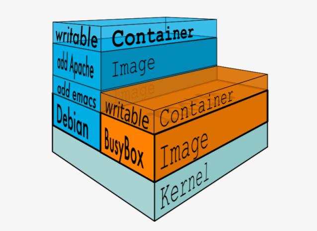
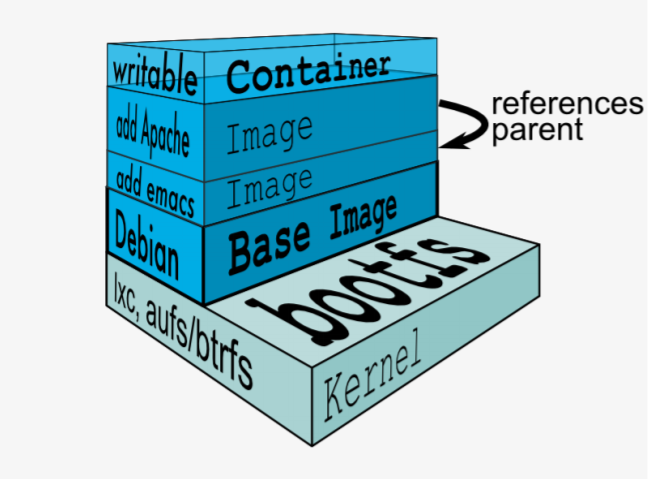
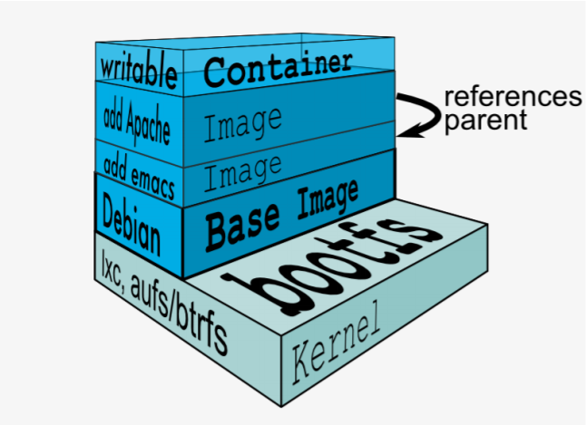

# docker的镜像管理
Docker镜像含有启动容器所需要的文件系统及所需要的内容，因此镜像主要用于创建并启动docker容器。

Docker镜像含里面是一层层文件系统,叫做UnionFS（联合文件系统）,联合文件系统，可以将几层目录挂载到一起，形成一个虚拟文件系统,虚拟文件系统的目录结构就像普通linux的目录结构一样，docker通过这些文件再加上宿主机的内核提供了一个linux的虚拟环境,每一层文件系统我们叫做一层layer，联合文件系统可以对每一层文件系统设置三种权限，只读（readonly）、读写（readwrite）和写出（whiteout-able），但是docker镜像中每一层文件系统都是只读的,构建镜像的时候,从一个最基本的操作系统开始,每个构建的操作都相当于做一层的修改,增加了一层文件系统,一层层往上叠加,上层的修改会覆盖底层该位置的可见性，这也很容易理解，就像上层把底层遮住了一样,当使用镜像的时候，我们只会看到一个完全的整体，不知道里面有几层也不需要知道里面有几层，结构如下：

一个典型的Linux文件系统由bootfs和rootfs两部分组成，bootfs(bootfilesystem)主要包含bootloader和kernel，bootloader主要用于引导加载kernel，当kernel被加载到内存中后bootfs会被umount掉，rootfs(rootfilesystem)包含的就是典型Linux系统中的/dev，/proc，/bin，/etc等标准目录和文件，下图就是dockerimage中最基础的两层结构，不同的linux发行版（如ubuntu和CentOS)在rootfs这一层会有所区别。

但是对于docker镜像通常都比较小，官方提供的centos基础镜像在200MB左右，一些其他版本的镜像甚至只有几MB，docker镜像直接调用宿主机的内核，镜像中只提供rootfs，也就是只需要包括最基本的命令、工具和程序库就可以了，比如alpine镜像，在5M左右。

下图就是有两个不同的镜像在一个宿主机内核上实现不同的rootfs。

容器、镜像父镜像：

