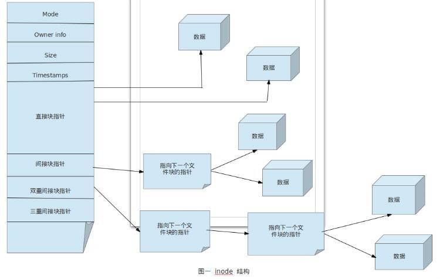
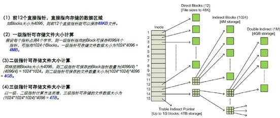
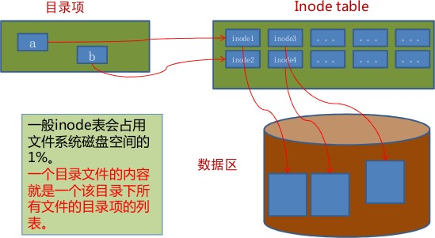

### Inode Table

#### 索引节点

inode（index node）表中包含文件系统所有文件列表

一个节点（索引节点）是在一个表项，包含有关文件的信息（元数据），包括：

* 文件类型，权限，UID，GID
* 链接数（指向这个文件名路径名称个数）
* 该文件的大小和不同的时间戳
* 指向磁盘上文件的数据块指针
* 有关文件的其他数据

#### Inode表结构

在Linux中，磁盘在保存文件信息时，会将一个磁盘拆分成两个部分，一个部分用来保存元数据，另一个部分用来保存文件的数据。

元数据中存放的为文件的各种属性信息，其中有一个属性用来标识这个文件与其他文件的区别，这个属性称为`Inode Num`

元数据中还有一个信息为指针，其内部存放了指向真正存放文件数据的位置。

当访问一个文件时，会通过文件的节点号找到文件的指针，进而找到文件所存储的位置读取文件内容。



##### 指针

一个文件如何在磁盘上定位其数据位置？

在元数据中存放了12个直接指针，1个间接指针，1个二级指针，1个三级指针。

每个指针所能存放的数据大小如下图所示：



##### `Inode Num`节点编号

每个文件都有自己独一无二的`Inode Num`。他是用来确保每个文件的唯一性，但是这个唯一性存在一个使用的范围，其范围就是其所在的磁盘分区内。

> Inode Num查看方法

```bash
[root@mylinuxops ~]# ll -i
total 16
2491560 -rw-------. 1 root root 7975 Mar  1 13:16 anaconda-ks.cfg
2491240 -rw-------. 1 root root 7578 Mar  1 13:16 original-ks.cfg
# 2491560和2491240就是文件的inode号
```

> 节点编号上限

每个分局的节点编号是有上限的，一个文件占用一个节点编号，一旦节点编号使用完毕，即使空间尚未完全使用也将无法存储数据。节点编号`Inodes`查看方法如下:

```bash
[root@mylinuxops ~]# df -i
Filesystem       Inodes IUsed    IFree IUse% Mounted on
devtmpfs         228026   326   227700    1% /dev
tmpfs            232558     1   232557    1% /dev/shm
tmpfs            232558   456   232102    1% /run
tmpfs            232558    17   232541    1% /sys/fs/cgroup
/dev/vda2      12951552 38793 12912759    1% /
/dev/vda1        128016   311   127705    1% /boot
tmpfs            232558     6   232552    1% /run/user/0
```

##### 目录的节点表

目录是一个比较特殊的文件，其也有元数据和数据，不过其数据块内存放的为该目录下所有文件名。

一个目录是目录下的文件名和文件inode号之间的映射。   



#### `CP`和`INODE`

在文件拷贝时其底层发生了什么？

在执行`CP`命令时，分配了一个空前的`inode`号，在`inode`表中生成新条目在目录中创建一个目录项，将名称与`inode`编号关联拷贝数据生成新的文件。

#### `MV`和`INODE`

在移动文件时其地层是怎么运作的？

如果`mv`命令的目标和源在相同的文件系统，作为`mv`命令用新的文件名创建对应新的目录项，删除旧目录条目对应的旧的文件名不影响`inode`表（除时间戳）或磁盘上的数据位置：没有数据被移动！

如果目标和源在一个不同的文件系统，`mv`相当于`cp`和`rm`