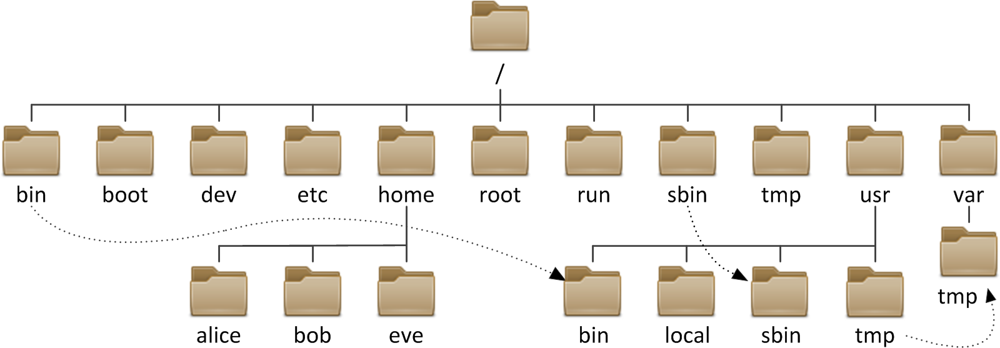

### 文件系统与目录结构

Linux是一个单根的目录结构，其目录结构如下：

#### 文件系统

* 文件和目录被组织成一个单根倒置树结构
* 文件系统从根目录下开始，用“/”表示
* 根文件系统(rootfs)：root filesystem
* 文件名称区分大小写
* 以.开头的文件为隐藏文件
* 路径分隔的 /
* 文件有两类数据：
  * 元数据：metadata
  * 数据：data

* 文件系统分层结构：LSB Linux Standard Base
* FHS: [Filesystem Hierarchy Standard](http://www.pathname.com/fhs/)

#### 文件名规则

* 文件名最长255个字节
* 包括路径在内文件名称最长4095个字节
* 蓝色-->目录	绿色-->可执行文件	红色-->压缩文件	浅蓝色-->链接文件	灰色-->其他文件
* 除了斜杠和NUL，所有字符都有效。但使用特殊字符的目录名和文件不推荐使用，有些字符需要用引号来引用它们

* 标准Linux文件系统（如ext4），文件名称大小写敏感。例如：MAIL, Mail, mail, mAiL

#### 文件系统结构

| 目录 | 作用 |
| ---- | ---- |
| `/boot` | 引导文件存放目录，内核文件(vmlinuz)、引导加载器(bootloader, grub) 都存放于此目录 |
| `/bin` | 所有用户使用的基本命令；不能关联至独立分区，OS启动即会用到的程序 |
| `/sbin` | 管理类的基本命令；不能关联至独立分区，OS启动即会用到的程序 |
| `/lib` | 启动时程序依赖的基本共享库文件以及内核模块文件(/lib/modules) |
| `/lib64` | 专用于x86_64系统上的辅助共享库文件存放位置 |
| `/etc` | 配置文件目录 |
| `/home/USERNAME` | 普通用户家目录 |
| `/root` | 管理员的家目录 |
| `/media` | 便携式移动设备挂载点 |
| `/mnt` | 临时文件系统挂载点 |
| `/dev` | 设备文件及特殊文件存储位置。 b: block device，随机访问。 c: character device，线性访问 |
| `/opt` | 第三方应用程序的安装位置 |
| `/srv` | 系统上运行的服务用到的数据 |
| `/tmp` | 临时文件存储位置 |
| `/usr` | universal shared, read-only data.(二级根目录) bin: 保证系统拥有完整功能而提供的应用程序 sbin:理类的基本命令 lib: 32 位 使 用  lib64: 只存在64位系统 include: C 程 序 的 头 文 件 (header files) share: 结构化独立的数据，例如doc, man等 local: 第三方应用程序的安装位置（bin, sbin, lib, lib64, etc, share） |
| `/var` | variable data files cache: 应用程序缓存数据目录 lib: 应用程序状态信息数据 local: 专用于为/usr/local下的应用程序存储可变数据​;lock: 锁文件 log: 日志目录及文件 opt: 专用于为/opt下的应用程序存储可变数据 run: 运行中的进程相关数据,通常用于存储进程pid文件 |
| `/proc` | 用于输出内核与进程信息相关的虚拟文件系统 |
| `/sys` | 用于输出当前系统上硬件设备相关信息虚拟文件系统 |
| `/selinux` | security enhanced Linux，selinux相关的安全策略等信息的存储位置 |

#### Linux上的应用程序的组成部分

* 二进制程序：`/bin`，` /sbin`，` /usr/bin`，` /usr/sbin`，` /usr/local/bin`，` /usr/local/sbin`
* 库文件：`/lib`，`/lib64`，`/usr/lib`，`/usr/lib64`,，`/usr/local/lib`，`/usr/local/lib64`
* 配置文件：`/etc`，`/etc/DIRECTORY`，`/usr/local/etc`
* 帮助文件：`/usr/share/man`，`/usr/share/doc`，`/usr/local/share/man`，`/usr/local/share/doc`

#### Linux文件类型

| 标识符 | 说明             | 颜色   |
| ------ | ---------------- | ------ |
| -      | 普通文件         | 白色   |
| d      | 目录文件         | 蓝色   |
| b      | 块设备           | 黄色   |
| c      | 字符设备         | 黄色   |
| l      | 符号连接文件     | 浅蓝色 |
| p      | 管道文件pipe     | 紫色   |
| s      | 套接字文件socket | 紫色   |

文件的后缀会影响文件的颜色，这些颜色可以通过修改`/etc/DIR_COLORS`内的配置进行修改。

