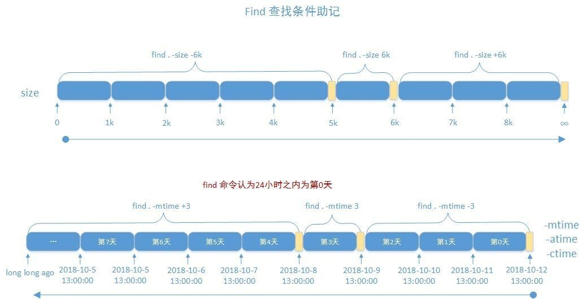

### 文件的查找

在文件系统上查找符合条件的文件，Linux中查找文件有`Locate`和`find`两种方法。

* `locate`: 非实时查找(数据库查找)。
* `find`: 实时查找

#### `locate`查找

查询系统上预建的文件索引数据库`/var/lib/mlocate/mlocate.db`

```bash
[root@mylinuxops ~]# ll /var/lib/mlocate/mlocate.db 
-rw-r----- 1 root slocate 1431547 Mar 19 13:34 /var/lib/mlocate/mlocate.db
```

依赖于事先构建的索引，索引的构建是在系统较为空闲时自动进行(周期性任务)，管理员手动更新数据库(`updatedb`)

```bash
# 新建的文件不会立即加入到数据库中
[root@mylinuxops data]# touch newfile-locate
[root@mylinuxops data]# locate newfile-locate 

# 需要使用updatedb更新数据库后才能查找到
[root@mylinuxops data]# updatedb
[root@mylinuxops data]# locate newfile-locate 
/data/newfile-locate
```

索引构建过程需要遍历整个根文件系统，极消耗资源。

工作特点:

* 查找速度快
* 模糊查找
* 非实时查找
* 搜索的是文件的全路径，不仅仅是文件名
* 可能只搜索用户具备读取和执行权限的目录

#### `locate`命令

```bash
locate KEYWORD
```

选项：

* `-i`: 不区分大小写的搜索
* `-n`: N只列举前N个匹配项目
* `-r`: 使用基本正则表达式

使用：

```bash
# 查找文件
[root@mylinuxops ~]# locate useradd.sh
/data/useradd.sh
# 查找文件列举前5个
[root@mylinuxops ~]# locate -n5 data
/data
/data/redmine-4.1.1
/data/redmine-4.1.1.tar.gz
/data/sumid.sh
/data/useradd.sh
# 使用正则表达式查找
[root@mylinuxops ~]# locate -r u.*add.sh$
/data/useradd.sh
```

#### find查找

`find`查找为实时查找，通过遍历指定路径完成文件查找，find命令的过滤条件非常丰富。

工作特点：

* 查找速度略慢

* 精确查找

* 实时查找

* 可能只搜索用户具备读取和执行权限的目录

#### `find`命令

```bash
find [OPTION]...[查找路径] [查找条件] [处理动作]
```

查找路径：指定具体目标路径；默认为当前目录

查找条件：指定的查找标准，可以文件名、大小、类型、权限等标准进行； 默认为找出指定路径下的所有文件

处理动作：对符合条件的文件做操作，默认输出至屏幕

##### 查找条件

###### 指搜索层级

* `-maxdepth level`: 最大搜索目录深度,指定目录下的文件为第1级

  ```bash
  # 指定最大搜索层级，后面不指定name则显示该层的所有内容
  [root@mylinuxops data]# find -maxdepth 1 
  .
  ./redmine-4.1.1.tar.gz
  ./sumid.sh
  ./useradd.sh
  ./newfile-locate
  ./redmine-4.1.1
  [root@mylinuxops data]# find -maxdepth 1 -name "f*"
  # 带上name参数则查找从当前目录到该层之间是否有f*的文件
  [root@mylinuxops data]# find -maxdepth 2 -name "f*"
  ./redmine-4.1.1/files
  ```

* `-mindepth level`: 最小搜索目录深度
  
* 可以和`-maxdepth level`一起使用表示只搜索第level曾
  
* -depth: 先处理目录内的文件，再处理指定目录。只影响显示结果

###### 根据文件名和`inode`查找：

* `-name "文件名称"`:支持使用glob，*, ?, [], [^]

  ```bash
  # 查找当前目录下以sh结尾的。
  [root@mylinuxops data]# find -name "*.sh"
  ./sumid.sh
  ./useradd.sh
  ```

* `-iname "文件名称"`: 不区分字母大小写

* `-inum n`: 按`inode`号查找

  ```bash
  [root@mylinuxops data]# ll -i
  total 2664
  4065676 -rw-r--r--  1 root root       0 Mar 19 13:44 newfile-locate
  4063234 drwxrwxr-x 17 wang wang    4096 Mar 18 14:22 redmine-4.1.1
  4063237 -rw-r--r--  1 root root 2712056 Apr  7  2020 redmine-4.1.1.tar.gz
  4063236 -rw-r--r--  1 root root     141 Mar 18 11:35 sumid.sh
  4063235 -rwxr-xr-x  1 root root      53 Mar 18 09:04 useradd.sh
  # 查找inode号为4065676的文件
  [root@mylinuxops data]# find -inum 4065676
  ./newfile-locate
  ```

* `-samefile name`: 相同`inode`号的文件

* `-links n`: 链接数为n的文件

* `-regex "PATTERN"`:以`PATTERN`匹配整个文件路径，而非文件名称

  ```bash
  # 正则表达式需要写整个文件路径
  [root@mylinuxops data]# find -regex ".*\.sh$"
  ./sumid.sh
  ./useradd.sh
  ```

###### 根据属主、属组查找：

* `-user USERNAME`: 查找属主为指定用户(`UID`)的文件

  ```bash
  # 查找属主为wang的文件并显示，使用-ls这个动作来显示
  [root@mylinuxops data]# find -user wang -ls
    4063234      4 drwxrwxr-x  17  wang     wang         4096 Mar 18 14:22 ./redmine-4.1.1
    4063928      4 drwxrwxr-x   2  wang     wang         4096 Apr  7  2020 ./redmine-4.1.1/vendor
  ...
  ```

* `-group GRPNAME`: 查找属组为指定组(`GID`)的文件

* `-uid UserID`: 查找属主为指定的`UID`号的文件

* `-gid GroupID`: 查找属组为指定的`GID`号的文件

* `-nouser`: 查找没有属主的文件

  ```bash
  [root@mylinuxops data]# find -nouser 
  ./f2
  ./f1
  ./f3
  ```

* `-nogroup`: 查找没有属组的文件

  ```bash
  [root@mylinuxops data]# find -nogroup 
  ./f2
  ./f1
  ./f3
  ```

###### 根据文件类型查找

* `-type TYPE`: f: 普通文件、d: 目录文件、l: 符号链接文件、s套接字文件、b: 块设备文件、c: 字符设备文件、p: 管道文件

  ```bash
  # 在但前目录下只搜索目录
  [root@mylinuxops data]# find -type d -ls
    4063233      4 drwxrwxr-x   3  root     root         4096 Mar 19 14:20 .
    4063234      4 drwxrwxr-x  17  wang     wang         4096 Mar 18 14:22 ./redmine-4.1.1
    4063928      4 drwxrwxr-x   2  wang     wang         4096 Apr  7  2020 ./redmine-4.1.1/vendor
  ```

###### 空文件或目录

* `-empty`: 搜索空文件或空目录

  ```bash
  [root@mylinuxops data]# find -empty -ls
    4065678      0 -rw-rw-r--   1  1010     1013            0 Mar 19 14:20 ./f2
    4065677      0 -rw-rw-r--   1  1010     1013            0 Mar 19 14:20 ./f1
    4065679      0 -rw-rw-r--   1  1010     1013            0 Mar 19 14:20 ./f3
    4065676      0 -rw-r--r--   1  root      root            0 Mar 19 13:44 ./newfile-locate
    # 文件大小都为0
  ```

###### 组合条件查找

find命令还支持与或非的查询，默认的查询方法为与。

* `-a`: 与

  ```bash
  [root@mylinuxops data]# find -name "*.sh" -user root
  ./sumid.sh
  ./useradd.sh
  # -a可以进行省略
  [root@mylinuxops data]# find -name "*.sh" -a -user root
  ./sumid.sh
  ./useradd.sh
  ```

* `-o`: 或

  ```bash
  # 或的条件，两个满足一个就行
  [root@mylinuxops data]# find -name "*.sh" -o -user root
  .
  ./redmine-4.1.1.tar.gz
  ./sumid.sh
  ./useradd.sh
  ./newfile-locate
  ```

* `-not`,`!`: 非
  * 德·摩根定律：

    * (非 A) 或 (非 B) = 非(A 且 B)
    * (非 A) 且 (非 B) = 非(A 或 B)

    ```bash
    !A -a !B = !(A -o B)
    !A -o !B = !(A -a B)
    ```

```bash
# 找出/tmp目录下，属主不是root，且文件名不以f开头的文件
[root@mylinuxops data]# find /tmp -not \( -user root -o -name "f*" \) -ls
[root@mylinuxops data]# find /tmp \(-not -user root -a -not -name "f*"\) -ls
```

###### 排除目录

* `-path "/path/to/dir" -a -prune`: 排除搜索`path`目录下的文件，需要注意路径最后的'/'不能输，否则将无法过滤。

```bash
# 查找/etc/下，除/etc/sane.d目录的其它所有.conf后缀的文件
find /etc -path '/etc/sane.d' -a –prune -o -name "*.conf"
# 查找/etc/下，除/etc/sane.d和/etc/fonts两个目录的所有.conf后缀的文件
find /etc \( -path "/etc/sane.d" -o -path "/etc/fonts" \) -a -prune -o - name "*.conf"
```

###### 根据文件大小来查找

* `-size [+|-] #UNIT`: 常用单位：k, M, G，c（byte） 
  
  * `#UNIT`: (#-1, #]，如：`6k` 表示`(5k,6k]`
  
    ```bash
    [root@mylinuxops data]# find -size 200k -ls
      4065678    200 -rw-rw-r--   1  1010     1013       204800 Mar 19 15:21 ./f2
    4065677    200 -rw-rw-r--   1  1010     1013       204790 Mar 19 15:18 ./f1
    ```
  
  * `-#UNIT`: [0,#-1]，如：`-6k` 表示`[0,5k]`
  
    ```bash
    [root@mylinuxops data]# find -size -200k -ls
      4063233      4 drwxrwxr-x   2  root     root         4096 Mar 19 15:21 .
      4063236      4 -rw-r--r--   1  root     root          141 Mar 18 11:35 ./sumid.sh
      4065679      0 -rw-rw-r--   1  1010     1013            0 Mar 19 14:20 ./f3
      4063235      4 -rwxr-xr-x   1  root      root           53 Mar 18 09:04 ./useradd.sh
      4065676      0 -rw-r--r--   1  root      root            0 Mar 19 13:44 ./newfile-locate
    ```
  
  * `+#UNIT`: (#,∞)，如：`+6k` 表示`(6k,∞)`
  
    ```bash
    [root@mylinuxops data]# find -size +200k -ls
      4063234    400 -rw-r--r--   1  root     root       409600 Mar 19 15:27 ./f4
    ```
  



###### 根据时间戳：

* 以“天”为单位

  * `-atime [+|-]#`,
    * `#`: [#,#+1)
    * `+#`: [#+1,∞]
    * `-#`: [0,#)

  * `-mtime`
  * `-ctime`

* 以“分钟”为单位

  * `-amin`
  * `-mmin`

  * `-cmin`

###### 根据权限查找：

* `-perm [/|-]MODE`

  * `MODE`: 精确权限匹配

    ```bash
    [root@mylinuxops data]# find -perm 600 -ls
      4063235      4 -rw-------   1  root     root           53 Mar 18 09:04 ./useradd.sh
    ```

  * `/MODE`: 任何一类(u,g,o)对象的权限中只要能一位匹配即可，或关系，+ 从`CentOS7`开始淘汰

    ```bash
    # 表示所有者所属主和other有一个有写权限就行
    [root@mylinuxops data]# find -perm /222 -ls
      4063233      4 drwxrwxr-x   2  root     root         4096 Mar 19 15:27 .
      4063236      4 -rw-r--r--   1  root     root          141 Mar 18 11:35 ./sumid.sh
      4065678    200 -rw-rw-r--   1  1010     1013       204800 Mar 19 15:21 ./f2
      4065677    200 -rw-rw-r--   1  1010     1013       204790 Mar 19 15:18 ./f1
      4063234    400 -rw-r--r--   1  root      root       409600 Mar 19 15:27 ./f4
      4065679      0 -rw-rw-r--   1  1010     1013            0 Mar 19 14:20 ./f3
      4063235      4 -rw-------   1  root      root           53 Mar 18 09:04 ./useradd.sh
      4065676      0 -rw-r--r--   1  root      root            0 Mar 19 13:44 ./newfile-locate
    ```

  * `-MODE`: 每一类对象都必须同时拥有指定权限，与关系0 表示不关注

    ```bash
    # 所有人必须有读权限
    [root@mylinuxops data]# find -perm -444 -ls
      4063233      4 drwxrwxr-x   2  root     root         4096 Mar 19 15:27 .
      4063236      4 -rw-r--r--   1  root     root          141 Mar 18 11:35 ./sumid.sh
      4065678    200 -rw-rw-r--   1  1010     1013       204800 Mar 19 15:21 ./f2
    # 所有者所属组必须有写权限，其他人不关心
    [root@mylinuxops data]# find -perm -220 -ls
      4063233      4 drwxrwxr-x   2  root     root         4096 Mar 19 15:27 .
      4065678    200 -rw-rw-r--   1  1010     1013       204800 Mar 19 15:21 ./f2
      4065677    200 -rw-rw-r--   1  1010     1013       204790 Mar 19 15:18 ./f1
      4065679      0 -rw-rw-r--   1  1010     1013            0 Mar 19 14:20 ./f3
    ```

* `find -perm 755` 会匹配权限模式恰好是755的文件
* 只要当任意人有写权限时，`find -perm +222`就会匹配
* 只有当每个人都有写权限时，`find -perm -222`才会匹配
* 只有当其它人（other）有写权限时，`find -perm -002`才会匹配
* 当只匹配一个权限位时`/`和`-`的结果相同，如`find -perm -002`和`find -perm /002`是一样的。

##### 处理动作

find命令将文件查找到之后可以执行一些处理的动作

* `-print`: 默认的处理动作，显示至屏幕

* `-ls`: 类似于对查找到的文件执行“ls -l”命令

* `-delete`: 删除查找到的文件(慎用)

* `-fls file`: 查找到的所有文件的长格式信息保存至指定文件中，类似于`-ls > FILE`重定向到文件中。

  ```bash
  [root@mylinuxops data]# find -perm /222 -fls 222.file
  [root@mylinuxops data]# cat 222.file 
    4063233      4 drwxrwxr-x   2  root     root         4096 Mar 19 16:05 .
    4063236      4 -rw-r--r--   1  root     root          141 Mar 18 11:35 ./sumid.sh
    4065678    200 -rw-rw-r--   1  1010     1013       204800 Mar 19 15:21 ./f2
    4065677    200 -rw-rw-r--   1  1010     1013       204790 Mar 19 15:18 ./f1
    4063234    400 -rw-r--r--   1  root      root       409600 Mar 19 15:27 ./f4
    4065679      0 -rw-rw-r--   1  1010     1013            0 Mar 19 14:20 ./f3
    4063235      4 -rw-------   1  root      root           53 Mar 18 09:04 ./useradd.sh
    4063237      0 -rw-r--r--   1  root      root            0 Mar 19 16:05 ./222.file
    4065676      0 -rw-r--r--   1  root      root            0 Mar 19 13:44 ./newfile-locate
  ```

* `-ok COMMAND {} \;`: 对查找到的每个文件执行由`COMMAND`指定的命令，对于每个文件执行命令之前，都会交互式要求用户确认。

  ```bash
  [root@mylinuxops data]# find -perm /222 -type f -ok chmod a-w {} \;
  < chmod ... ./sumid.sh > ? y
  < chmod ... ./f2 > ? y
  < chmod ... ./f1 > ? y
  < chmod ... ./f4 > ? y
  < chmod ... ./f3 > ? y
  ```

* `-exec COMMAND {} \;`: 对查找到的每个文件执行由`COMMAND`指定的命令，和`-ok`相比将不会询问，比较为危险的操作。

  ```bash
  # 当前目录下文件权限
  [root@mylinuxops data]# ll
  total 812
  -r--r--r-- 1 root root    735 Mar 19 16:05 222.file
  -r--r--r-- 1 1010 1013 204790 Mar 19 15:18 f1
  -r--r--r-- 1 1010 1013 204800 Mar 19 15:21 f2
  -r--r--r-- 1 1010 1013      0 Mar 19 14:20 f3
  -r--r--r-- 1 root root 409600 Mar 19 15:27 f4
  -r--r--r-- 1 root root      0 Mar 19 13:44 newfile-locate
  -r--r--r-- 1 root root    141 Mar 18 11:35 sumid.sh
  -r-------- 1 root root     53 Mar 18 09:04 useradd.sh
  # 将所有属主、属组、other都有读权限的改为660
  [root@mylinuxops data]# find -perm -444 -type f -exec chmod 660 {} \;
  # 使用-exec后将不再询问。
  [root@mylinuxops data]# ll
  total 812
  -rw-rw---- 1 root root    735 Mar 19 16:05 222.file
  -rw-rw---- 1 1010 1013 204790 Mar 19 15:18 f1
  -rw-rw---- 1 1010 1013 204800 Mar 19 15:21 f2
  -rw-rw---- 1 1010 1013      0 Mar 19 14:20 f3
  -rw-rw---- 1 root root 409600 Mar 19 15:27 f4
  -rw-rw---- 1 root root      0 Mar 19 13:44 newfile-locate
  -rw-rw---- 1 root root    141 Mar 18 11:35 sumid.sh
  -r-------- 1 root root     53 Mar 18 09:04 useradd.sh
  ```

`{}`: 用于引用查找到的文件名称自身，`find`传递查找到的文件至后面指定的命令时，查找到所有符合条件的文件一次性传递给后面的命令

