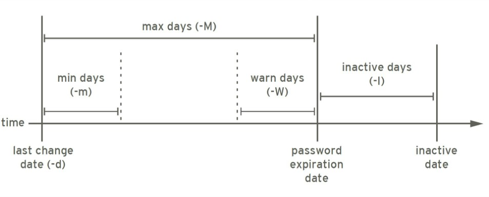

### 用户和组的配置文件

Linux用户和组的主要配置文件：

* /etc/passwd：用户及其属性信息(名称、UID、主组ID等）

* /etc/group：组及其属性信息

* /etc/shadow：用户密码及其相关属性

* /etc/gshadow：组密码及其相关属性

#### `passwd`文件格式

```bash
[wang@mylinuxops ~]$ tail -5 /etc/passwd
wang:x:1000:1000::/home/wang:/bin/bash
saslauth:x:990:76:Saslauthd user:/run/saslauthd:/sbin/nologin
mailnull:x:47:47::/var/spool/mqueue:/sbin/nologin
smmsp:x:51:51::/var/spool/mqueue:/sbin/nologin
postfix:x:89:89::/var/spool/postfix:/sbin/nologin
```

每个字段对应的含义如下：

* `login name`：登录用名（wang）

* `passwd`：密码	(x)

* `UID`：用户身份编号 (1000)

* `GID`：登录默认所在组编号(1000)

* `GECOS`：用户全名或注释，使用`chfn`添加注释信息，使用`finger`查看信息

  ```bash
  [root@mylinuxops ~]# chfn wang
  Changing finger information for wang.
  Name []: wangyan
  Office []: ops
  Office Phone []: 110
  Home Phone []: 120
  
  Finger information changed.
  # 查看注释信息
  [root@mylinuxops ~]# cat /etc/passwd | grep "wang"
  wang:x:1000:1000:wangyan,ops,110,120:/home/wang:/bin/bash
  ```

* `home directory`：用户主目录 (/home/wang)

* `shell`：用户默认使用shell (/bin/bash)，可以使用`chsh`修改默认`shell`

  ```bash
  # 修改wang用户的shell类型
  [root@mylinuxops ~]# chsh -s /bin/zsh wang
  Changing shell for wang.
  Shell changed.
  [root@mylinuxops ~]# cat /etc/passwd | grep "wang"
  wang:x:1000:1000:wangyan,ops,110,120:/home/wang:/bin/zsh
  # 登陆到wang用户查看shell类型
  [root@mylinuxops ~]# su - wang
  Last login: Wed Mar 10 13:22:17 CST 2021 on pts/0
  [wang@mylinuxops]~% echo $SHELL
  /bin/zsh
  ```

#### `shadow`文件格式

shadow文件是用来存放用户的口令的。一行一个用户的信息

```bash
[root@mylinuxops ~]# tail -5 /etc/shadow
wang:$6$nFnDQvhbJMDCLI2K$vh1l1uJbU1/zgt/1MZSjGbLDtKqOaUB.rCj.fgzQDRNW/bl2d3TJ1Mby.2mefCCXGdpOPZaSKfMczd3U0ZFxy0:18695:0:99999:7:::
saslauth:!!:18695::::::
mailnull:!!:18695::::::
smmsp:!!:18695::::::
postfix:!!:18695::::::
```

每个字段含义如下：

- 登录用名
- 用户密码:一般用sha512加密，加salt。
- 从1970年1月1日起到密码最近一次被更改的时间
- 密码再过几天可以被变更（0表示随时可被变更）
- 密码再过几天必须被变更（99999表示永不过期）
- 密码过期前几天系统提醒用户（默认为一周）
- 密码过期几天后帐号会被锁定
- 从1970年1月1日算起，多少天后帐号失效

##### 密码加密

加密机制：

* 加密：明文--> 密文

* 解密：密文--> 明文

单向加密：哈希算法，原文不同，密文必不同

* 相同算法定长输出，获得密文不可逆推出原始数据

* 雪崩效应：初始条件的微小改变，引起结果的巨大改变
  * md5: message digest, 128bits
  * sha1: secure hash algorithm, 160bits
  * sha224: 224bits sha256: 256bits sha384: 384bits sha512: 512bits

更改加密算法：

```bash
authconfig --passalgo=sha256 --update
```

##### 密码的复杂性策略

* 足够长

* 使用数字、大写字母、小写字母及特殊字符中至少3种

* 使用随机密码

* 定期更换，不要使用最近曾经使用过的密码

```bash
# 随机密码生成1
]# ( cat /dev/urandom | tr -dc 'a-zA-Z0-9' | head -c12 ) 2> /dev/null
# 随机密码生成2
]# openssl rand -base64 9
```


  

##### 密码期限



密码期限可以使用`chage`命令进行修改

```bash
[root@mylinuxops ~]# chage wang
Changing the aging information for wang
Enter the new value, or press ENTER for the default

        Minimum Password Age [0]: 3
        Maximum Password Age [99999]: 300
        Last Password Change (YYYY-MM-DD) [2021-03-09]: 
        Password Expiration Warning [7]: 7
        Password Inactive [-1]: 5
        Account Expiration Date (YYYY-MM-DD) [-1]: 
```

#### `group`文件格式

`/etc/group`文件类似于`/etc/passwd`用来存组的信息。

```bash
[root@mylinuxops ~]# tail -5 /etc/group
wang:x:1000:
saslauth:x:76:
mailnull:x:47:
smmsp:x:51:
postdrop:x:90:
```

group中每个字段含义如下：

* 群组名称：就是群组名称
* 群组密码：通常不需要设定，密码是被记录在 `/etc/gshadow`
* GID：就是群组的`ID`。
* 附加组：以当前组为附加组的用户列表(分隔符为逗号)

#### gshadow文件格式

`/etc/gshadow`文件类似于`/etc/shadow`用来存组的密码。

用户加入了组就意味着拥有了该组的权限，若要将用户加入组，则需要使用管理员权限去添加。但是如果普通用户自己加入组则需要使用组的口令来实现。现在组密码使用意义不大。

```bash
[root@mylinuxops ~]# tail -5 /etc/gshadow
wang:!::
saslauth:!::
mailnull:!::
smmsp:!::
postdrop:!::
```

gshadow中每个字段含义如下：

* 群组名称：就是群的名称
* 群组密码：
* 组管理员列表：组管理员的列表，更改组密码和成员
* 以当前组为附加组的用户列表：多个用户间用逗号分隔

##### 使用组口令添加组

```bash
# 创建两个用户
[root@mylinuxops ~]# useradd wang
[root@mylinuxops ~]# useradd masuri
[root@mylinuxops ~]# id wang
uid=1000(wang) gid=1000(wang) groups=1000(wang)
[root@mylinuxops ~]# id masuri
uid=1001(masuri) gid=1001(masuri) groups=1001(masuri)
# 对masuri组设置组秘密
[root@mylinuxops ~]# gpasswd masuri
Changing the password for group masuri
New Password: 
Re-enter new password: 
# 切换到wang用户，添加组，输入masuri组的密码
[root@mylinuxops ~]# su - wang
[wang@mylinuxops ~]$ newgrp masuri
Password: 
# 使用newgrp后会将masuri组加入wang的附加组，并且设置为wang用户的主组
[wang@mylinuxops ~]$ id
uid=1000(wang) gid=1001(masuri) groups=1001(masuri),1000(wang)

# 加入组后创建一个文件，可以看到其所属组为masuri
[wang@mylinuxops ~]$ touch 123
[wang@mylinuxops ~]$ ll
total 0
-rw-r--r-- 1 wang masuri 0 Mar 10 15:38 123
# 使用exit退出组
[wang@mylinuxops ~]$ exit
exit
# 再次创建一个文件，可以看到其属组为wang
[wang@mylinuxops ~]$ touch 234
[wang@mylinuxops ~]$ ll
total 0
-rw-r--r-- 1 wang masuri 0 Mar 10 15:38 123
-rw-rw-r-- 1 wang wang   0 Mar 10 15:39 234
```

使用组的密码加入组这种操作十分危险，所以现在已经不再使用，由管理员来指定。

#### 配置文件的操作

`/etc/passwd`和`/etc/group`文件不建议直接修改操作，一旦修改错误将无法启动Linux，建议使用以下命令修改：

- `vipw`和`vigr`

文件修改完毕后可以使用以下命令来检查文件的语法格式是否正确。

- `pwck`和`grpck`