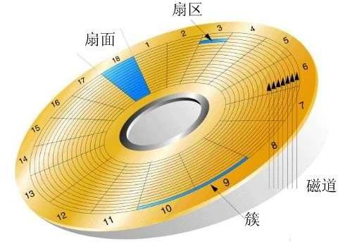

### 磁盘存储和文件系统

在Linux中一切皆文件，相应的设备文件在`/dev`目录下能够看到，其分为两类：

* 块设备：block，存取单位"块"，磁盘
* 字符设备：char，存取单位"字符"，键盘

设备文件：关联至一个设备驱动程序，进而能够跟与之对应硬件设备进行通信

设备号码：

* 主设备号：`major number`，标识设备类型

* 次设备号：`minor number`，标识同一类型下的不同设备

#### 机械硬盘和固态硬盘

机械硬盘(`HDD`): `Hard Disk Drive`，即是传统普通硬盘，主要由：盘片，磁头，盘片转轴及控制电机，磁头控制器，数据转换器，接口，缓存等几个部分组成。机械硬盘    中所有的盘片都装在一个旋转轴上，每张盘片之间是平行的，在每个盘片的存储面上有一个磁头，磁头与盘片之间的距离比头发丝的直径还小，所有的磁头联在一个磁头控制器上，由磁头控制器负责各个磁头的运动。磁头可沿盘片的半径方向运动，加上盘片每分钟几千转的高速旋转，磁头就可以定位在盘片的指定位置上进行数据的读写操作。数据通过磁头由电磁流来改变极性方式被电磁流写到磁盘上，也可以通过相反方式读取。硬盘为精密设备，进入硬盘的空气必须过滤

固态硬盘`SSD`: `Solid State Drive`，用固态电子存储芯片阵列而制成的硬盘，由控制单元和存储单元（FLASH芯片、DRAM芯片）组成。固态硬盘在接口的规范和定义、功能及使用方法上与普通硬盘的完全相同，在产品外形和尺寸上也与普通硬盘一致

相较于`HDD`，`SSD`在防震抗摔、传输速率、功耗、重量、噪音上有明显优势，`SSD`传输速率性能是`HDD`的2倍

相较于`SSD`，`HDD`在价格、容量占有绝对优势

硬盘有价，数据无价，目前`SSD`不能完全取代`HHD`

#### 设备文件

磁盘设备的设备文件命名：`/dev/DEV_FILE`

`SCSI`, `SATA`, `SAS`, `IDE`,`USB`: `/dev/sd`

虚拟磁盘: `/dev/vd` 、`/dev/xvd`

不同磁盘标识: `a-z`,`aa`,`ab`…

* `/dev/sda`, `/dev/sdb`, ...

同一设备上的不同分区：1,2, ...

* `/dev/sda1`, `/dev/sda5`

#### 硬盘存储术语

* head：磁头

* track：磁道

* cylinder：柱面

* sector：扇区，`512bytes`

#### 区位记录磁盘扇区结构

`ZBR`(Zoned Bit Recording): 由于早期的磁盘扇区数分配不合理外圈和内圈的扇区数相同，导致硬盘的存储上限为8GB。后来对其进行了改进，将扇区均匀的分配到磁道上，每个扇区的大小相同，这就是区域记录磁盘。不过这个带来个问题无法定位扇区位置，此时`CHS`就时效了，改用`LBA`方式，存储上限也更大了。

#### `CHS`和`LBA`

`CHS`：CHS分别表示的是磁盘的三位，`cylinder`、`head`和`sector`

- 采用`24bit`位寻址
- 其中前10位表示`cylinder`，中间8位表示`head`，后面6位表示`sector`
- 最大寻址空间`8GB`

`LBA`（logical block addressing）

* `LBA`是一个整数，通过转换成`CHS`格式完成磁盘具体寻址

* `ATA-1`规范中定义了28位寻址模式，以每扇区512位组来计算，`ATA-1`所定义的28位`LBA上`限达到128 `GiB`。2002年`ATA-6`规范采用48位`LBA`，同样以每扇区512位组计算容量上限可达128 `Petabytes`

由于`CHS`寻址方式的寻址空间在大概`8GB`以内，所以在磁盘容量小于大概`8GB`时，可以使用`CHS`寻址方式或是`LBA`寻址方式；在磁盘容量大于大概`8GB`时，则只能使用`LBA`寻址方式。

