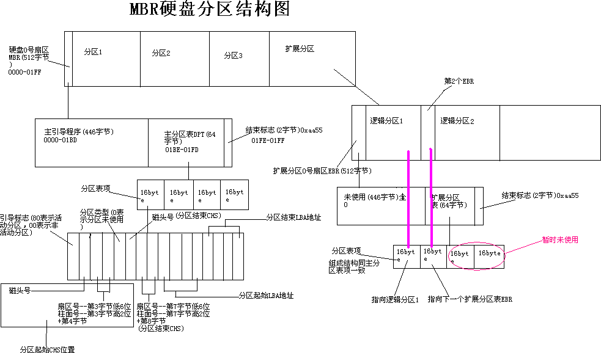
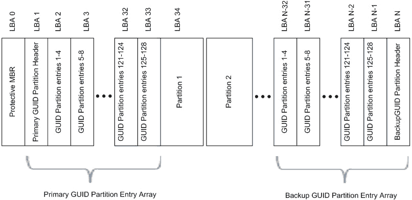
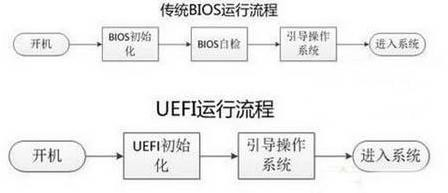

### 磁盘分区

磁盘分区有以下这些好处：

* 优化I/O性能

* 实现磁盘空间配额限制

* 提高修复速度，只需要对损坏的分区进行修复，无需全盘扫描修复

* 可以实现隔离系统和程序

* 在不同的分区上安装多个不同OS

* 对每个分区采用不同文件系统

#### 分区的方式

磁盘分区有两种方式：`MBR`，`GPT`

`MBR`: Master Boot Record，1982年，使用32位表示扇区数，分区不超过`2T`

`MBR`的磁盘组织方式是按柱面进行划分的，其中0磁道0扇区中的`512bytes`被划分成3个部分：

* 第一部分：前`446bytes`用来存放`boot loader`

- 第二部分：中间`64bytes`用来存放分区表，其中每`16bytes`标识一个分区，这就是主分区和扩展分区最多只能分4个分区的原因
- 第三部分：最后的`2bytes`用来存放 `55AA`的标记位，表示这是一块有分区的磁盘

`MBR`分区中一块硬盘最多有4个主分区，也可以3主分区+1扩展(N个逻辑分区)

##### 查看磁盘的前512`byte`

```bash
[root@mylinuxops ~]# hexdump -C -n 512 /dev/vda
00000000  eb 63 90 10 8e d0 bc 00  b0 b8 00 00 8e d8 8e c0  |.c..............|
00000010  fb be 00 7c bf 00 06 b9  00 02 f3 a4 ea 21 06 00  |...|.........!..|
00000020  00 be be 07 38 04 75 0b  83 c6 10 81 fe fe 07 75  |....8.u........u|
00000030  f3 eb 16 b4 02 b0 01 bb  00 7c b2 80 8a 74 01 8b  |.........|...t..|
00000040  4c 02 cd 13 ea 00 7c 00  00 eb fe 00 00 00 00 00  |L.....|.........|
00000050  00 00 00 00 00 00 00 00  00 00 00 80 01 00 00 00  |................|
00000060  00 00 00 00 ff fa 90 90  f6 c2 80 74 05 f6 c2 70  |...........t...p|
00000070  74 02 b2 80 ea 79 7c 00  00 31 c0 8e d8 8e d0 bc  |t....y|..1......|
00000080  00 20 fb a0 64 7c 3c ff  74 02 88 c2 52 be 05 7c  |. ..d|<.t...R..||
00000090  b4 41 bb aa 55 cd 13 5a  52 72 3d 81 fb 55 aa 75  |.A..U..ZRr=..U.u|
000000a0  37 83 e1 01 74 32 31 c0  89 44 04 40 88 44 ff 89  |7...t21..D.@.D..|
000000b0  44 02 c7 04 10 00 66 8b  1e 5c 7c 66 89 5c 08 66  |D.....f..\|f.\.f|
000000c0  8b 1e 60 7c 66 89 5c 0c  c7 44 06 00 70 b4 42 cd  |..`|f.\..D..p.B.|
000000d0  13 72 05 bb 00 70 eb 76  b4 08 cd 13 73 0d 5a 84  |.r...p.v....s.Z.|
000000e0  d2 0f 83 de 00 be 85 7d  e9 82 00 66 0f b6 c6 88  |.......}...f....|
000000f0  64 ff 40 66 89 44 04 0f  b6 d1 c1 e2 02 88 e8 88  |d.@f.D..........|
00000100  f4 40 89 44 08 0f b6 c2  c0 e8 02 66 89 04 66 a1  |.@.D.......f..f.|
00000110  60 7c 66 09 c0 75 4e 66  a1 5c 7c 66 31 d2 66 f7  |`|f..uNf.\|f1.f.|
00000120  34 88 d1 31 d2 66 f7 74  04 3b 44 08 7d 37 fe c1  |4..1.f.t.;D.}7..|
00000130  88 c5 30 c0 c1 e8 02 08  c1 88 d0 5a 88 c6 bb 00  |..0........Z....|
00000140  70 8e c3 31 db b8 01 02  cd 13 72 1e 8c c3 60 1e  |p..1......r...`.|
00000150  b9 00 01 8e db 31 f6 bf  00 80 8e c6 fc f3 a5 1f  |.....1..........|
00000160  61 ff 26 5a 7c be 80 7d  eb 03 be 8f 7d e8 34 00  |a.&Z|..}....}.4.|
00000170  be 94 7d e8 2e 00 cd 18  eb fe 47 52 55 42 20 00  |..}.......GRUB .|
00000180  47 65 6f 6d 00 48 61 72  64 20 44 69 73 6b 00 52  |Geom.Hard Disk.R|
00000190  65 61 64 00 20 45 72 72  6f 72 0d 0a 00 bb 01 00  |ead. Error......|
000001a0  b4 0e cd 10 ac 3c 00 75  f4 c3 00 00 00 00 00 00  |.....<.u........|
000001b0  00 00 00 00 00 00 00 00  d1 cd 93 cd 00 00 80 04  |................|
000001c0  01 04 83 fe c2 ff 00 08  00 00 00 a0 0f 00 00 fe  |................|
000001d0  c2 ff 83 fe c2 ff 00 a8  0f 00 00 58 b0 18 00 fe  |...........X....|
000001e0  c2 ff 82 fe c2 ff 00 00  c0 18 00 00 40 00 00 00  |............@...|
000001f0  00 00 00 00 00 00 00 00  00 00 00 00 00 00 55 aa  |..............U.|
00000200
```

#### `MBR`分区结构




硬盘主引导记录`MBR`由4个部分组：

* 主引导程序（偏移地址`0000H`--`0088H`），它负责从活动分区中装载，并运行系统引导程序

* 出错信息数据区，偏移地址`0089H`--`0E1H`为出错信息，`00E2H`--`01BDH`全为0字节

* 分区表（DPT,Disk Partition Table）含4个分区项，偏移地址`01BEH`--`01FDH`, 每个分区表项长16个字节，共64字节为分区项1、分区项2、分区项3、分区项4

* 结束标志字，偏移地址`01FE`--`01FF`的2个字节值为结束标志`55AA`

##### `MBR`结构

| 地址          | 内容                             | 含义       |
| ------------- | -------------------------------- | ---------- |
| `0000`-`0088` | Master Boot Record（主引导程序） | 主引导程序 |
| `0089`-`01BD` | 出错信息数据区                   | 数据区     |
| `01BE`-`01CD` | 分区项1(16字节)                  | 分区表     |
| `01CE`-`01DD` | 分区项2(16字节)                  | 分区表     |
| `01DE`-`01ED` | 分区项3(16字节)                  | 分区表     |
| `01EE`-`01FD` | 分区项4(16字节)                  | 分区表     |
| `01FE`        | 55                               | 结束标志   |
| `01FF`        | AA                               | 结束标志   |

##### `MBR`中`DPT`结构

| 存储字节位  | 内容及含义                                                   |
| ----------- | ------------------------------------------------------------ |
| 第1字节     | 引导标志。若值为00H表示非活动分区。                          |
| 第2-4字节   | 本分区的起始磁头号、扇区号、柱面号。其中：<br>磁头号--第2字节<br>扇区号--第3字节的低6位<br>柱面号--为第3字节高2位+第4字节8位 |
| 第5字节     | 分区类型符：<br>`00H`--表示该分区未用（即没有指定）<br>`06H`--`FAT16`基本分区<br>`0BH`--`FAT32`基本分区<br>`05H`--扩展分区<br>`07H`--`NTFS`分区<br>`0FH`--(`LBA`模式)扩展分区(`83H`为Linux分区等) |
| 第6-8字节   | 本分区的结束磁头号、扇区号、柱面号。其中：<br>磁头号--第6字节<br>扇区号--第7字节的低6位<br>柱面号--第7字节的高2位+第8字节 |
| 第9-12字节  | 本分区之前已用了的扇区数                                     |
| 第14-16字节 | 本分区的总扇区数                                             |

#### `GPT`分区

`GPT`: `GUID`(`Globals Unique Identifiers`) `partition table`支持128个分区， 使用64位，最大支持`8Z`(`512Byte/block`)`64Z`(`4096Byte/block`)

使用128位`UUID`(`Universally Unique Identifier`) 表示磁盘和分区`GPT`分区表自动备份在头和尾两份，并有`CRC`校验位

`UEFI `(统一扩展固件接口)硬件支持`GPT`，使操作系统启动。



`EFI`部分又可以分为4个区域：`EFI`信息区(`GPT`头)、分区表、`GPT`分区、备份区域

#### `BIOS+MBR`与`UEFI+GPT`启动流程

