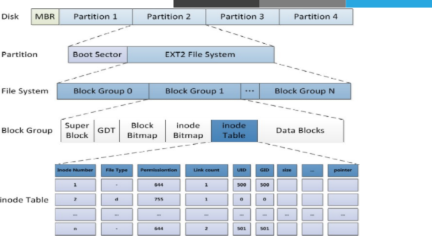

## 文件系统

文件系统是操作系统用于明确存储设备或分区上的文件的方法和数据结构；即在存储设备上组织文件的方法。操作系统中负责管理和存储文件信息的软件结构称为文件管理系统，简称文件系统

从系统角度来看，文件系统是对文件存储设备的空间进行组织和分配，负责文件存储并对存入的文件进行保护和检索的系统。具体地说，它负责为用户建立文件，存入、读出、修改、转储文件，控制文件的存取，安全控制，日志，压缩，加密等

支持的文件系统可以在系统中的以下目录中查看到：

```bash
/lib/modules/`uname –r`/kernel/fs
```

各种文件系统：

[https://en.wikipedia.org/wiki/Comparison_of_file_systems](https://en.wikipedia.org/wiki/Comparison_of_file_systems)

### 文件系统类型

Linux中文件系统：

* `ext2`(Extended file system): 适用于那些分区容量不是太大，更新也不频繁的情况，例如`/boot`分区

* `ext3`:是`ext2`的改进版本，其支持日志功能，能够帮助系统从非正常关机导致的异常中恢复。它通常被用作通用的文件系统

* `ext4`: 是`ext`文件系统的最新版。提供了很多新的特性，包括纳秒级时间戳、创建和使用巨型文件(`16TB`)、最大`1EB`的文件系统，以及速度的提升`xfs`:`SGI`，支持最大`8EB`的文件系统

* `btrfs`（Oracle）, `reiserfs`,`jfs`（`AIX`）, swap

```bash
# 查看当前系统上的文件系统类型
[root@mylinuxops ~]# lsblk -f
NAME   FSTYPE LABEL UUID                                 MOUNTPOINT
sr0                                                      
vda                                                      
├─vda1 ext4         cde18fcc-03b4-4c90-a235-512769ec23bc /boot
├─vda2 ext4         dfd00454-d3b4-475f-aacb-64e27e5377f9 /
└─vda3 swap         5596e69d-a88a-498c-b821-f0f114a368d6 [SWAP]
vdb                                                      
└─vdb1  
```

其他文件系统：

* 光盘：`iso9660`

* `Windows`: `FAT32`, `exFAT`,`NTFS`

* `Unix`: `FFS`(`fast`), `UFS`(`unix`), `JFS2`

* 网络文件系统：`NFS`, `CIFS`

* 集群文件系统：`GFS2`, `OCFS2`(`oracle`)

* 分布式文件系统： `fastdfs`,`ceph`, `moosefs`, `mogilefs`, `glusterfs`, `Lustre`

* `RAW`: 未经处理或者未经格式化产生的文件系统

### 文件系统分类

根据其是否支持"`journal`"功能：

* 日志型文件系统: `ext3`, `ext4`, `xfs`, ... 
* 非日志型文件系统: `ext2`, `vfat`

文件系统的组成部分：

* 内核中的模块：`ext4`, `xfs`, `vfat`

* 用户空间的管理工具：`mkfs.ext4`, `mkfs.xfs`,`mkfs.vfat`

Linux的虚拟文件系统：`VFS`

查前支持的文件系统：`cat /proc/filesystems`

### 创建文件系统

#### `mkfs`命令

创建文件系统使用`mkfs`命令：

```bash
# mkfs创建文件系统方法1
mkfs.FS_TYPE /dev/DEVICE
# mkfs创建文件系统方法1
mkfs -t FS_TYPE /dev/DEVICE -L 'LABEL' # 设定卷标，卷标通常设置为挂载点。

# FS_TYPE:ext4 xfs btrfs vfat
```

##### `mkfs`示例

1. 查看`mkfs`支持的`FS_TYPE`类型

```bash
# mkfs.所支持的FS_TYPE
[root@mylinuxops ~]# mkfs.
mkfs.cramfs  mkfs.ext2    mkfs.ext3    mkfs.ext4    mkfs.minix   mkfs.xfs
```

2. 对`vdb1`创建`xfs`文件系统

```bash
# 对vdb1创建xfs文件系统
[root@mylinuxops ~]# mkfs.xfs /dev/vdb1
meta-data=/dev/vdb1              isize=512    agcount=4, agsize=624960 blks
         =                       sectsz=512   attr=2, projid32bit=1
         =                       crc=1        finobt=1, sparse=1, rmapbt=0
         =                       reflink=1
data     =                       bsize=4096   blocks=2499840, imaxpct=25
         =                       sunit=0      swidth=0 blks
naming   =version 2              bsize=4096   ascii-ci=0, ftype=1
log      =internal log           bsize=4096   blocks=2560, version=2
         =                       sectsz=512   sunit=0 blks, lazy-count=1
realtime =none                   extsz=4096   blocks=0, rtextents=0
Discarding blocks...Done.
# 查看vdb1的文件系统类型
[root@mylinuxops ~]# blkid /dev/vdb1
/dev/vdb1: UUID="5afd3b49-1a95-4973-bc2c-d5a832c95268" BLOCK_SIZE="512" TYPE="xfs" PARTUUID="5b803719-01"
```

3. 对`vdb2`创建`ext4`文件系统

```bash
# 创建ext4文件系统
[root@mylinuxops ~]# mkfs.ext4 /dev/vdb2
mke2fs 1.45.6 (20-Mar-2020)
Discarding device blocks: done                            
Creating filesystem with 2499584 4k blocks and 625856 inodes
Filesystem UUID: 41123277-6b7b-4a20-9354-48e6cbe14f2c
Superblock backups stored on blocks: 
        32768, 98304, 163840, 229376, 294912, 819200, 884736, 1605632

Allocating group tables: done                            
Writing inode tables: done                            
Creating journal (16384 blocks): done
Writing superblocks and filesystem accounting information: done 
# 查看vdb2的文件系统
[root@mylinuxops ~]# blkid /dev/vdb2
/dev/vdb2: UUID="41123277-6b7b-4a20-9354-48e6cbe14f2c" BLOCK_SIZE="4096" TYPE="ext4" PARTUUID="5b803719-02"
```

4. 格式化时对`vdb2`设定卷标

```bash
# 使用-L选项设定卷标
[root@mylinuxops ~]# mkfs.ext4 -L "/mnt/vdb2" /dev/vdb2
mke2fs 1.45.6 (20-Mar-2020)
/dev/vdb2 contains a ext4 file system
        created on Thu Mar 25 13:34:43 2021
Proceed anyway? (y,N) y			# vdb2上已经存在文件系统，再次格式化将清除数据
Discarding device blocks: done                            
Creating filesystem with 2499584 4k blocks and 625856 inodes
Filesystem UUID: 60d8d326-887d-4f9f-835b-eaa5d9e1ade5
Superblock backups stored on blocks: 
        32768, 98304, 163840, 229376, 294912, 819200, 884736, 1605632
# 超级块存放位置
Allocating group tables: done                            
Writing inode tables: done                            
Creating journal (16384 blocks): done
Writing superblocks and filesystem accounting information: done 
# 再次查看
[root@mylinuxops ~]# blkid /dev/vdb2
# 卷标信息已经被打上
/dev/vdb2: LABEL="/mnt/vdb2" UUID="60d8d326-887d-4f9f-835b-eaa5d9e1ade5" BLOCK_SIZE="4096" TYPE="ext4" PARTUUID="5b803719-02"
```

#### `mke2fs`命令

`mke2fs`是`mkfs`的一个变种。它是一个支持ext系列文件系统专用管理工具

命令格式：

```bash
mke2fs [options]... DEVICE... 
```

选项：

* `-t {ext2|ext3|ext4}`: 指定文件系统类型，如果不指定默认`ext2`

* `-b {1024|2048|4096}`: 指定块大小，在ext文件系统上读取或写入数据是都是以块为单位。

* `-L 'LABEL'`: 设置卷标

* `-j`: 相当于`-t ext3`

  ```bash
  # 以下4条命令的功能是相同的
  mkfs.ext3 
  mkfs -t ext3 
  mke2fs -j 
  mke2fs -t ext3
  ```

* `-i #`: 为数据空间中每多少个字节创建一个`inode`；不应该小于`block`大小

* `-N #`: 指定分区中创建多少个`inode`

* `-I`: 一个`inode`记录占用的磁盘空间大小，128---4096

* `-m #`: 默认5%,为管理人员预留空间占总空间的百分比

* `-O FEATURE[,...]`: 启用指定特性

* `-O ^FEATURE`: 关闭指定特性

#### `tune2fs`命令

`tune2fs`: 重新设定ext系列文件系统可调整参数的值

```bash
tune2fs [OPTIONS] DEVICE
```

[OPTIONS]

* `-l`: 查看指定文件系统超级块信息；`super block`

* `-L 'LABEL'`: 修改卷标

* `-m #`: 修预留给管理员的空间百分比

* `-j`: 将`ext2`升级为`ext3`

* `-O`: 文件系统属性启用或禁用，如: 禁用日志:`–O ^has_journal`

* `-o`: 调整文件系统的默认挂载选项，如: 添加`acl`: `–o acl`。添加`CentOS6`上添加`ACL`后需要重新挂载

* `-U UUID`: 修改`UUID`号

##### `tune2fs`示例

1.`tune2fs`用来查看文件系统的属性信息

```bash
[root@mylinuxops ~]# tune2fs -l /dev/vdb2
tune2fs 1.45.6 (20-Mar-2020)
Filesystem volume name:   /mnt/vdb2
Last mounted on:          <not available>
Filesystem UUID:          60d8d326-887d-4f9f-835b-eaa5d9e1ade5
Filesystem magic number:  0xEF53
Filesystem revision #:    1 (dynamic)
Filesystem features:      has_journal ext_attr resize_inode dir_index filetype extent 64bit flex_bg sparse_super large_file huge_file dir_nlink extra_isize metadata_csum
Filesystem flags:         signed_directory_hash 
Default mount options:    user_xattr acl	# 分区具有acl功能
Filesystem state:         clean				# 文件系统的状态值，clean表示正常。
Errors behavior:          Continue
Filesystem OS type:       Linux
Inode count:              625856			# 分区上总共的inode数量
Block count:              2499584
Reserved block count:     124979			# 保留的块数量5%的空间预留给root使用
Free blocks:              2434681
Free inodes:              625845
First block:              0
Block size:               4096
Fragment size:            4096
Group descriptor size:    64
Reserved GDT blocks:      1024
Blocks per group:         32768
Fragments per group:      32768
Inodes per group:         8128
Inode blocks per group:   508
Flex block group size:    16
Filesystem created:       Thu Mar 25 13:43:52 2021
Last mount time:          n/a
Last write time:          Thu Mar 25 13:43:52 2021
Mount count:              0
Maximum mount count:      -1
Last checked:             Thu Mar 25 13:43:52 2021
Check interval:           0 (<none>)
Lifetime writes:          4137 kB
Reserved blocks uid:      0 (user root)
Reserved blocks gid:      0 (group root)
First inode:              11
Inode size:               256              # 每个inode占用256字节
Required extra isize:     32
Desired extra isize:      32
Journal inode:            8
Default directory hash:   half_md4
Directory Hash Seed:      86842f59-9ed3-4ec1-8abd-9be5653c75db
Journal backup:           inode blocks
Checksum type:            crc32c
Checksum:                 0xd848d0f1
```

#### 超级块和`INODE TABLE`

超级块中存放了文件系统中从第m块到第n块为一个块组，超级块损坏，文件系统将无法运行。所以在Linux系统中避免超级块损坏，将其备份了多份。



超级块可以使用`dumpe2fs`来查看

`dumpe2fs`：将磁盘块分组管理

* -h：查看超级块信息，不显示分组信息

##### `dumpe2fs`示例

```bash
# 使用dumpe2fs查看超级块备份存放位置
[root@mylinuxops ~]# dumpe2fs /dev/vdb2 | grep -B 1 "Backup"
dumpe2fs 1.45.6 (20-Mar-2020)
Group 1: (Blocks 32768-65535) csum 0x6e03 [INODE_UNINIT, BLOCK_UNINIT]
  Backup superblock at 32768, Group descriptors at 32769-32770
--
Group 3: (Blocks 98304-131071) csum 0x3866 [INODE_UNINIT, BLOCK_UNINIT]
  Backup superblock at 98304, Group descriptors at 98305-98306
--
Group 5: (Blocks 163840-196607) csum 0xbf7c [INODE_UNINIT, BLOCK_UNINIT]
  Backup superblock at 163840, Group descriptors at 163841-163842
--
Group 7: (Blocks 229376-262143) csum 0xce64 [INODE_UNINIT, BLOCK_UNINIT]
  Backup superblock at 229376, Group descriptors at 229377-229378
--
Group 9: (Blocks 294912-327679) csum 0xaae1 [INODE_UNINIT, BLOCK_UNINIT]
  Backup superblock at 294912, Group descriptors at 294913-294914
--
Group 25: (Blocks 819200-851967) csum 0x9dcc [INODE_UNINIT, BLOCK_UNINIT]
  Backup superblock at 819200, Group descriptors at 819201-819202
--
Group 27: (Blocks 884736-917503) csum 0xe36f [INODE_UNINIT, BLOCK_UNINIT]
  Backup superblock at 884736, Group descriptors at 884737-884738
--
Group 49: (Blocks 1605632-1638399) csum 0x5676 [INODE_UNINIT, BLOCK_UNINIT]
  Backup superblock at 1605632, Group descriptors at 1605633-1605634
[root@mylinuxops ~]# 
```

#### 文件系统检测和修复

Linux发生于死机或者非正常关机之后，挂载文件系统标记有可能为“no clean”，这时候就需要将其进行修复。

注意：一定不要在挂载状态下修复，需要注意以下两个修复命令只适用于ext系统，

##### `fsck`命令

`fsck`: File System Check 

命令格式：

```bash
fsck.FS_TYPE [OPTIONS] DEVICE
fsck -t FS_TYPE [OPTIONS] DEVICE
```

[OPTIONS]

* `-p` 自动修复错误

* `-r` 交互式修复错误

* `FS_TYPE`	一定要与分区上已经文件类型相同

##### `e2fsck`命令

`e2fsck`: ext系列文件专用的检测修复工具

[OPTIONS]

* `-y`: 自动回答为yes

* `-f`: 强制修复

#### 文件系统标签

指向设备的另一种方法，与设备无关。

* `blkid`: 块设备属性信息查看

	```bash
	blkid [OPTION]... [DEVICE]
	```
	
	[OPTION]
	
	* `-U UUID`: 根据指定的`UUID`来查找对应的设备
	
	* `-L LABEL`: 根据指定的LABEL来查找对应的设备

* `e2label`: 管理ext系列文件系统的LABEL 

	```bsah
	e2label DEVICE [LABEL]
	```

* `findfs`: 查找分区，功能与`blkid`相似

  ```bash
  findfs [options] LABEL=<label> 
  findfs [options] UUID=<uuid>
  ```

  
