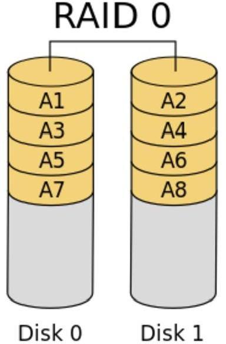
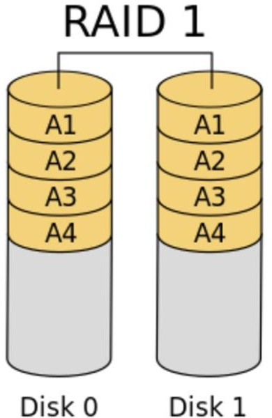
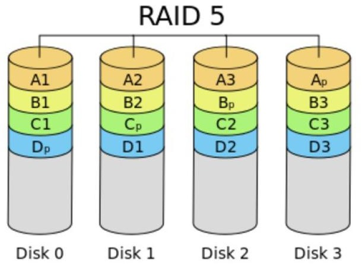
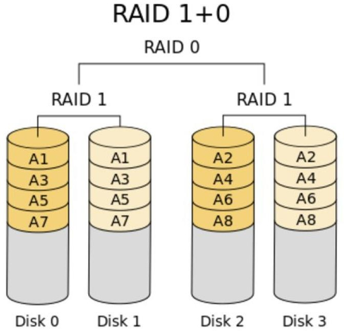
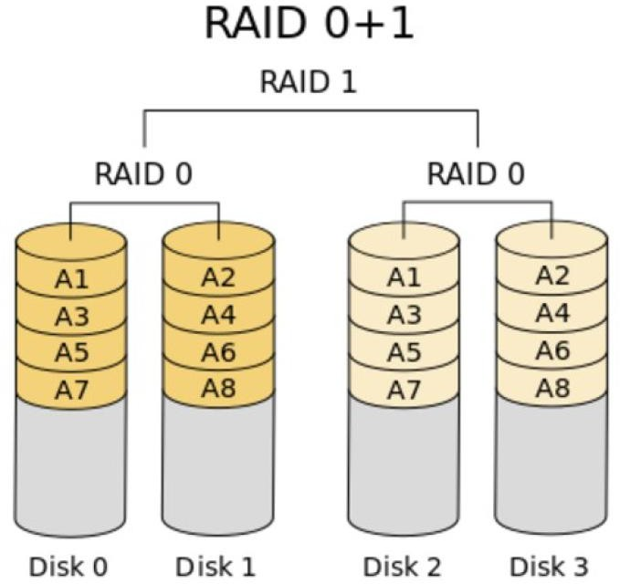
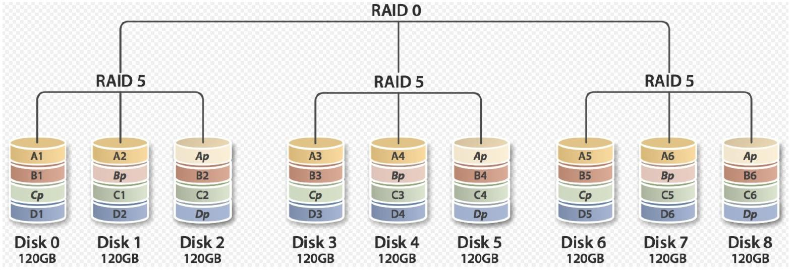
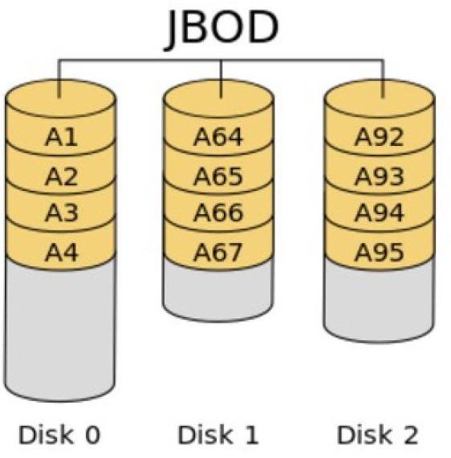

## RAID技术

在工作中通常会使用多块硬盘，组成raid来使用。

RAID: Redundant Arrays of Inexpensive(Independent) Disks

1988年由加利福尼亚大学伯克利分校(University of California Berkeley) "A Case for Redundant Arrays of  Inexpensive Disks"

多个磁盘合成一个"阵列"来提供更好的性能、冗余，或者两者都提供。

RAID优点：

1. 提高IO能力：磁盘并行读写
2. 提高耐用性：磁盘冗余来实现

RAID的实现方式：

1. 外接式磁盘整列：通过扩展卡提供适配能力
2. 内接式RAID：主板集成RAID控制器，安装OS前在BIOS里配置
3. 软件RAID：通过OS实现

### RAID级别

#### `RAID-0`：条带卷，strip

将两块磁盘组合成一个块硬盘，存放文件时，将文件分割成若干个小块(chuck)，平分在每块磁盘上。

特点：

* 读、写性能提升

* 可用空间：N*min(S1,S2,...) 

* 无容错能力，`RAID`中任意一块磁盘损坏，全盘将损坏。

* 最少磁盘数：2块, 2块+

#### `RAID-1`：镜像卷，mirror

将两块硬盘组合成一个`RAID-1`设备，存放数据时，将文件分割成若干个chuck，在两块磁盘上都存放一份相同的数据。

特点：

* 读性能提升、写性能略有下降

* 可用空间：1*min(S1,S2,...) 

* 有冗余能力

* 最少磁盘数：2, 2N

#### `RAID-4`

类似于`RAID-5`，将多块数据盘异或运算值存于专用校验盘。生产中不太使用，用于存放校验位的磁盘容易故障。

特点：

* 读、写性能提升
* 可用空间：(n-1)min(S1,S2)
* 有冗余能力
* 最少磁盘数量：3，3+

#### `RAID-5`

`RAID-5`和`RAID-4`不同的地方在于其将校验位，均匀的分布在每一块磁盘上。但是若`RAID-5`中损坏一块硬盘将会降级使用，读写速度会减慢。此时磁盘的读写将更加繁忙，故障率更高。可以考虑使用热备盘或`RAID-6`

特点：

* 读、写性能提升
* 可用空间：(n-1)min(S1,S2)
* 有冗余能力
* 最少磁盘数量：3，3+

#### `RAID-6`

`RAID-6`相较于`RAID-5`多出1块磁盘作校验位，拥有2个校验位置，其容错率更高，可以允许2块磁盘的损坏

特点：

* 读、写性能提升

* 可用空间：(N-2)*min(S1,S2,...)
* 有容错能力：允许最多2块磁盘损坏
* 最少磁盘数：4, 4+

#### `RAID-10`

将多块磁盘先组合成`RAID-1`，再组合成`RAID-0`

特点：

* 读、写性能提升

* 可用空间：N*min(S1,S2,...)/2

* 有容错能力：每组镜像最多只能坏一块

* 最少磁盘数：4, 4+

#### `RAID-01`

多块磁盘先实现`RAID0`,再组合成`RAID1`，容错性能弱于`RAID-01`，不使用。

#### `RAID-50`

多块磁盘先实现`RAID5`，再组合成`RAID0`，成本太高，不常用

#### `JBOD`：Just a Bunch Of Disks

功能：将多块磁盘的空间合并一个大的连续空间使用

可用空间：sum(S1,S2,...)

#### `RAID-7`

可以理解为一个独立存储计算机，自身带有操作系统和管理工具，可以独立运行，理论上性能最高的RAID模式

### 常用的RAID级别

`RAID-0`, `RAID-1`, `RAID-5`, `RAID-10`, `RAID-50`, `JBOD`