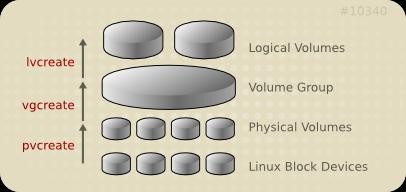
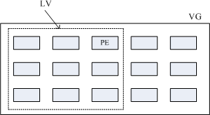

## 逻辑卷管理器(`LVM`)

`RAID`技术虽然提高了磁盘的读写性能以及容错性，但是依旧存在一个问题，使用`RAID`技术能将多个磁盘组合成一个逻辑硬盘(如: `sda`)来使用，而这个逻辑硬盘的容量取决于`RAID`的类型。一旦对`sda`进行了分区后，其大小将无法改变，一旦某个分区的空间使用完毕，该分区将无法扩容。

所以无论RAID还是普通硬盘都存在此类问题。工作中很有可能预先估计的硬盘空间和实际所需的空间不一致。后期业务增长迅速而硬盘空间无法扩展。后来出现了一种解决硬盘空间不足的方法`LVM`



### `LVM`逻辑卷

逻辑卷技术可以轻松解决空间不足问题，他可以更具需求，动态的调整空间大小。

#### 逻辑卷具体实现逻辑

1. 先将单块硬盘变为物理卷(`Physical Volumes`或`PV`)，物理卷可以是单块硬盘，也可以是单个分区。物理卷的名称和单块硬盘或分区的名称是一一对应的。
2. 将单个或多个物理卷创建为一个卷组，此时可以将这个卷组抽象为一个逻辑上的大硬盘。
3. 在卷组这个逻辑上的大硬盘中创建出多个逻辑卷，逻辑卷可以将其抽象为卷组这个逻辑大硬盘上的分区。但是这个逻辑卷和普通分区的区别在于其可以扩展。

物理卷是用固定大小的物理区域(Physical Extent，PE)来定义的。在物理卷创建的逻辑卷是由物理区域(PE)组成。

##### 逻辑卷的容量更改

`LVM`可以弹性的更改`LVM`的容量，通过交换PE来进行资料的转换，将原来`LV`内的PE转移到其他的设备中以降低`LV`的容量，或将其他设备中的PE加到`LV`中以加大容量



### `LVM`逻辑卷管理工具

#### `pv`管理工具

显 示`pv`信 息

```bash
pvs
```

简要`pv`信息显示

```bash
pvdisplay
```

创建`pv`

```bash
pvcreate /dev/DEVICE
```

删除`pv`

```bash
pvremove /dev/DEVICE
```