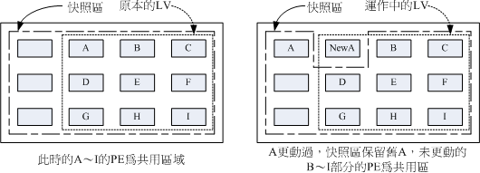

## 逻辑卷管理器(`LVM`)

`RAID`技术虽然提高了磁盘的读写性能以及容错性，但是依旧存在一个问题，使用`RAID`技术能将多个磁盘组合成一个逻辑硬盘(如: `sda`)来使用，而这个逻辑硬盘的容量取决于`RAID`的类型。一旦对`sda`进行了分区后，其大小将无法改变，一旦某个分区的空间使用完毕，该分区将无法扩容。

所以无论RAID还是普通硬盘都存在此类问题。工作中很有可能预先估计的硬盘空间和实际所需的空间不一致。后期业务增长迅速而硬盘空间无法扩展。后来出现了一种解决硬盘空间不足的方法`LVM`


### `LVM`逻辑卷

逻辑卷技术可以轻松解决空间不足问题，他可以更具需求，动态的调整空间大小。

#### 逻辑卷具体实现逻辑

1. 先将单块硬盘变为物理卷(`Physical Volumes`或`PV`)，物理卷可以是单块硬盘，也可以是单个分区。物理卷的名称和单块硬盘或分区的名称是一一对应的。
2. 将单个或多个物理卷创建为一个卷组，此时可以将这个卷组抽象为一个逻辑上的大硬盘。
3. 在卷组这个逻辑上的大硬盘中创建出多个逻辑卷，逻辑卷可以将其抽象为卷组这个逻辑大硬盘上的分区。但是这个逻辑卷和普通分区的区别在于其可以扩展。

物理卷是用固定大小的物理区域(Physical Extent，PE)来定义的。在物理卷创建的逻辑卷是由物理区域(PE)组成。

##### 逻辑卷的容量更改

`LVM`可以弹性的更改`LVM`的容量，通过交换PE来进行资料的转换，将原来`LV`内的PE转移到其他的设备中以降低`LV`的容量，或将其他设备中的PE加到`LV`中以加大容量


### `LVM`逻辑卷管理工具

#### `pv`管理工具

显 示`pv`信 息

```bash
pvs
```

简要`pv`信息显示

```bash
pvdisplay
```

创建`pv`

```bash
pvcreate /dev/DEVICE
```

删除`pv`

```bash
pvremove /dev/DEVICE
```

#### `vg`管理工具

显示卷组

```bash
vgs 
vgdisplay
```

创建卷组

```bash
vgcreate [-s #[kKmMgGtTpPeE]] VolumeGroupName PhysicalDevicePath [PhysicalDevicePath...]
```

管理卷组

```bash
# 扩展物理卷
vgextend VolumeGroupName PhysicalDevicePath [PhysicalDevicePath...]

vgreduce VolumeGroupName PhysicalDevicePath [PhysicalDevicePath...]
```

删除卷组

先做`pvmove`，再做`vgremove`

#### `lv`管理工具

显示逻辑卷

```bash
lvs 
Lvdisplay
```

创建逻辑卷

```bash
# 指定逻辑卷大小来创建lv
lvcreate -L #[mMgGtT] -n NAME VolumeGroup

# 指定pe个数来创建lv
lvcreate -l 60%VG -n mylv testvg lvcreate -l 100%FREE -n yourlv testvg
```

删除逻辑卷

```bash
lvremove /dev/VG_NAME/LV_NAME
```

重设文件系统大小

```bash
fsadm [options] resize device [new_size[BKMGTEP]] 
# 扩容后需要扩展文件系统，否则无法识别。
# ext文件系统使用resize2fs来扩展，xfs需要使用xfs_growfs来扩容
resize2fs [-f] [-F] [-M] [-P] [-p] device [new_size] 
xfs_growfs /mountpoint
```

#### 扩展和缩减逻辑卷

##### 扩展逻辑卷

扩展逻辑卷必须要确保卷组有空间，且扩展无需卸载设备。可在线扩容。

```bash
# +表示在现有的基础上增加多少容量，不带+表示扩展到多少容量
lvextend [-r] -L [+]#[mMgGtT] /dev/VG_NAME/LV_NAME

# 扩容后需要扩展文件系统，否则无法识别。若lvextend使用-r选项，以下命令可无需再执行。
# ext文件系统使用resize2fs来扩展，xfs需要使用xfs_growfs来扩容
resize2fs /dev/VG_NAME/LV_NAME
xfs_growfs /mountpoint

# 指定pe的个数来扩容
lvresize [-r] -l +100%FREE /dev/VG_NAME/LV_NAME
```

##### 缩减逻辑卷

逻辑卷的缩减是看文件系统的，`xfs`文件系统只支持增长，不支持缩减。ext系列文件系统支持缩减。缩减时需要离线进行，需要卸载。

```bash
# 卸载逻辑卷
umount /dev/VG_NAME/LV_NAME 
# 对lv作检测
e2fsck -f /dev/VG_NAME/LV_NAME
# 缩减文件系统，需要指定缩减到多少大小
resize2fs /dev/VG_NAME/LV_NAME #[mMgGtT] 
# 缩减逻辑卷
lvreduce -L [-]#[mMgGtT] /dev/VG_NAME/LV_NAME mount
```

#### 跨主机迁移卷组

##### 源计算机上

1. 在旧系统中，`umount`所有卷组上的逻辑卷

2. 禁用卷组

   ```bash
   vgchange –a n vg0 
   lvdisplay
   ```

3. 导出卷组

   ```bash
   vgexport vg0 
   pvscan 
   vgdisplay
   ```

   拆下旧硬盘

##### 在目标计算机上

4. 在新系统中安装旧硬盘，并导入卷组：

   ```bash
   vgimport vg0
   ```

5. 启用卷组

   ```bash
   vgchange –ay vg0
   ```

6. `mount`所有卷组上的逻辑卷

#### 逻辑卷管理器快照

快照是特殊的逻辑卷，它是在生成快照时存在的逻辑卷的准确拷贝

对于需要备份或者复制的现有数据临时拷贝以及其它操作来说，快照是最合适的选择

快照只有在它们和原来的逻辑卷不同时才会消耗空间

* 在生成快照时会分配给它一定的空间，但只有在原来的逻辑卷或者快照有所改变才会使用这些空间

* 当原来的逻辑卷中有所改变时，会将旧的数据复制到快照中

* 快照中只含有原来的逻辑卷中更改的数据或者自生成快照后的快照中更改的数据

* 建立快照的卷大小小于等于原始逻辑卷,也可以使用`lvextend`扩展快照

快照就是将当时的系统信息记录下来，就好像照相一般，若将来有任何数据改动了，则原始数据会被移动到快照区，没有改动的区域则由快照区和文件系统共享



由于快照区与原本的`LV`共用很多PE的区块，因此快照与被快照的`LV`必须在同一个VG中.系统恢复的时候的文件数量不能高于快照区的实际容量

#### `lVM`快照使用

为现有逻辑卷创建快照

```bash
# 创建快照-L指定大小，-s指定创建的为快照，-n 指定快照名字，-p r 表示以只读方式创建，对/dev/vg0/data创建快照
lvcreate -L 100M -s -n data-snapshot -p r /dev/vg0/data
```

挂载快照

```bash
mkdir -p /mnt/snap
# 由于快照卷和逻辑卷uuid是相同的，所以挂载时需要使用nouuid选项来挂载(xfs文件系统用)。ext4文件系统可无需添加nouuid选项。
mount -o ro,nouuid /dev/vg0/data-snapshot /mnt/snap
```

恢复快照

```bash
# 卸载快照卷
umount /dev/vg0/data-snapshot 
# 卸载逻辑卷
umount /dev/vg0/data
# 快照恢复
lvconvert --merge /dev/vg0/data-snapshot
```

删除快照

```bash
# 卸载快照目录
umount /mnt/databackup 
# 删除快照卷
lvremove /dev/vg0/databackup
```