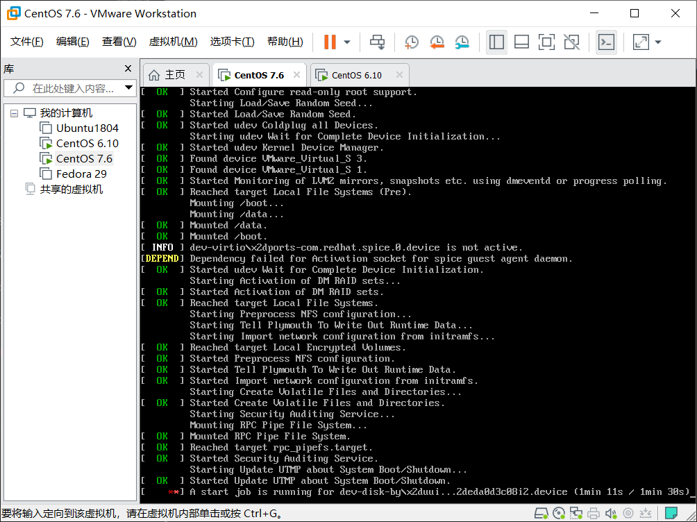

## fstab挂载错误修复

### 一、CentOS6环境

#### 1.创建错误环境

```bash
[root@centos6 ~]# vim /etc/fstab
#
# /etc/fstab
# Created by anaconda on Tue Mar  5 13:07:05 2019
#
# Accessible filesystems, by reference, are maintained under '/dev/disk'
# See man pages fstab(5), findfs(8), mount(8) and/or blkid(8) for more info
#
UUID=3fa49288-1c40-4e74-ad2c-a32fefedf20f /                       ext4    defaults        1 1
UUID=5f0da078-420b-be5b-95ce5a8a2efc /boot                   ext4    defaults        1 2           此行的UUID原本为5f0da078-2991-420b-be5b-95ce5a8a2efc
UUID=bf0d1aa-83e5-4127-9e59-a4fc7aa9dbb9 /data                   ext4    defaults        1 2      此行的UUID原本为5bf0d1aa-83e5-4127-9e59-a4fc7aa9dbb9
UUID=07895eae-ecf4-4a48-9c4a-668e407fc70a swap                    swap    defaults        0 0
tmpfs                   /dev/shm                tmpfs   defaults        0 0
devpts                  /dev/pts                devpts  gid=5,mode=620  0 0
sysfs                   /sys                    sysfs   defaults        0 0
proc                    /proc                   proc    defaults        0 0

```
保存退出重启  

#### 2.排错

此时两行uuid报错，要求输入root口令登录排错


登录后进入/etc/fstab对文件进行修改，发现此时文件处于只读状态。


CentOS6在对根挂载时默认使用的是只读挂载，所以需要对/重新挂载并设置读写属性


重新进入fstab对UUID进行修复。


重启后重新进入系统

注意：此处实验使用的是将文件直接修复，也可以把错误的行注销，或者将最后一位检查次序设置位0不做检查。等进入系统后再做修复。

### 二、CentOS7环境

#### 1.创建环境

```bash
[root@centos7 ~]# vim /etc/fstab
#
# /etc/fstab
# Created by anaconda on Tue Mar  5 21:07:19 2019
#
# Accessible filesystems, by reference, are maintained under '/dev/disk'
# See man pages fstab(5), findfs(8), mount(8) and/or blkid(8) for more info
#
UUID=45490aa4-cf29-420d-a606-af32688b6707 /                       xfs     defaults        0 0
UUID=x15dcd896-b7cf-48d0-b8bd-4c0b0f2c62b2 /boot                   xfs     defaults        0 0       此处正确UUID为 15dcd896-b7cf-48d0-b8bd-4c0b0f2c62b2
UUID=4b6e1813-2c46-402a-869a-02cbbcb76ade /data                   xfs     defaults        0 0
UUID=0995b444-48c1-4423-92bc-2deda0d3c082 swap                    swap    defaults        0 0                                       
```
保存重启

#### 2.排错

重启后已出现错误



输入root口令，登录系统


修改/etc/fstab，直接将错误的那行注释掉


保存重启，此时已经能够正常进入系统


登录系统后将/etc/fstab的参数修改正确


注意：CentOS7与6的区别在于emergency模式下，7是可读可写，6只能读需要重新挂载，7的fstab最后一位检查次序设置为0时没有用无法让系统不检查需要直接注释掉错误行或者直接修复错误。