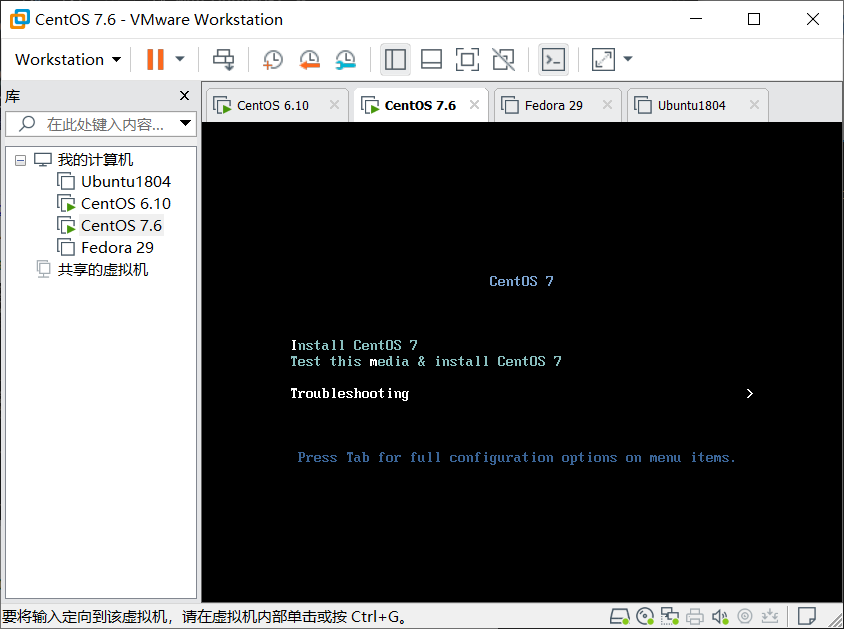

### 磁盘分区表的备份、删除和回复


#### 简要说明

`MBR`分区磁盘的分区表信息存放在硬盘0磁道第0个扇区内总共512字节，前446字节为`bootloader`。中间64位为磁盘分区表信息，每个分区信息占16个字节，总计存放4个分区。(这段就是需要备份出来的数据)  最后的`aa55`为结束标志位。

#### 一、分区表的备份

首先先查看下硬盘前512字节，从2080开启时至`aa55`前的64字节就是我们需要备份的磁盘分区表
```bash
[root@centos7 ~]# hexdump -n 512 /dev/sda
0000000 63eb 1090 d08e 00bc b8b0 0000 d88e c08e
0000010 befb 7c00 00bf b906 0200 a4f3 21ea 0006
0000020 be00 07be 0438 0b75 c683 8110 fefe 7507
0000030 ebf3 b416 b002 bb01 7c00 80b2 748a 8b01
0000040 024c 13cd 00ea 007c eb00 00fe 0000 0000
0000050 0000 0000 0000 0000 0000 8000 0001 0000
0000060 0000 0000 faff 9090 c2f6 7480 f605 70c2
0000070 0274 80b2 79ea 007c 3100 8ec0 8ed8 bcd0
0000080 2000 a0fb 7c64 ff3c 0274 c288 be52 7c05
0000090 41b4 aabb cd55 5a13 7252 813d 55fb 75aa
00000a0 8337 01e1 3274 c031 4489 4004 4488 89ff
00000b0 0244 04c7 0010 8b66 5c1e 667c 5c89 6608
00000c0 1e8b 7c60 8966 0c5c 44c7 0006 b470 cd42
00000d0 7213 bb05 7000 76eb 08b4 13cd 0d73 845a
00000e0 0fd2 de83 be00 7d85 82e9 6600 b60f 88c6
00000f0 ff64 6640 4489 0f04 d1b6 e2c1 8802 88e8
0000100 40f4 4489 0f08 c2b6 e8c0 6602 0489 a166
0000110 7c60 0966 75c0 664e 5ca1 667c d231 f766
0000120 8834 31d1 66d2 74f7 3b04 0844 377d c1fe
0000130 c588 c030 e8c1 0802 88c1 5ad0 c688 00bb
0000140 8e70 31c3 b8db 0201 13cd 1e72 c38c 1e60
0000150 00b9 8e01 31db bff6 8000 c68e f3fc 1fa5
0000160 ff61 5a26 be7c 7d80 03eb 8fbe e87d 0034
0000170 94be e87d 002e 18cd feeb 5247 4255 0020
0000180 6547 6d6f 4800 7261 2064 6944 6b73 5200
0000190 6165 0064 4520 7272 726f 0a0d bb00 0001
00001a0 0eb4 10cd 3cac 7500 c3f4 0000 0000 0000
00001b0 0000 0000 0000 0000 b4f0 000a 0000 2080         #2080:分区表开始
00001c0 0021 aa83 8228 0800 0000 0000 0020 aa00
00001d0 8229 fe83 ffff 0800 0020 0000 0c80 fe00         
00001e0 ffff fe83 ffff 0800 0ca0 0000 0640 fe00         
00001f0 ffff fe05 ffff 0800 12e0 f800 061f aa55         #061f:分区表结束
0000200
```
1.使用dd命令将硬盘分区表的信息备份出来。
```bash
[root@centos7 ~]# dd if=/dev/sda of=mbr.bak bs=1 count=64 skip=446  复制sda的内的信息，复制方法为跳过前446个字节
64+0 records in
64+0 records out
64 bytes (64 B) copied, 0.000224581 s, 285 kB/s
```
2.查看下所备份出来的数据，然后将其备份至远程主机上，也可以将其复制到U盘进行备份，此处以远程主机为例。  
查看备份数据，确保备份数据的正确性
```bash
[root@centos7 ~]# hexdump mbr.bak                   #确保备份出来的数据没有错误
0000000 2080 0021 aa83 8228 0800 0000 0000 0020
0000010 aa00 8229 fe83 ffff 0800 0020 0000 0c80
0000020 fe00 ffff fe83 ffff 0800 0ca0 0000 0640
0000030 fe00 ffff fe05 ffff 0800 12e0 f800 061f
0000040
```
将文件备份至远程主机，并登录远程主机查看下数据。
```bash
[root@centos7 ~]# scp mbr.bak root@192.168.172.140:/root
The authenticity of host '192.168.172.140 (192.168.172.140)' can't be established.
RSA key fingerprint is SHA256:gPedPBi+OsdkYR+Y7j26ViQWSi4lIPU4cViDPImib0A.
RSA key fingerprint is MD5:46:d8:67:07:f3:51:87:95:2c:d7:4b:27:ce:85:a2:ed.
Are you sure you want to continue connecting (yes/no)? yes
Warning: Permanently added '192.168.172.140' (RSA) to the list of known hosts.
root@192.168.172.140's password: 
mbr.bak                                                          100%   64    51.9KB/s   00:00    
[root@centos7 ~]# ssh root@192.168.172.140
root@192.168.172.140's password: 
Last login: Sat Mar 23 20:48:30 2019
[root@centos6 ~]# ls
anaconda-ks.cfg  install.log  install.log.syslog  mbr.bak
[root@centos6 ~]# hexdump mbr.bak 
0000000 2080 0021 aa83 8228 0800 0000 0000 0020
0000010 aa00 8229 fe83 ffff 0800 0020 0000 0c80
0000020 fe00 ffff fe83 ffff 0800 0ca0 0000 0640
0000030 fe00 ffff fe05 ffff 0800 12e0 f800 061f
0000040
```
注意：千万不要把备份文件放在本机，否则当分区表被破坏后，磁盘将无法读取内部的任何数据，存放在本地的备份毫无意义。

#### 删除和恢复

##### 1.清空磁盘分区表  

将446字节后的64字节清空
```bash
[root@centos7 ~]# dd if=/dev/zero of=/dev/sda bs=1 count=64 seek=446
64+0 records in
64+0 records out
64 bytes (64 B) copied, 0.000366417 s, 175 kB/s
[root@centos7 ~]# reboot
```
至此，磁盘分区已被破坏重启后将无法进入系统。重启。   

##### 2.恢复`MBR`分区表

1.重启后显示没有磁盘


2.重启选择光盘模式


3.选择Troubleshooting



4.选择Rescue a CentOS System进入救援模式


5.选择1 continue


6.此时主机没有网络地址无法从远程主机获取备份文件。所以先给本地主机配置IP地址


7.获取地址后将远程主机上的mbr.bak文件拉取至本机


8.将备份的分区表重新恢复至/dev/sda内，然后重启


9.此时注意已经都能正常启动。


