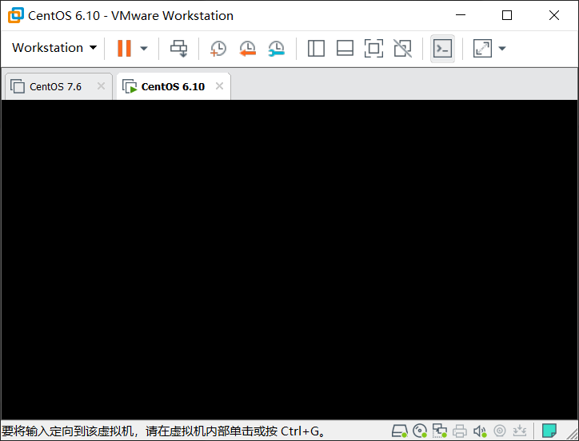
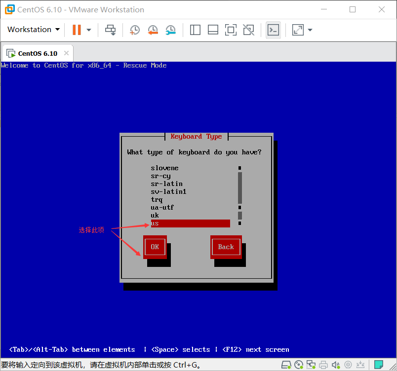
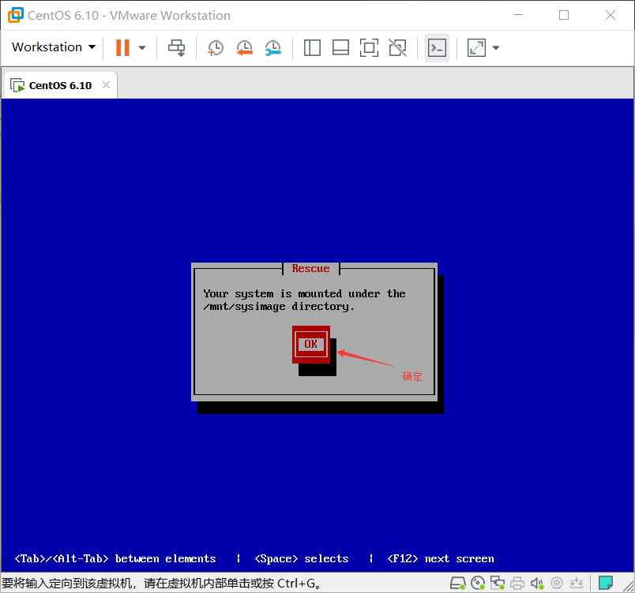

## 删除initramfs修复

以下操作为演示initramfs被删除后的报错，以及修复的方法。

#### 一、删除initramfs文件

```bash
[root@centos6 boot]# rm initramfs-2.6.32-754.el6.x86_64.img 
rm: remove regular file `initramfs-2.6.32-754.el6.x86_64.img'? y
[root@centos6 boot]# ls
config-2.6.32-754.el6.x86_64  lost+found                        vmlinuz-2.6.32-754.el6.x86_64
efi                           symvers-2.6.32-754.el6.x86_64.gz
grub                          System.map-2.6.32-754.el6.x86_64
```
#### 二、重启查看报错。



#### 三、修复错误 

1.进入救援模式








2.修复错误 

切换根目录至硬盘目录


`cd`至`/boot`目录下，然后使用`mkinitrd`命令对`initramfs`文件进行修复，`mkinitrd`命令需要带上系统内核的版本号所以此处使用`uname -r`来获取版本号


重启机器


#### 四、重启后正常进入系统

