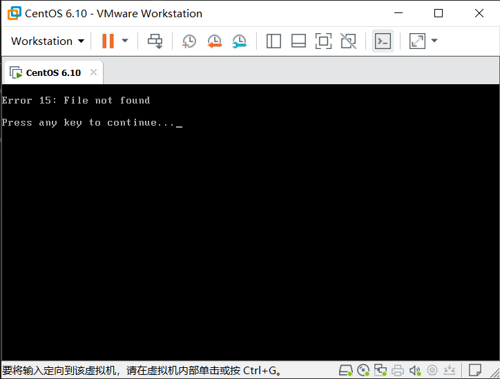
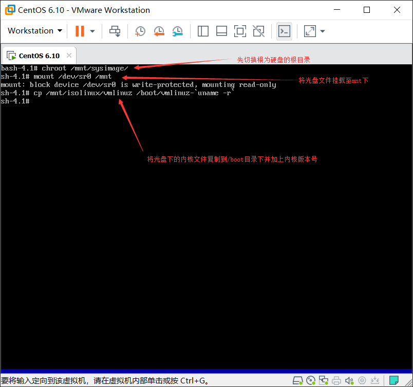
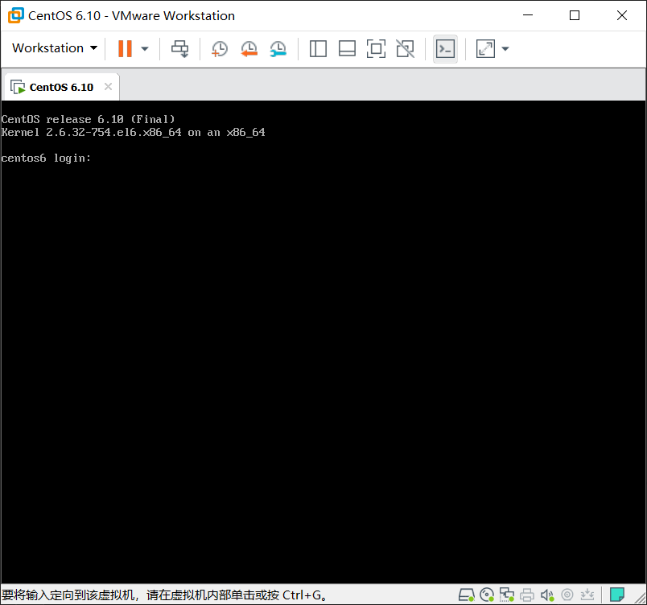

## 删除vmlinuz-xxx.img修复

以下为演示vmlinuz内核文件丢失后的报错以及修复的过程

#### 一、删除vmlinuz-xxx.img

```bash
[root@centos6 ~]# rm /boot/vmlinuz-2.6.32-754.el6.x86_64
rm: remove regular file `/boot/vmlinuz-2.6.32-754.el6.x86_64'? y
[root@centos6 ~]# ls /boot
config-2.6.32-754.el6.x86_64  initramfs-2.6.32-754.el6.x86_64.img  System.map-2.6.32-754.el6.x86_64
efi                           lost+found
grub                          symvers-2.6.32-754.el6.x86_64.gz

```
#### 二、重启后查看报错  

内核丢失报错状态为下图



#### 三、修复  

1.进入光盘救援模式  

2.修复错误

修复方法，由于内核文件光盘上也存有一份，所以将光盘下的内核文件复制一份至boot就可以恢复。



3.重启 

重启后已经正常进入系统

