## `/boot`目录删除恢复

以下为分别演示在`CentOS 6`和`CentOS 7`上`boot`目录被删除后出现的报错以及修复的方法

### `CentOS6`删除`/boot`

#### 一、删除/boot目录下内容

```bash
[root@centos6 ~]# rm -rf /boot/
rm: cannot remove `/boot': Device or resource busy
[root@centos6 boot]# sync
```
#### 二、查看错误状态

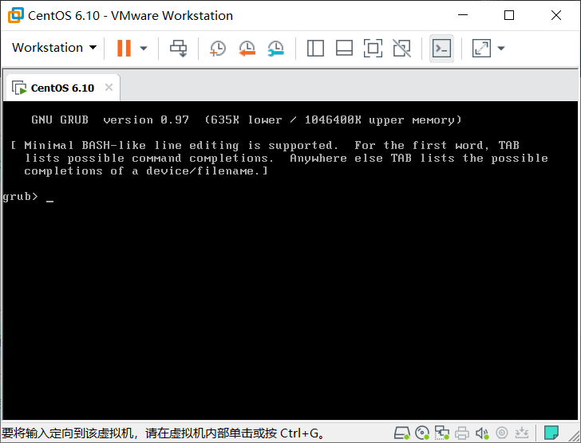

#### 三、修复

修复思路，由于/boot下存放的文件为开机启动所需要的内核、虚拟文件系统、以及grub的1，1.5，以及2阶段的文件，所以修复时需要将这些文件全部创建出来。

1. 使用救援光盘登录系统。  

此步骤省略

2. 切换根至硬盘根目录下，挂载光盘至`/mnt`目录下 

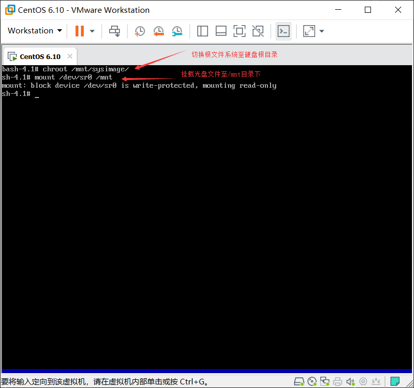

 

3. 复制内核文件至/boot目录下，并在/boot目录下创建虚拟文件系统。 

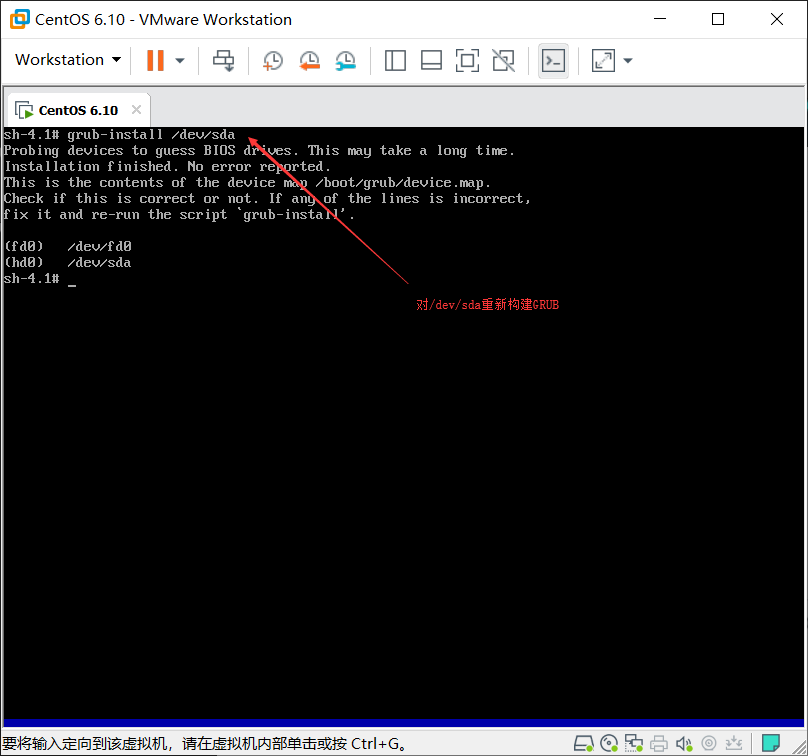

4. 修复`GRUB`的各个阶段  

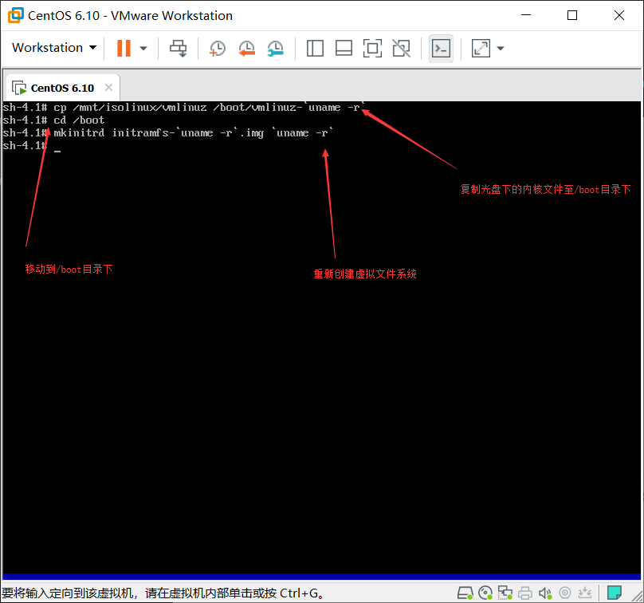

5. 由于`grub-install`修复了`grub`的各阶段但没有`grub`的配置文件，所以需要手动写配置文件。

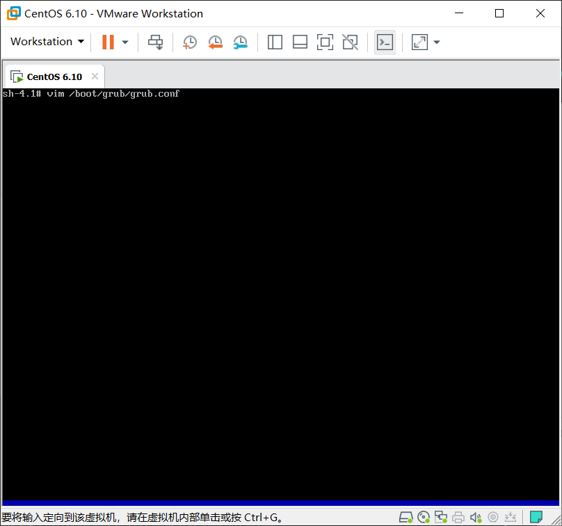

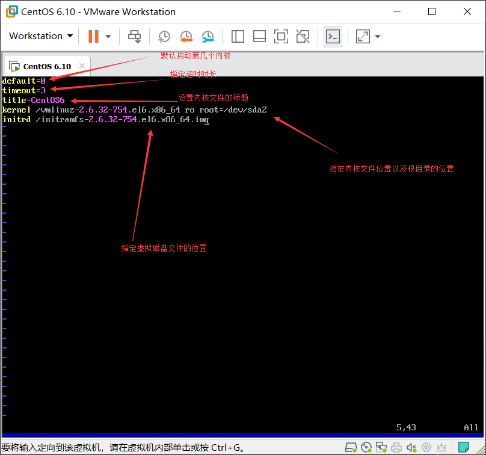

注意：`kenerl`和`initrd`次序绝对不能错，次序错误会导致系统不能正常启动  

修复完毕，重启能正常进入系统

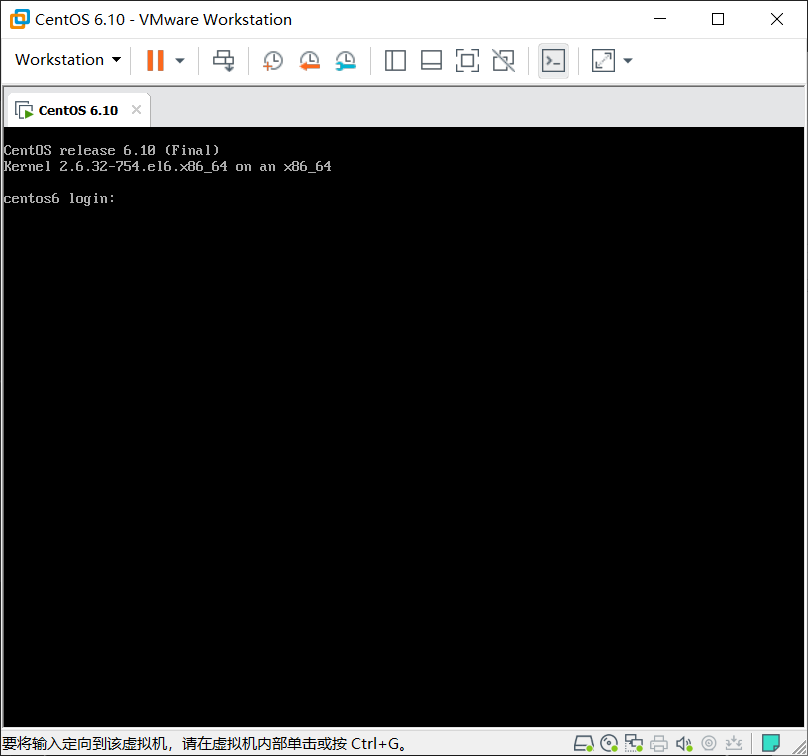

***
### `CentOS7` 删除`boot`恢复

#### 一、执行破坏操作

```bash
[root@centos7 /]# rm -rf boot
rm: cannot remove ‘boot’: Device or resource busy
[root@centos7 boot]# sync
```
#### 二、重启查看效果

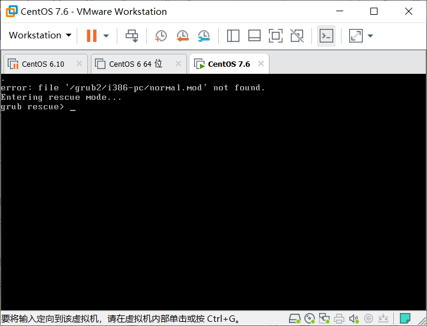

#### 三、修复  

1. 重启进入救援模式  

由于救援模式下把系统的根挂载至了`mnt/sysroot`下所以需要先切换根，然后挂载光盘文件至`mnt`目录下，安装内核。在使用`grub2-instal`装`grub2`。


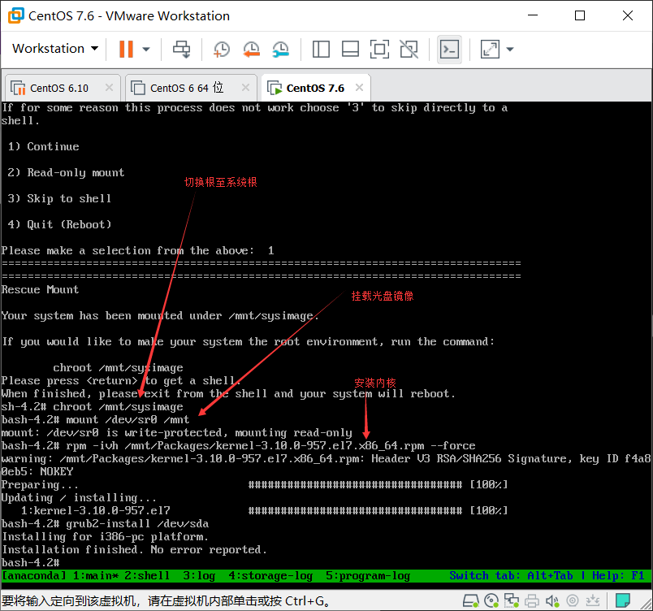

`grub2`安装完毕此时还缺少启动所需要的`grub.cfg`文件，所以需要使用`grub2-mkconfig`来生成此文件

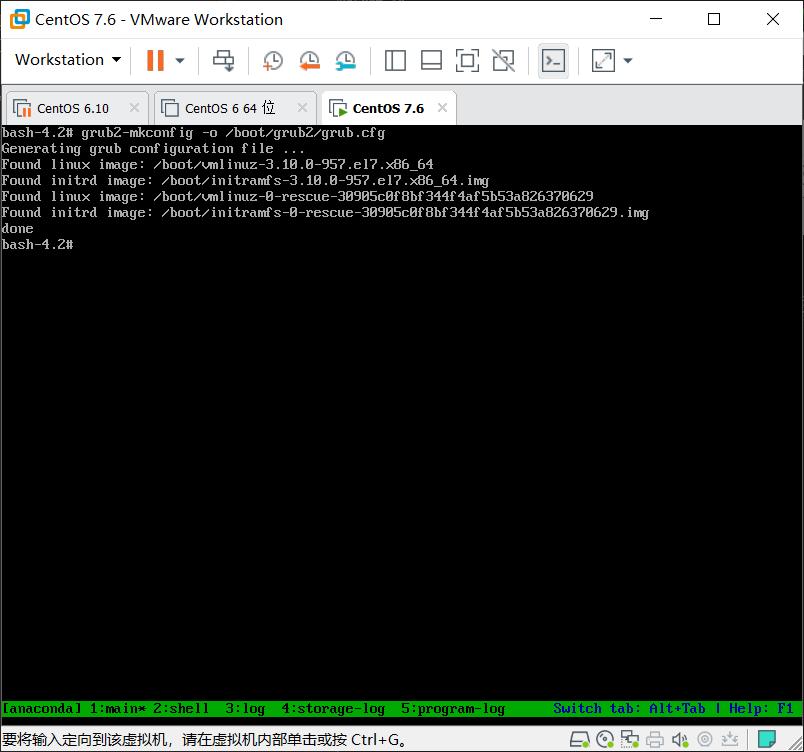

重启后正常进入系统

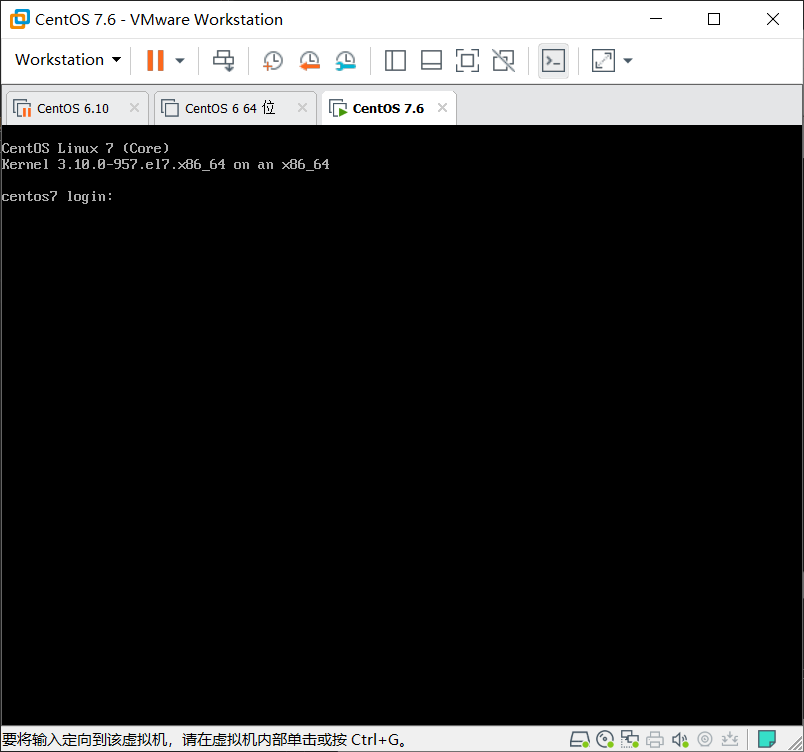