## `fstab`和`boot`目录删除及恢复方法

以下为演示当`fstab`和`boot`都丢失时的错误状态以及恢复的方法

### 环境准备

删除`/etc/fstab`,`/boot`目录

```bash
[root@centos6 ~]# rm -rf /etc/fstab /boot
rm: cannot remove `/boot': Device or resource busy
[root@centos6 ~]# sync
```

重启查看故障状态

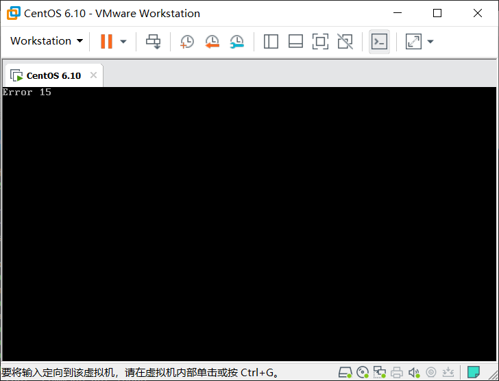

### 修复

1. 启动光盘救援模式

由于`/etc/fstab`文件被删除此时系统找不到硬盘相对应的挂载位置所以此处提示没有`Linux`分区

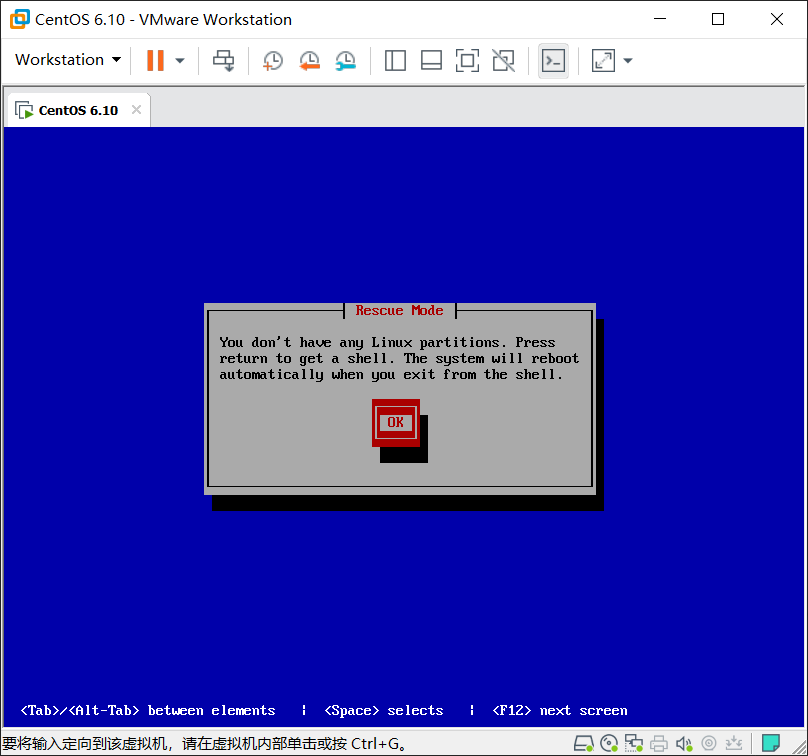

2. 查看下所有硬盘分区信息

发现所有磁盘分区信息均能看见，此时可以判断`/dev/sda1`为`boot`目录，`/dev/sda2`为根目录。

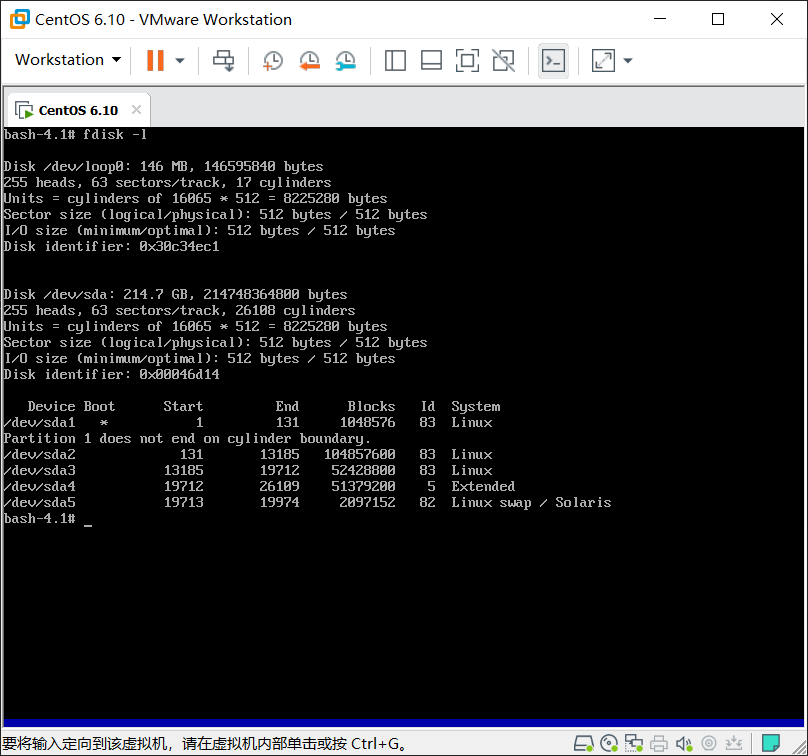

3. 手动将硬盘分区挂载

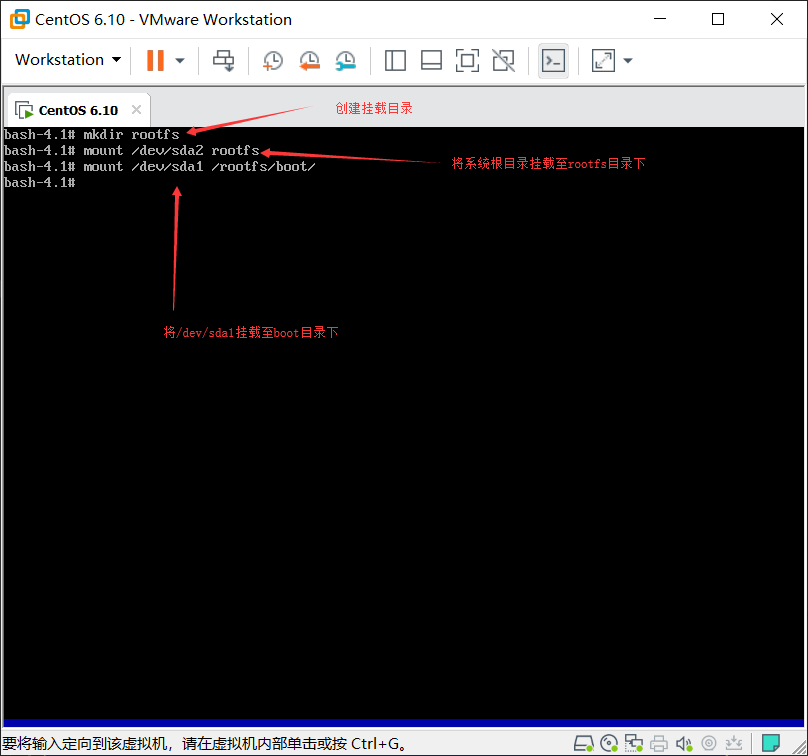

4. 将根切换至硬盘的根目录，并创建`fstab`文件

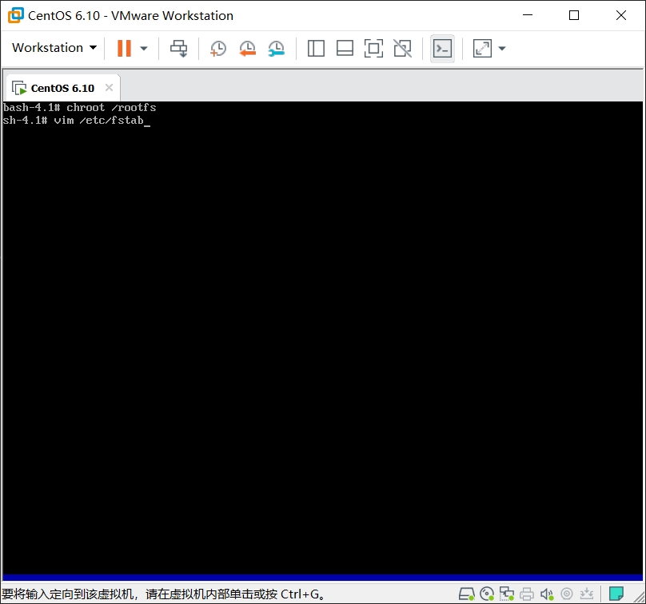

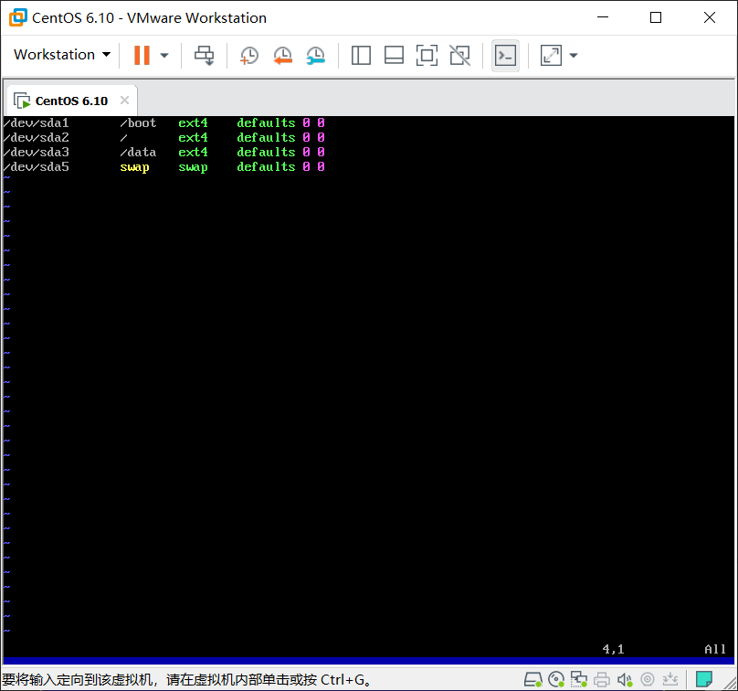

5. 重启后再次进入救援模式，查看系统的根目录是否能被正常找到。

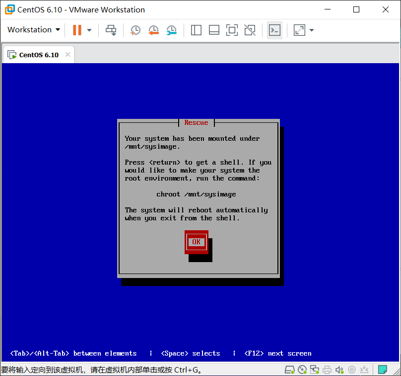

此时救援光盘上的系统已经能够正常识别磁盘的根文件系统系统

***
接下来要执行的为修复内核和`grub`的过程

1. 切换根至硬盘目录下，挂载光盘至`/mnt`目录下 

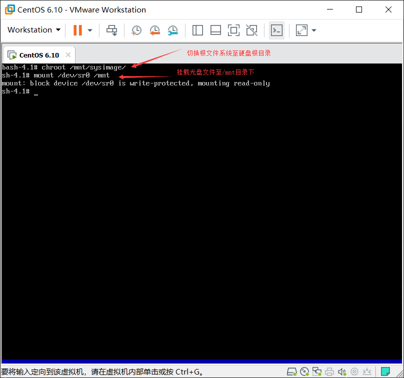

 

2. 复制内核文件至`/boot`目录下，并在`/boot`目录下创建虚拟文件系统。 

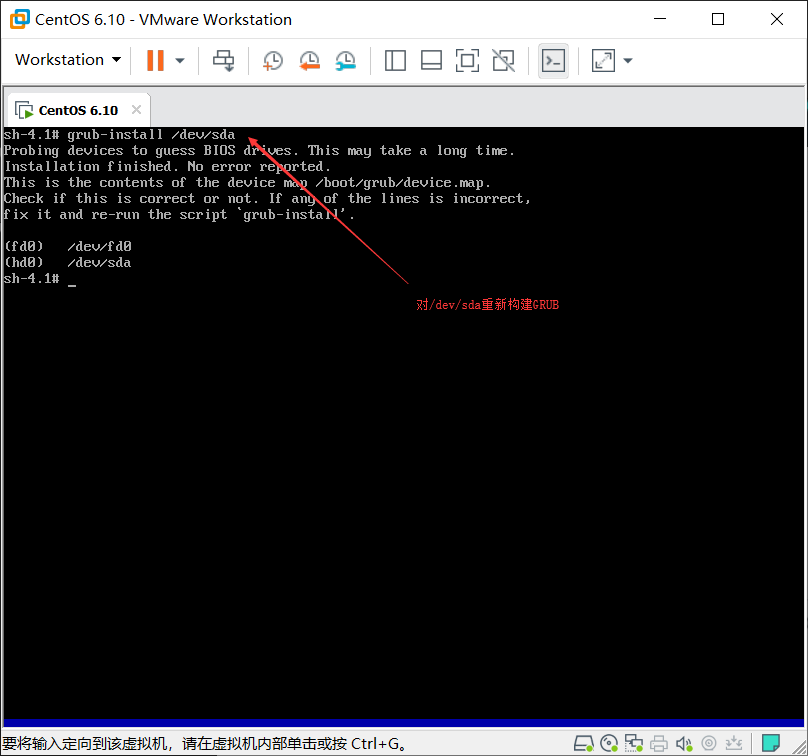

3. 修复`GRUB`的各个阶段 

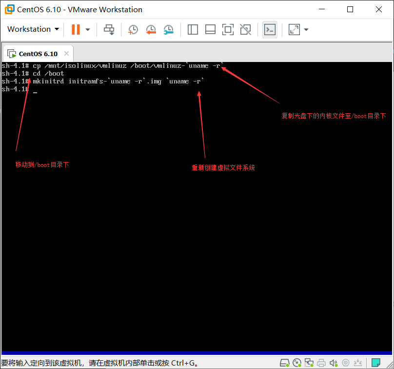

4. 由于`grub-install`修复了`grub`的各阶段但没有`grub`的配置文件，所以需要手动写配置文件。

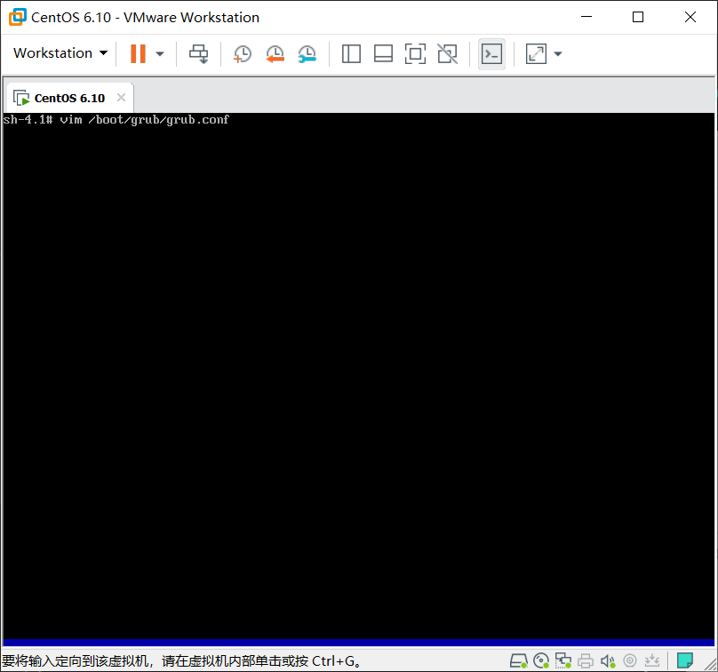

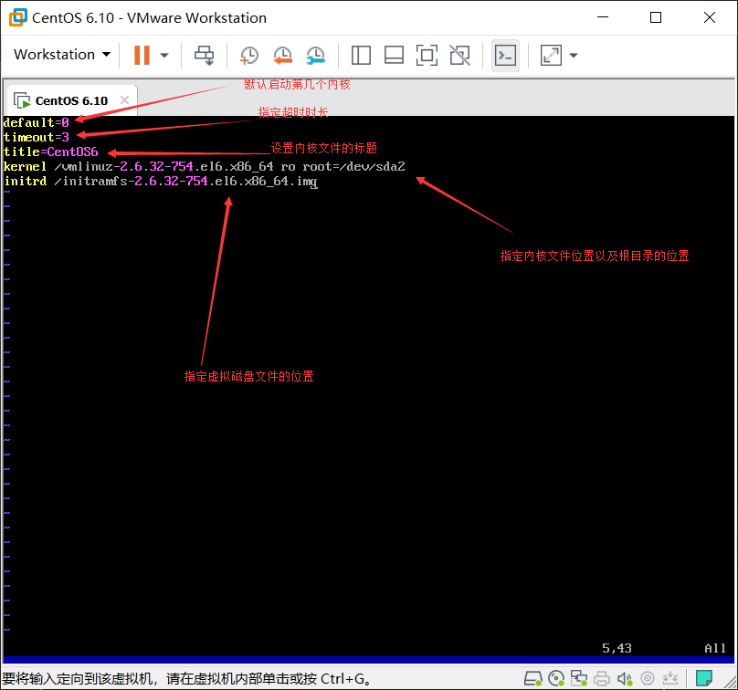

注意：`kenerl`和`initrd`次序绝对不能错，次序错误会导致系统不能正常启动  

修复完毕，重启能正常进入系统

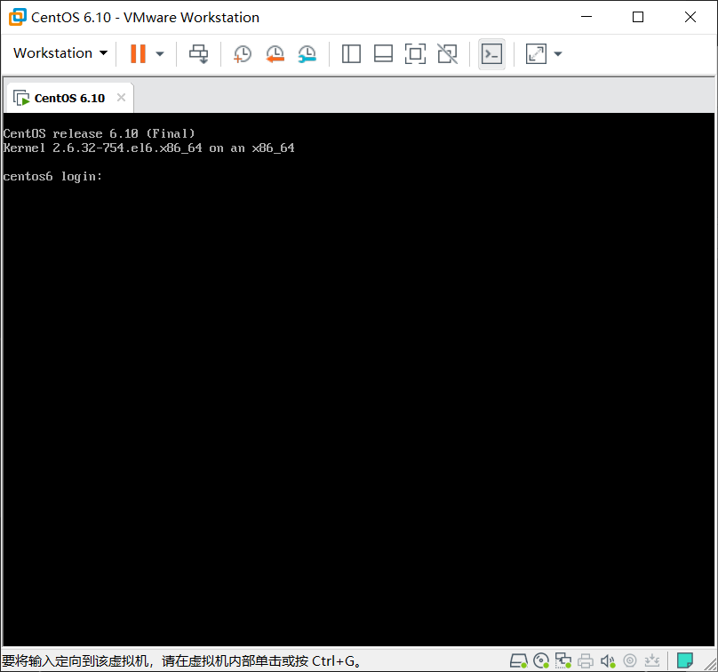