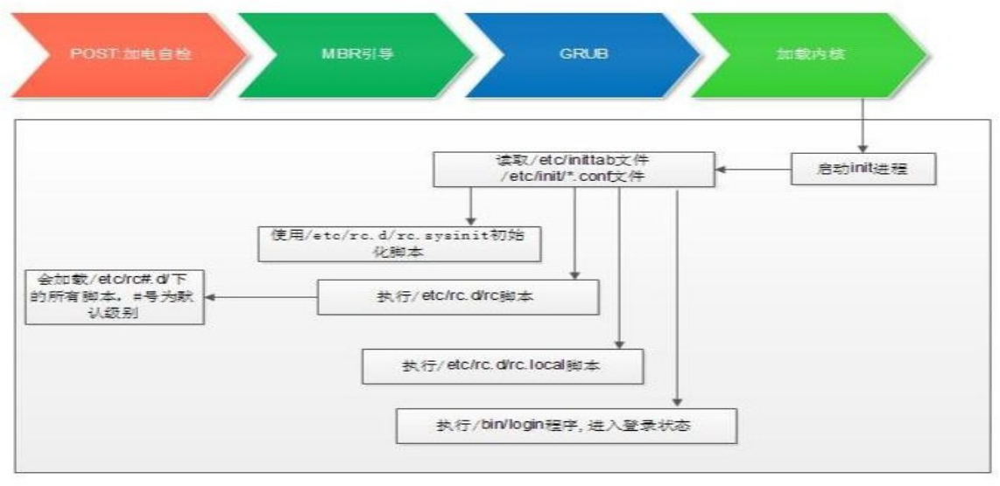

## Linux系统启动流程

`CentOS5/6/7`的启动流程大致相似，细节上略为不同。

### `Linux`组成

Linux: `kernel`+`rootfs`。目前的Linux是由内核和文件系统相关的工具组合而成。

* `kernel`: 进程管理、内存管理、网络管理、驱动程序、文件系统、安全功能

* `rootfs`: 程序和`glibc`

* 库: 函数集合, function, 调用接口（头文件负责描述） 
* 程序: 二进制执行文件

内核设计流派：

* 单内核(`monolithic kernel`): `Linux`把所有功能集成于同一个程序

* 微内核(`micro kernel`): `Windows`,`Solaris`每种功能使用一个单独子系统实现

### `CentOS6`启动流程



`CentOS6`启动步骤大致分为一下10个步骤：

1. 加载`BIOS`的硬件信息，获取第一个启动设备

2. 读取第一个启动设备`MBR`的引导加载程序(`grub`)的启动信息

3. 加载核心操作系统的核心信息，核心开始解压缩，并尝试驱动所有的硬件设备

4. 核心执行`init`程序，并获取默认的运行信息
5. `init`程序执行`/etc/rc.d/rc.sysinit`文件

6. 启动核心的外挂模块

7. `init`执行运行的各个批处理文件(`scripts`) 
8. `init`执行`/etc/rc.d/rc.local`

9. 执行`/bin/login`程序，等待用户登录

10. 登录之后开始以`Shell`控制主机

#### `post`加电自检

`POST`: `Power-On-Self-Test`，加电自检，是BIOS功能的一个主要部分。负责完成对CPU、主板、内存、硬盘子系统、显示子系统、串并行接口、键盘等硬件情况的检测。

* `ROM`: `BIOS`，`Basic Input and Output System`，保存着有关计算机系统最重要的基本输入输出程序，系统信息设置、开机加电自检程序和系统启动自举程序等

* `RAM`：`CMOS`互补金属氧化物半导体，保存各项参数的设定

* 按次序查找引导设备，第一个有引导程序的设备为本次启动设备

#### `bootloader`引导加载器

一般启动是是用硬盘来进行引导，所以需要从硬盘上加载引导程序。这个引导程序就是`bootloader`

`bootloader`: 引导加载器，引导程序。不同的操作系统的引导程序不同。

* `windows`: `ntloader`，仅是启动OS

* `Linux`：功能丰富，提供菜单，允许用户选择要启动系统或不同的内核版本；把用户选定的内核装载到内存中的特定空间中，解压、展开，并把系统控制权移交给内核。
  * `LILO`：`LInux LOader`，早期Linux启动使用的`bootloader`。`CentOS5`版本后淘汰，改用`GRUB`。
  * `GRUB`: `GRand Unified Bootloader`
    * `GRUB 0.X`: `GRUB Legacy`， `GRUB2`(`CentOS7`后使用)

##### `GRUB`的存放位置

`MBR`分区：第一个扇区的前446个字节，存放的就是`bootloader`，中间64字节为分区表，最后为`55AA`标记位置

需要注意的是前446个字节只是存放了`GRUB`的其中一部分程序，另一部分存放在了`/boot`分区内。

GRUB分为两个阶段

* `primary boot loader` : 分区表内的为第一阶段(1st stage)，1.5 stage 
* `secondary boot loader` : `/boot`分区内的文件为第二阶段(2nd stage)，分区文件

`GRUB`启动完毕后会将程序的启动权限交给内核

#### `kernel`内核

`GRUB`启动完毕交给内核后内核会进行初始化工作：

1. 探测可识别到的所有硬件设备

2. 加载硬件驱动程序（借助于`ramdisk`加载驱动） 
3. 以只读方式挂载根文件系统
4. 运行用户空间的第一个应用程序: `/sbin/init`

##### Linux内核特点：

* 支持模块化：`.ko`（内核对象）如：文件系统，硬件驱动，网络协议等
* 支持内核模块的动态装载和卸载

##### 内核组成部分：

* 核心文件：`/boot/vmlinuz-VERSION-release`
  * `ramdisk`: 辅助的伪根系统。对于必要的驱动文件会存放在此伪根系统中。
    * `CentOS 5`: `/boot/initrd-VERSION-release.img`
    * `CentOS 6,7`: `/boot/initramfs-VERSION-release.img`

模块文件：`/lib/modules/VERSION-release`

##### `ramdisk`：

内核中的特性之一：使用缓冲和缓存来加速对磁盘上的文件访问，并加载相应的硬件驱动

在`CentOS5`上系统启动时，内核需要先加载`ramdisk`，通过`ramdisk`进加载文件系统，速度偏慢。

在`CentOS6`后改为了`ramfs`，系统启动后内核直接加载文件系统，从而提高了速度。

`ramdisk` --> `ramfs`提高速度

`CentOS 5`: `initrd.img`

* 工 具 程 序: `mkinitrd` 

`CentOS 6，7`: `initramfs.img`

* 工具程序: `mkinitrd`, `dracut`

**注意**：一但此文件遭到破坏，系统将无法启动。此时需要进入救援模式重新制作`ramdisk`文件

```bash
# ramdisk文件的制作：
# (1)mkinitrd命令
# 为当前正在使用的内核重新制作ramdisk文件
mkinitrd /boot/initramfs-$(uname -r).img $(uname -r)
# (2)dracut命令
# 为当前正在使用的内核重新制作ramdisk文件
dracut /boot/initramfs-$(uname -r).img $(uname -r)
```

##### 系统初始化流程：

`POST` --> `BootSequence(BIOS)` --> `Bootloader(MBR)` -->`kernel(ramdisk)` --> `rootfs(readonly)` --> `init(systemd)`

`init`程序的类型：

* `SysV`: `init`, `CentOS 5`之前
  * 配置文件：`/etc/inittab`

* Upstart: `init`, `CentOS 6`
  * 配置文件: `/etc/inittab`, `/etc/init/*.conf`

* `Systemd`: `systemd`, `CentOS 7`
  * 配置文件：`/usr/lib/systemd/system`, `/etc/systemd/system`

#### `init`初始化

`init`进程再运行时有一些初始化的配置文件`centos6`及`centos6`之前的系统会读取一个专门的配置文件`/etc/inittab`，来决定运行再哪种模式下。

```bash
]# vim /etc/inittab
# inittab is only used by upstart for the default runlevel.
#
# ADDING OTHER CONFIGURATION HERE WILL HAVE NO EFFECT ON YOUR SYSTEM.
#
# System initialization is started by /etc/init/rcS.conf
#
# Individual runlevels are started by /etc/init/rc.conf
#
# Ctrl-Alt-Delete is handled by /etc/init/control-alt-delete.conf
#
# Terminal gettys are handled by /etc/init/tty.conf and /etc/init/serial.conf,
# with configuration in /etc/sysconfig/init.
#
# For information on how to write upstart event handlers, or how
# upstart works, see init(5), init(8), and initctl(8).
#
# Default runlevel. The runlevels used are:
#   0 - halt (Do NOT set initdefault to this)
#   1 - Single user mode
#   2 - Multiuser, without NFS (The same as 3, if you do not have networking)
#   3 - Full multiuser mode
#   4 - unused
#   5 - X11
#   6 - reboot (Do NOT set initdefault to this)
# 
id:3:initdefault:
# id: 表示行标识
# 3: 表示3模式
# initdefault: 表示开机进入此模式
```

运行级别：为系统运行或维护等目的而设定；`0-6`: 7个级别

* 0：关机

* 1：单用户模式(root自动登录), single, 维护模式

* 2: 多用户模式，启动网络功能，但不会启动NFS；维护模式

* 3：多用户模式，正常模式；文本界面

* 4：预留级别；可同3级别

* 5：多用户模式，正常模式；图形界面

* 6：重启

默认级别：3, 5

切换级别：`init #`

查看级别：`runlevel`; `who` 

##### `CentOS6 `中`/etc/inittab`和相关文件

```bash
/etc/inittab  #设置系统默认的运行级别
/etc/init/control-alt-delete.conf
/etc/init/tty.conf
/etc/init/start-ttys.conf
/etc/init/rc.conf
/etc/init/prefdm.conf
```

##### `init`启动流程

根据`/etc/rc.d/rc.sysinit`中所定义的内容来进行启动的初始化，主要按照以下顺序进行执行

1. 设置主机名
2. 设置欢迎信息
3. 激活`udev`和`selinux`
4. 挂载`/etc/fstab`文件中定义的文件系统
5. 检测根文件系统，并以读写方式重新挂载根文件系统
6. 设置系统时钟
7. 激活`swap`设备
8. 根据`/etc/sysctl.conf`文件设置内核参数
9. 激活`lvm`及`software raid`设备
10. 加载额外设备的驱动程序
11. 清理操作

以上流程执行完毕后，会继续执行`/etc/rc.d/rcN.d/`目录下的脚本，N为当前的运行级别。

`/etc/rc.d/rcN.d`目录下存在众多的脚本文件，分别以K和S加上数字命名，其中K开头表示开机后对应的服务不启动，S开头表示对应的服务开机启动。：

* `K*`: 如`K##*`其中`##`表示运行次序；数字越小，越先运行；数字越小的服务，通常为依赖到别的服务。

* `S*`: `如S##*`其中`##`表示运行次序；数字越小，越先运行；数字越小的服务，通常为被依赖到的服务。

  ```bash
  # 开机服务启动脚本
  # 关闭和开启服务的执行次序如下，其会按照字符的大小排序进行关闭进程和开启服务
  for srv in /etc/rc.d/rcN.d/K*; do
  	$srv stop
  done
  for srv in /etc/rc.d/rcN.d/S*; do
  	$srv start
  done
  ```


注意：自己定义的服务启动脚本的数字往后排，因为服务可能存在依赖关系。所依赖的服务需要先启动，否则将启动失败。

##### `ntsysv`命令

`ntsysv`命令可以用来修改当前模式下，程序是否自动启动。设置完成后下次重启时生效。

```bash
]# ntsysv
```

若要修改指定模式下的程序的运行，则需要指定`level`级别

```bash
]# ntsysv --level=N
# N表是0-6级别
```

##### `chkconfig`命令

`ntsysv`一次只能修改一个级别的启动项，使用chkconfig命令可以一次对多个级别的开机启动做修改。

查看服务在所有级别的启动或关闭设定情形: 

```bash
chkconfig [--list] [name]
```

添加：

```bash
chkconfig --add name
```

删除：

```bash
chkconfig --del name
```

修改指定的链接类型: 

```bash
chkconfig [--level levels] name <on|off|reset>
# --level LLLL: 指定要设置的级别；省略时表示2345
```

##### `service`命令

手动管理服务，用来管理本次启动的服务的状态

```bash
service 服务 start|stop|restart 
service --status-all
```

##### 自定义服务启动脚本

`SysV`的服务脚本放置于`/etc/rc.d/init.d` (`/etc/init.d`)

启动脚本有格式要求：

1. 首行为shabang机制
2. 有`chkconfig`描述行
3. 需要将脚本存放于`/etc/rc.d/init.d` 目录下

```bash
#!/bin/bash
# chkconfig: LLLL nn nn

# LLLL 表示初始在哪个级别下启动，-表示都不启动
# 第一个nn 表示启动服务时的顺序
# 第二个nn 表示关闭服务时的顺序
# 需要注意的是，启动服务数值大时，关闭服务的数字必然小，反之亦然。

```

##### 服务脚本示例

1. 在`/etc/rc.d/init.d/`目录下创建出脚本文件

```bash
[root@mylinuxops ~]# vim /etc/rc.d/init.d/testsvc

#!/bin/bash
#
#chkconfig: - 96 2
#description: test service

SVC=`basename $0`
source /etc/rc.d/init.d/functions

start(){
    if [ -f /var/lock/subsys/$SVC ];then
        echo "$SVC has been started"
    else
        touch /var/lock/subsys/$SVC
        action "starting $SVC" true
    fi
}

stop(){
    if [ -f /var/lock/subsys/$SVC ];then
        rm -rf /var/lock/subsys/$SVC
        action "stopping $SVC" true
    fi
}

status(){
    if [ -f /var/lock/subsys/$SVC ];then
        echo $SVC is running...
    else
        echo $SVC is stopped...
    fi
}

case $1 in
start)
    $1
    ;;
stop)
    $1
    ;;
restart)
    stop
    start
    ;;
status)
    $1
    ;;
*)
    echo "Syntex error\nUseage: service $SVC start|stop|restart|status"
    ;;
esac
```

2. 将服务脚本添加`chkconfig`列表

```
[root@mylinuxops init.d]# chkconfig --add testsvc
```

3. 将服务设置为开机启动

```bash
# 由于启动脚本中chkconfig行使用了-所以默认所有级别下开机不启动
[root@mylinuxops init.d]# chkconfig testsvc on
```

4. 启动服务

```bash
# 使用service命令启动服务。
[root@mylinuxops init.d]# service testsvc start
```

##### 注意事项

正常级别下，最后启动一个服务`S99local`没有链接至`/etc/rc.d/init.d`一个服务脚本，而是指向了`/etc/rc.d/rc.local`脚本

不便或不需写为服务脚本放置于`/etc/rc.d/init.d/`目录，且又想开机时自动运行的命令，可直接放置于`/etc/rc.d/rc.local`文件中

`/etc/rc.d/rc.local`在指定运行级别脚本后运行，可以根据情况，进行自定义修改

`CentOS7`需要对此文件添加执行权限才能有效。

##### `xinetd`服务

我们有时候希望某些服务开机不自动启动，当需要使用它时，服务会自动启动。这时候就需要一种服务来解决。

这种服务叫做非独立服务，非独立服务启动与否是由一个代理来监控，非独立服务平时的访问量不大，所以平时非独立服务让其运行或不运行都不合适，这时候就需要一个代理服务来监控网络中是否有用户来进行访问此服务。如果有人访问，则将此非独立服务唤醒来对外提供服务，等服务访问完毕后再将其关闭。如果有多个非独立服务，我们只需要一个代理服务来进行监听即可，当有人访问这些非独立服务中的一个时，只需要将其唤醒进行服务就可，当没人服务时将其关闭，只需要存在一个代理服务即可。在系统中这个代理服务就叫做`xinetd`。

瞬态（Transient）服务被xinetd进程所管理，进入的请求首先被`xinetd`代理

配置文件：

```bash
/etc/xinetd.conf
/etc/xinetd.d/<service> 与libwrap.so文件链接
```

用chkconfig控制的服务：

```bash
chkconfig tftp on
```

#### `CentOS6`启动过程总结

* 总结：`/sbin/init` --> (`/etc/inittab`) --> 设置默认运行级别 --> 运行系统初始脚本、完成系统初始化 --> (关闭对应下需要关闭的服务)启动需要启动服务 -->设置登录终端

* `CentOS 6` init程序为: `upstart`, 其配置文件：`/etc/inittab, /etc/init/*.conf`，配置文件的语法 遵循 upstart配置文件语法格式，和CentOS5不同。


