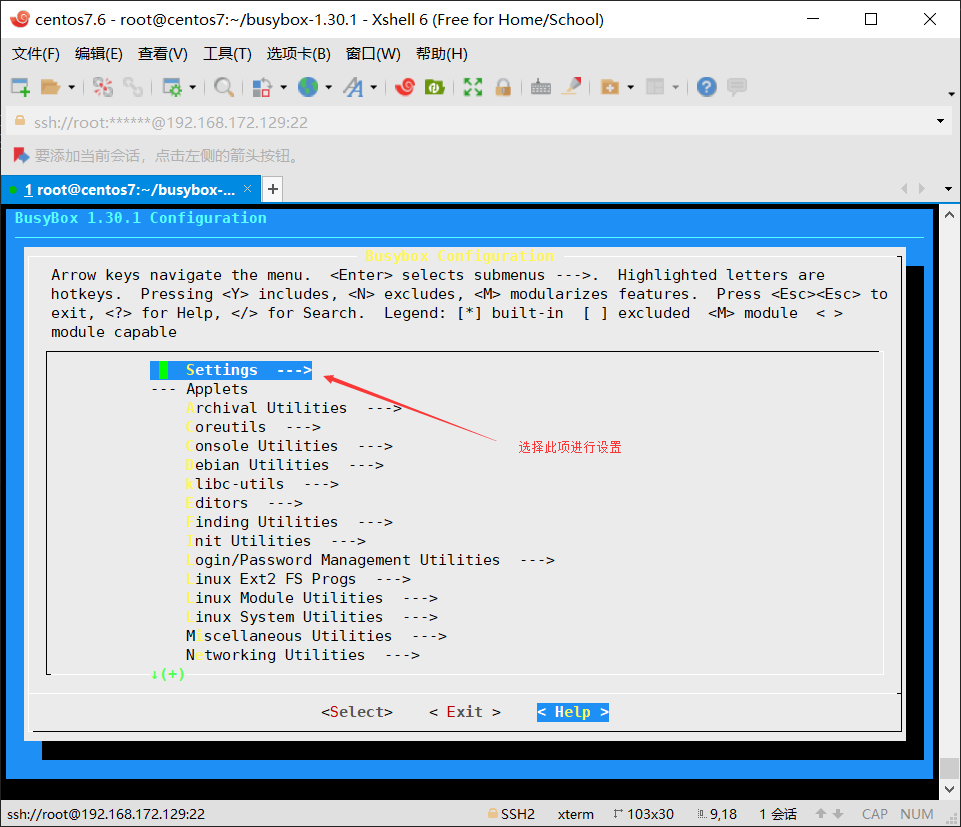
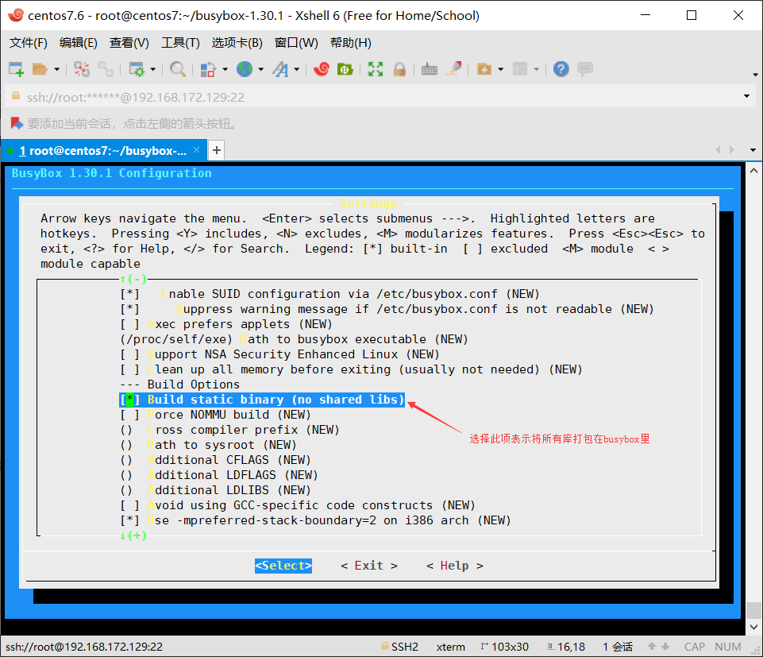

## busybox

`Busybox`最初是由 `Bruce Perens` 在 1996 年为 `Debian GNU/Linux` 安装盘编写的。其目标是在一张软盘(存储空间只有1.4-1.7MB)上创建一个可引导的`GNU/Linux`系统，可以用作安装盘和急救盘

`Busybox`是一个开源项目，遵循`GPL v2`协议。`Busybox`将众多的`UNIX`命令集合进一个很小的可执行程序中，可以用来替代`GNU fileutils`、`shellutils`等工具集。`Busybox`中各种命令与相应的`GNU`工具相比，所能提供的选项比较少，但是也足够一般的应用了。`Busybox`主要用于嵌入式系统

 

`Busybox`是一个集成了三百多个最常用`Linux`命令和工具的软件。`BusyBox`包含了一些简单的工具，例如`ls`、`cat`和`echo`等等，还包含了一些更大、更复杂的工具，例`grep`、`find`、`mount`以及`telnet`。有些人将 `BusyBox`称为`Linux`工具里的瑞士军刀。简单的说`BusyBox`就好像是个大工具箱，它集成压缩了`Linux`的许多工具和命令，也包含了 Android 系统的自带的shell

定制小型的`Linux`操作系统：`linux内核`+`busybox`

官方网站：https://busybox.net/

`busybox`的编译过程与`Linux`内核的编译类似

`busybox`的使用有三种方式：

* `busybox`后直接跟命令，如`busybox ls`

* 直接将`busybox`重命名，如`cp busybox tar`

* 创建符号链接，如 `ln -s busybox rm`

`busybox`的安装

以上方法中，第三种方法最方便，但为`busybox`中每个命令都创建一个软链接， 相当费事，`busybox`提供自动方法：`busybox`编译成功后，执行`make install`，则会产生一个`_install`目录，其中包含了`busybox`及每个命令的软链接


#### 源码编译`busybox`

##### 一、下载源码包

```bash
[root@centos7 ~]# wget https://busybox.net/downloads/busybox-1.30.1.tar.bz2
--2019-04-12 00:50:43--  https://busybox.net/downloads/busybox-1.30.1.tar.bz2
Resolving busybox.net (busybox.net)...
```
##### 二、解压源码包

```bash
[root@centos7 ~]# tar xf busybox-1.30.1.tar.bz2 
```
##### 三、进入busybox目录，执行make menuconfig命令

```bash
[root@centos7 ~]# cd busybox-1.30.1/
[root@centos7 busybox-1.30.1]# make menuconfig
```
手动选择选择所需要的模块





保存退出，此时在此目录下多出了一个.config的文件，里面保存的为刚才的配置

```bash
[root@centos7 busybox-1.30.1]# l.
.  ..  .config  .indent.pro  .kconfig.d  .kernelrelease
```
##### 四、使用make生成二进制文件

在使用前先安装相应的工具

```bash
[root@centos7 busybox-1.30.1]# yum install gcc gcc-c++ glibc glibc-devel pcre pcre-devel openssl openssl-devel systemd-devel zlib-devel libmcrypt-devel glibc-static ncurses-devel -y
```
使用make生成二进制文件
```bash
[root@centos7 busybox-1.30.1]# make
```
##### 五、编译完成，测试

```bash
[root@centos7 busybox-1.30.1]# ./busybox ls /
bin    data   etc    lib    media  opt    root   sbin   sys    usr
boot   dev    home   lib64  mnt    proc   run    srv    tmp    var
```
##### 六、使用make install

使用make install 生成一个_install文件夹，里面存放各种软链接，指向为busybox，将_install移走就能使用了

```bash
[root@centos7 busybox-1.30.1]# make install
```
##### 七、测试

将_install移动至/data/rootfs，由于没有bash无法切根所以需要创建一个bash的软链接

```bash
[root@centos7 busybox-1.30.1]# mv _install/ /data/rootfs
[root@centos7 busybox-1.30.1]# cd /data/rootfs
[root@centos7 rootfs]# cd bin/
[root@centos7 bin]# ln -s busybox ./bash
```
