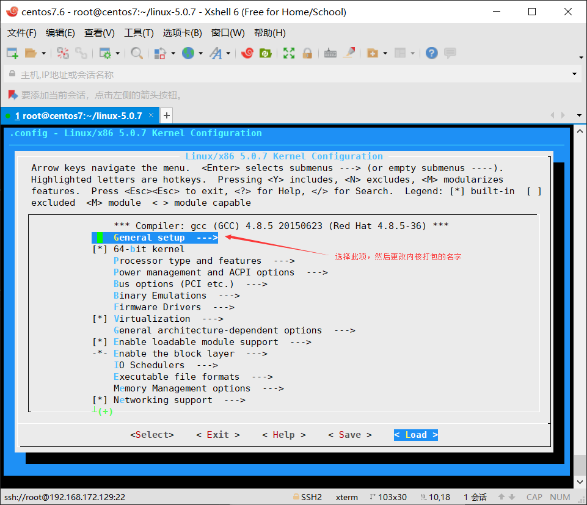
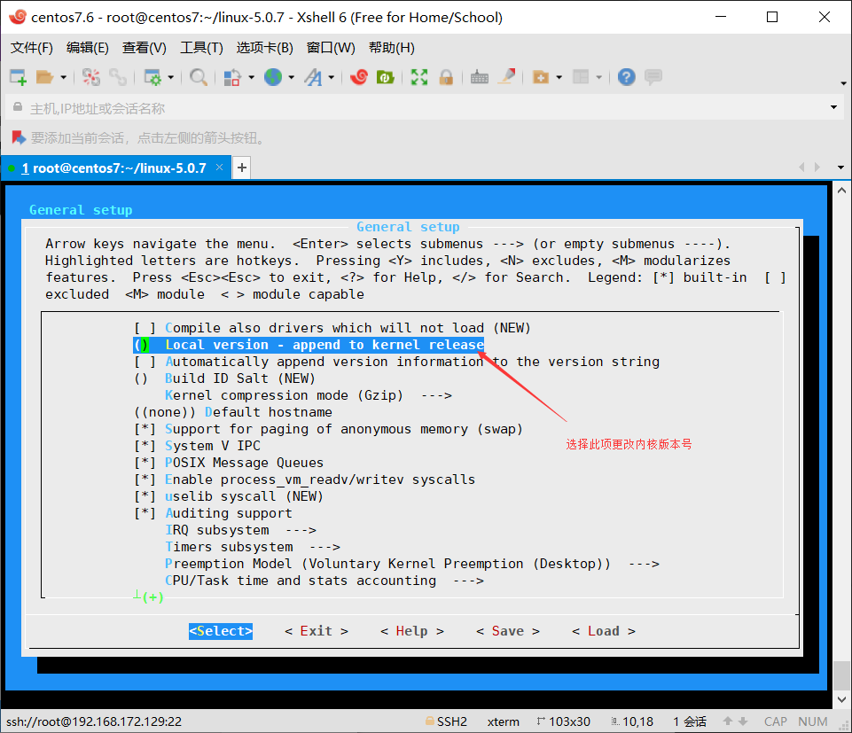
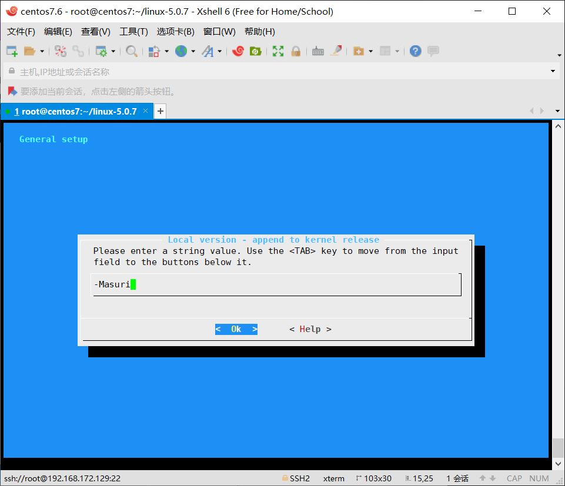
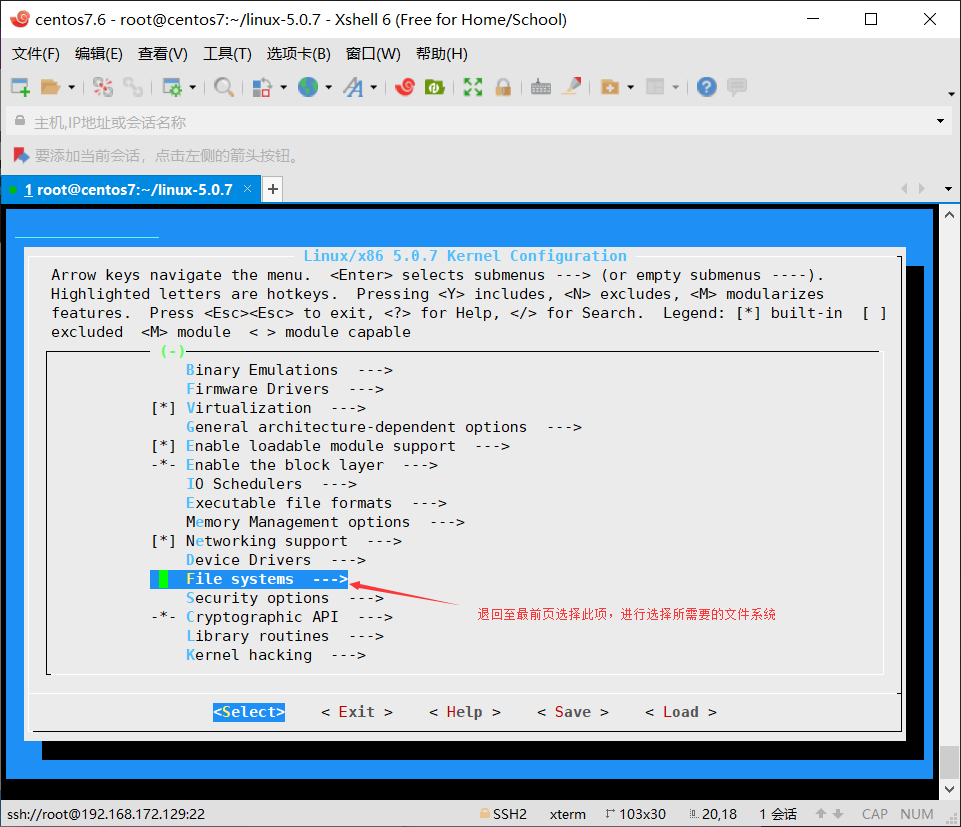
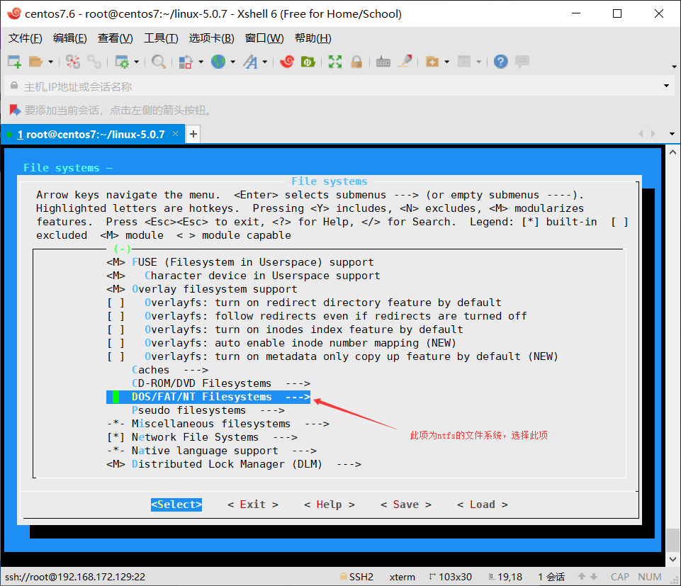
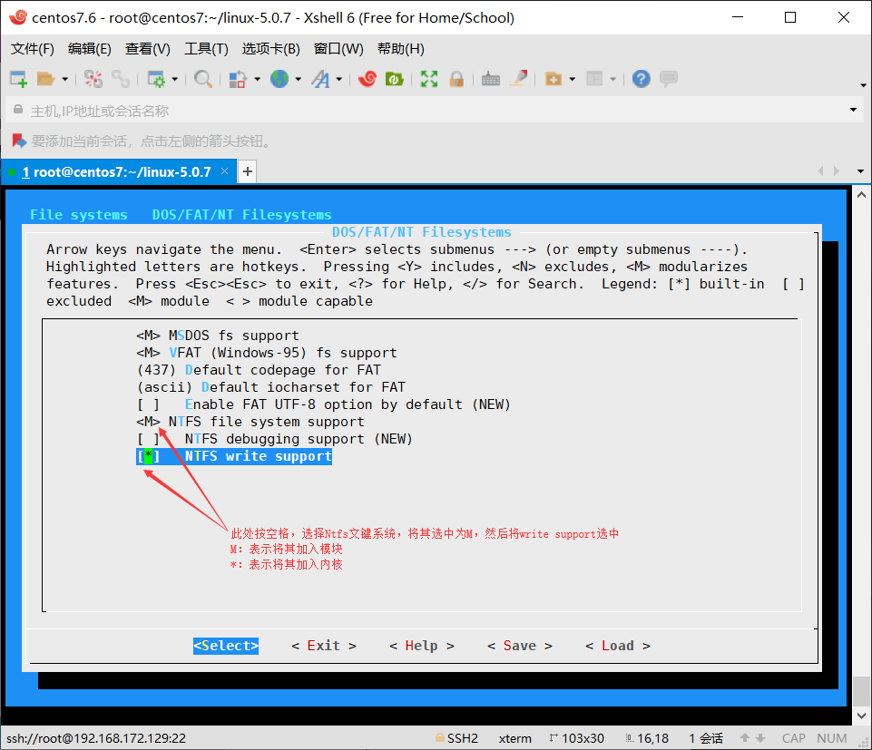
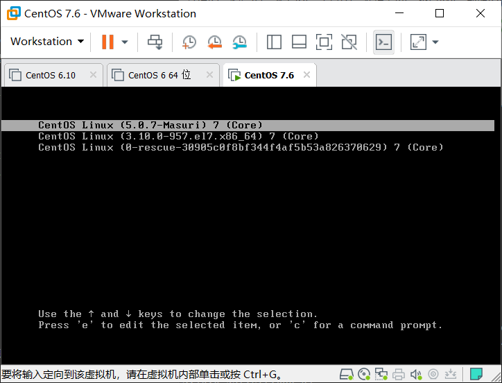

## 内核编译

内核的编译与普通的软件编译过程相似，只不过内核过于复杂。内核的功能非常丰富。使用命令行来进行编译太过复杂，一般使用菜单来加载选项进行编译。

单内核体系设计、但充分借鉴了微内核设计体系的优点，为内核引入模块化机制。

内核组成部分：

* `kernel`: 内核核心，一般为`bzImage`，通常在`/boot`目录下名称为`vmlinuz-VERSION-RELEASE`

* `kernel object`：内核对象，一般放置于`/lib/modules/VERSION-RELEASE/`

编译菜单内选项说明：

* `[ * ]`: 表示启用此功能，并打入到`/boot/vmlinuz-VERSION-RELEASE`文件中
* `[ M ]`: 表示以模块方式启用此功能，放入到`/lib/modules/VERSION-RELEASE/`中
* `[   ]`: 表示不启用此功能。

辅助文件：`ramdisk`, `initrd`, `initramfs`

### 编译前准备工作

在编译内核前需要先对当前的硬件进行一定的了解。比如以下信息。

#### 内核版本

##### `uname`命令

`uname` - `print system information`

```bash
 uname [OPTION]...
```

选项：

* `-n`: 显示节点名称

* `-r`: 显示`VERSION-RELEASE`

* `-a`: 显示所有信息

#### 内核模块相关

##### `lsmod`命令

显示由核心已经装载的内核模块

显示的内容来自于: `/proc/modules`文件

##### `modinfo`命令

显示模块的详细描述信息

```bash
modinfo [ -k kernel ] [ modulename|filename... ]
```

选项：

* `-n`: 只显示模块文件路径

* `-p`: 显示模块参数

* `-a`: 作者

* `-d`: 描述

示例：

```bash
lsmod |grep xfs
modinfo xfs
```

##### `modprobe`命令

装载或卸载内核模块

```bash
# 安装模块
modprobe [ -C config-file ]	[ modulename ]	[ module parame-ters... ] 
# 卸载模块
modprobe [ -r ] modulename…
```

配置文件：`/etc/modprobe.conf`, `/etc/modprobe.d/*.conf`

示例：

```bash
# 加载usb存储模块
[root@mylinuxops ~]# lsmod | grep usb
[root@mylinuxops ~]# modprobe usb_storage
[root@mylinuxops ~]# lsmod | grep usb
usb_storage            73728  0
# 卸载模块
[root@mylinuxops ~]# modprobe -r usb_storage
[root@mylinuxops ~]# lsmod | grep usb
```

##### `depmod`命令

内核模块依赖关系文件及系统信息映射文件的生成工具

##### 装载或卸载内核模块

使用一下两条命令装载和卸载模块不会自动解决依赖性，不推荐，建议使用`modprobe`

###### `insmod`命令

加载模块

```bash
insmod [ filename ]	[ module options...] 
```

示例：

```bash
insmod `modinfo –n exportfs`
lnsmod `modinfo –n xfs`
```

###### `rmmod`命令：

卸载模块

```bash
rmmod [modulename]
```

示例:

```bash
rmmod xfs
rmmod exportfs
```

####  硬件设备

##### `PCI`设备：

```bash
lspci [-v|-vv]
lsusb [-v|-vv]
lsblk BLOCK_DEV
```

##### 了解全部硬件设备信息`CentOS 6`使用

```bash
hal-device
```

***

### 编译安装Linux内核

在生产环境中某些软件依赖于较新的内核，此时就需要将内核进行升级，以下为演示手动编译安装较新的5.07内核的方法。

##### 一、下载内核

至内核官方网站下载内核www.kernel.org
##### 二、解压内核文件
```bash
[root@centos7 ~]# tar xf linux-5.0.7.tar.xz 
```
##### 三、准备`.config`文件
由于内核编译需要依靠`.config`这个配置文件，可以在系统自带的`config`文件的基础上进行修改，系统自带的`config`文件在`/boot`目录下，需要将其复制到内核解压的目录下并改名为`.config` 
```bash
[root@centos7 ~]# cp /boot/config-3.10.0-957.el7.x86_64 ~/linux-5.0.7/.config
```
##### 四、安装编译内核所需要的一些工具
```bash
[root@centos7 ~]# yum install gcc gcc-c++ glibc glibc-devel pcre pcre-devel ncurses-devel flex bison-devel bison perl-Test-Fatal  openssl-devel elfutils-libelf-devel -y
```
##### 五、执行`make menuconfig`命令
```bash
[root@centos7 linux-5.0.7]# make menuconfig
```
以下开始进入编译内核选项













##### 六、开始编译
```bash
[root@centos7 linux-5.0.7]# make -j 12
```
##### 七、执行make modules_install
执行make modules_install 在/lib/modules目录下生成新的内核模块
```bash
[root@centos7 linux-5.0.7]# make modules_install
```
##### 八、生成内核
```bash
[root@centos7 linux-5.0.7]# make install
Makefile:159: warning: overriding recipe for target `Makefile'
Makefile:125: warning: ignoring old recipe for target `Makefile'
sh ./arch/x86/boot/install.sh 5.0.7-Masuri arch/x86/boot/bzImage \
	System.map "/boot"
```
##### 九、重启选择5.07内核
重启选择新的内核



```bash
[masuri@centos7 ~]$ uname -r
5.0.7-Masuri
```
***
### 内核的卸载
##### 一、删除`/lib/modules`下相应的内核文件

```bash
[root@centos7 ~]# rm -rf /lib/modules/5.0.7-Masuri/
```
##### 二、删除`boot`下的相关内核文件

```bash
[root@centos7 ~]# rm -rf /boot/*-5.0.7-*
```
##### 三、清理`grub2`

此时`/boot/grub2/grub.cfg`中还有残留的版本信息，需要将其清理干净

```bash
menuentry 'CentOS Linux (5.0.7-Masuri) 7 (Core)' --class centos --class gnu-linux --class gnu --class os --unrestricted $menuentry_id_option 'gnulinux-3.10.0-957.el7.x86_64-advanced-45490aa4-cf29-420d-a606-af32688b6707' {
        load_video
        set gfxpayload=keep
        insmod gzio
        insmod part_msdos
        insmod xfs
        set root='hd0,msdos1'
        if [ x$feature_platform_search_hint = xy ]; then
          search --no-floppy --fs-uuid --set=root --hint-bios=hd0,msdos1 --hint-efi=hd0,msdos1 --hint-baremetal=ahci0,msdos1 --hint='hd0,msdos1'  15dcd896-b7cf-48d0-b8bd-4c0b0f2c62b2
        else
          search --no-floppy --fs-uuid --set=root 15dcd896-b7cf-48d0-b8bd-4c0b0f2c62b2
        fi
        linux16 /vmlinuz-5.0.7-Masuri root=UUID=45490aa4-cf29-420d-a606-af32688b6707 ro crashkernel=auto rhgb quiet LANG=en_US.UTF-8
        initrd16 /initramfs-5.0.7-Masuri.img
}
```
清理方法使用`grub2-mkconfig`重新生成新的`grub.cfg`文件
```bash
[root@centos7 ~]# grub2-mkconfig -o /boot/grub2/grub.cfg
```
***
### 其他
若要使用`ntfs`文件系统，可以不必重新编译内核，只需要安装`ntfs-3g`包就行，此包在`epel`源中。