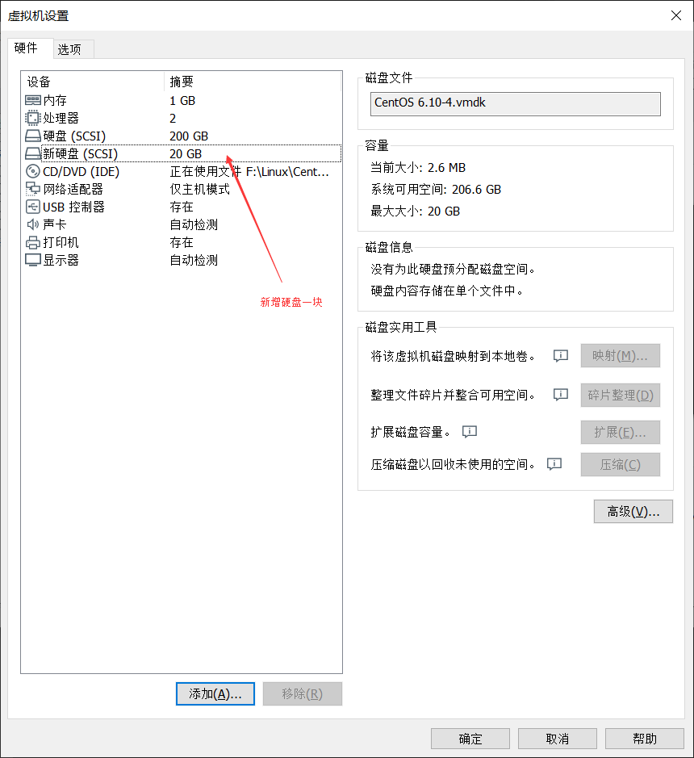
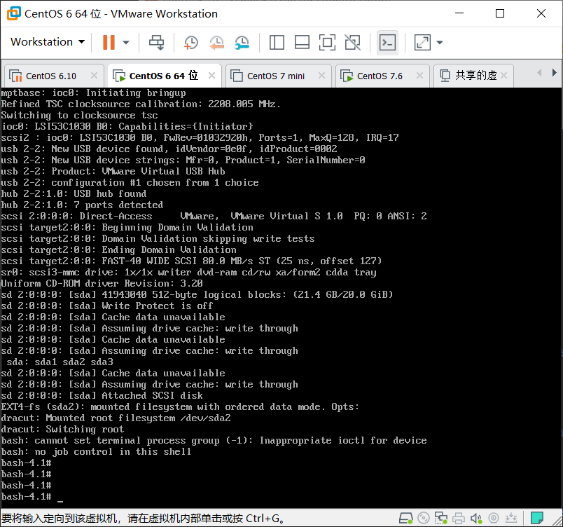
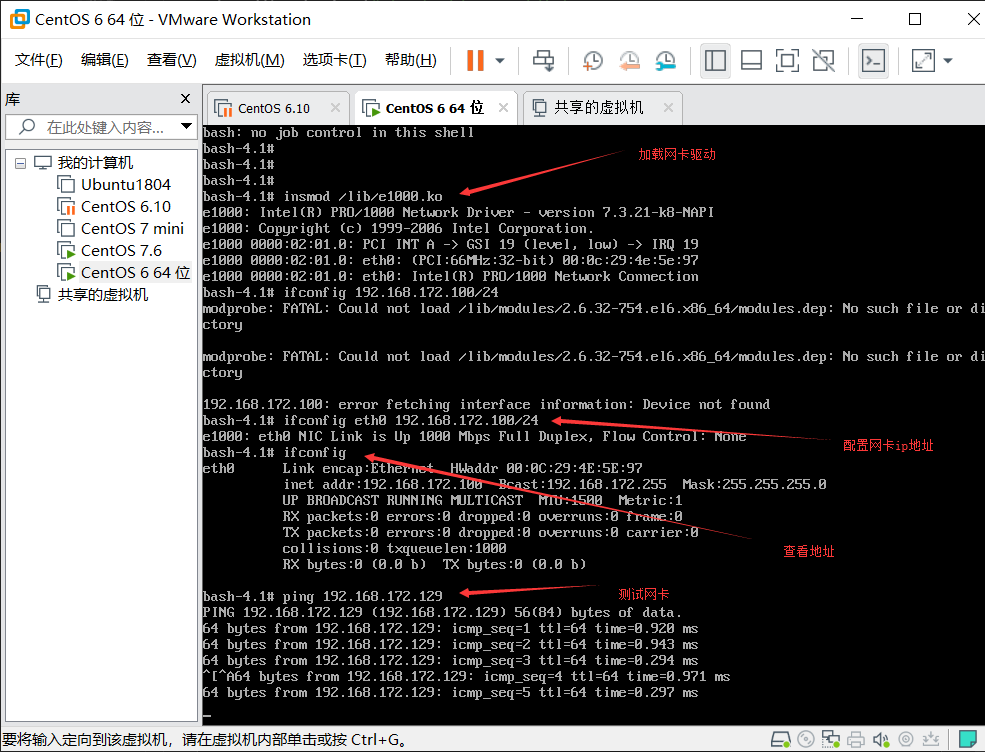

## 自制Linux系统

以下为使用现有的Linux系统对其制作出一个小型的Linux系统

### 一、新增一块硬盘作为自制Linux的系统盘



### 二、在新增硬盘上进行分区 

* 分区1为boot大小1G

* 分区2为/大小为10G

* 分区3为swap大小为2G

```bash
[root@centos6 ~]# fdisk /dev/sdb
Device contains neither a valid DOS partition table, nor Sun, SGI or OSF disklabel
Building a new DOS disklabel with disk identifier 0xc06ac594.
Changes will remain in memory only, until you decide to write them.
After that, of course, the previous content won't be recoverable.

Warning: invalid flag 0x0000 of partition table 4 will be corrected by w(rite)

WARNING: DOS-compatible mode is deprecated. It's strongly recommended to
         switch off the mode (command 'c') and change display units to
         sectors (command 'u').
#新建一个分区作为BOOT分区
Command (m for help): n
Command action
   e   extended
   p   primary partition (1-4)
p
Partition number (1-4): 1
First cylinder (1-2610, default 1): 
Using default value 1
Last cylinder, +cylinders or +size{K,M,G} (1-2610, default 2610): +1G
#新建一个分区作为/分区
Command (m for help): n
Command action
   e   extended
   p   primary partition (1-4)
p
Partition number (1-4): 2
First cylinder (133-2610, default 133): 
Using default value 133
Last cylinder, +cylinders or +size{K,M,G} (133-2610, default 2610): +10G
#新建一个分区作为swap分区
Command (m for help): n
Command action
   e   extended
   p   primary partition (1-4)
p
Partition number (1-4): 3
First cylinder (1439-2610, default 1439): 
Using default value 1439
Last cylinder, +cylinders or +size{K,M,G} (1439-2610, default 2610): +2G
#更改SWAP分区标签
Command (m for help): t
Partition number (1-4): 3
Hex code (type L to list codes): 82
Changed system type of partition 3 to 82 (Linux swap / Solaris)
#查看下所创建的分区是否正确
Command (m for help): p

Disk /dev/sdb: 21.5 GB, 21474836480 bytes
255 heads, 63 sectors/track, 2610 cylinders
Units = cylinders of 16065 * 512 = 8225280 bytes
Sector size (logical/physical): 512 bytes / 512 bytes
I/O size (minimum/optimal): 512 bytes / 512 bytes
Disk identifier: 0xc06ac594

   Device Boot      Start         End      Blocks   Id  System
/dev/sdb1               1         132     1060258+  83  Linux
/dev/sdb2             133        1438    10490445   83  Linux
/dev/sdb3            1439        1700     2104515   82  Linux swap / Solaris
#确认无误写入磁盘
Command (m for help): w
The partition table has been altered!

Calling ioctl() to re-read partition table.
Syncing disks.
```
### 三、对3个分区创建文件系统

1. sdb1使用ext4文件系统

```bash
[root@centos6 ~]# mkfs.ext4 /dev/sdb1
mke2fs 1.41.12 (17-May-2010)
Filesystem label=
OS type: Linux
Block size=4096 (log=2)
Fragment size=4096 (log=2)
Stride=0 blocks, Stripe width=0 blocks
66384 inodes, 265064 blocks
13253 blocks (5.00%) reserved for the super user
First data block=0
Maximum filesystem blocks=272629760
9 block groups
32768 blocks per group, 32768 fragments per group
7376 inodes per group
Superblock backups stored on blocks: 
	32768, 98304, 163840, 229376

Writing inode tables: done                            
Creating journal (8192 blocks): done
Writing superblocks and filesystem accounting information: done

This filesystem will be automatically checked every 21 mounts or
180 days, whichever comes first.  Use tune2fs -c or -i to override.
```
2. /使用ext4系统

```bash
[root@centos6 ~]# mkfs.ext4 /dev/sdb2
mke2fs 1.41.12 (17-May-2010)
Filesystem label=
OS type: Linux
Block size=4096 (log=2)
Fragment size=4096 (log=2)
Stride=0 blocks, Stripe width=0 blocks
655776 inodes, 2622611 blocks
131130 blocks (5.00%) reserved for the super user
First data block=0
Maximum filesystem blocks=2688548864
81 block groups
32768 blocks per group, 32768 fragments per group
8096 inodes per group
Superblock backups stored on blocks: 
	32768, 98304, 163840, 229376, 294912, 819200, 884736, 1605632

Writing inode tables: done                            
Creating journal (32768 blocks): done
Writing superblocks and filesystem accounting information: done

This filesystem will be automatically checked every 31 mounts or
180 days, whichever comes first.  Use tune2fs -c or -i to override.
```
3. `sdb3`使用`swap`系统

```bash
[root@centos6 ~]# mkswap /dev/sdb3
Setting up swapspace version 1, size = 2104508 KiB
no label, UUID=2ae55ed1-8e5c-4d45-853d-1a4c94badfc2
```
### 四、对分区进行挂载

把`sdb1`挂载在`/mnt/boot`下，`sdb2`挂载在`/mnt/sysroot`下

```bash
[root@centos6 /]# mkdir /mnt/boot
[root@centos6 /]# mount /dev/sdb1 /mnt/boot
[root@centos6 /]# mkdir /mnt/sysroot
[root@centos6 /]# mount /dev/sdb2 /mnt/sysroot
```
### 五、在`/mnt/sysroot`下创建相应的根文件系统目录

```bash
[root@centos6 sysroot]# cd /mnt/sysroot/
[root@centos6 sysroot]# for i in `ls /`;do mkdir $i;done 
[root@centos6 sysroot]# ls
bin   data  etc   lib    lost+found  misc  net  proc  sbin     srv  tmp  var
boot  dev   home  lib64  media       mnt   opt  root  selinux  sys  usr
[root@centos6 sysroot]# 
```
### 六、将内核文件和虚拟文件系统复制到`/mnt/boot`目录下

```bash
[root@centos6 sysroot]# cp /boot/vmlinuz-2.6.32-754.el6.x86_64 /mnt/boot/
[root@centos6 sysroot]# cp /boot/initramfs-2.6.32-754.el6.x86_64.img /mnt/boot/
```
### 七、安装`Grub`写入`grub`配置文件

1. 安装`grub`

```bash
[root@centos6 boot]# grub-install --root-directory=/mnt /dev/sdb  
Probing devices to guess BIOS drives. This may take a long time.
Installation finished. No error reported.
This is the contents of the device map /mnt/boot/grub/device.map.
Check if this is correct or not. If any of the lines is incorrect,
fix it and re-run the script `grub-install'.

(fd0)	/dev/fd0
(hd0)	/dev/sda
(hd1)	/dev/sdb
[root@centos6 boot]# ls /mnt/boot
grub  initramfs-2.6.32-754.el6.x86_64.img  vmlinuz-2.6.32-754.el6.x86_64
```
2. 写配置文件

```bash
[root@centos6 boot]# cd /mnt/boot/grub/
[root@centos6 grub]# ls
device.map     ffs_stage1_5      minix_stage1_5     stage2           xfs_stage1_5
e2fs_stage1_5  iso9660_stage1_5  reiserfs_stage1_5  ufs2_stage1_5
fat_stage1_5   jfs_stage1_5      stage1             vstafs_stage1_5
[root@centos6 grub]# vim grub.conf
default=0
timeout=3
title=linux
kernel /vmlinuz-2.6.32-754.el6.x86_64 ro root=/dev/sda2 selinux=0 init=/bin/bash         
#由于硬盘是需要安装至新机器上所以此处指定的root为/dev/sda2  linux系统启动后用bash来代替init进程 selinux必须关闭
initrd /initramfs-2.6.32-754.el6.x86_64.img
~                                                
```
### 八、复制相应的命令和库文件至新的根内

1. 编写一个简易的脚本

```bash
#!/bin/bash
DIRPATH=/mnt/sysroot
while true ;do
    read -p "please input a cmd: " CMD
        ldd `which $CMD | grep -E '/.*'` | grep -Eo "/[^ ]+" | while read LINE ;do
           cp --parents `which $CMD | egrep '/.*'` $DIRPATH
           cp --parents $LINE $DIRPATH
        done
done
```
2. 复制命令及库文件

```bash
[root@centos6 ~]# bash +x cpcmd.sh 
please input a cmd: cp
please input a cmd: ls
please input a cmd: vim
please input a cmd: cat
please input a cmd: ping
please input a cmd: ifconfig
please input a cmd: modprobe
please input a cmd: insmod
please input a cmd: rm
please input a cmd: lsblk
please input a cmd: blkid
please input a cmd: mount
please input a cmd: swapon
please input a cmd: df
please input a cmd: hostname
please input a cmd: exit
```
### 九、复制网卡的驱动模块

1. 查看网卡的驱动模块

```bash
[root@centos6 ~]# ethtool -i eth0
driver: e1000                   #模块为e1000
version: 7.3.21-k8-NAPI
firmware-version: 
bus-info: 0000:02:01.0
supports-statistics: yes
supports-test: yes
supports-eeprom-access: yes
supports-register-dump: yes
supports-priv-flags: no
```
2. 查看模块文件所在的位置

```bash
[root@centos6 ~]# modinfo e1000 | grep "e1000"
filename:       /lib/modules/2.6.32-754.el6.x86_64/kernel/drivers/net/e1000/e1000.ko
```
3. 复制模块文件至相应位置

```bash
[root@centos6 ~]# cp /lib/modules/2.6.32-754.el6.x86_64/kernel/drivers/net/e1000/e1000.ko /mnt/sysroot/lib
[root@centos6 ~]# ls /mnt/sysroot/lib
e1000.ko
```
### 十、切根测试

```ssh
[root@centos6 ~]# chroot /mnt/sysroot/
bash-4.1# ls
bin   data  etc   lib	 lost+found  misc  net	proc  sbin     srv  tmp  var
boot  dev   home  lib64  media	     mnt   opt	root  selinux  sys  usr
bash-4.1# hostname
centos6.localdomain
```
测试成功 

### 十一、将硬盘挪至新机器测试开机



### 十二、加载网卡驱动测试

