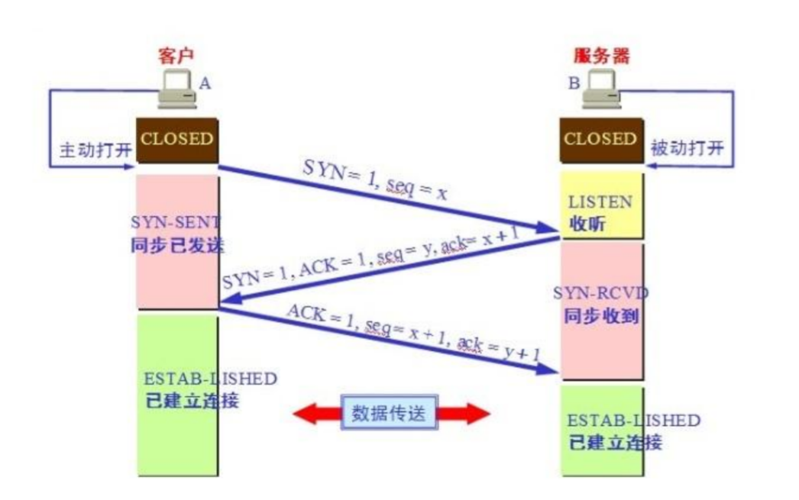
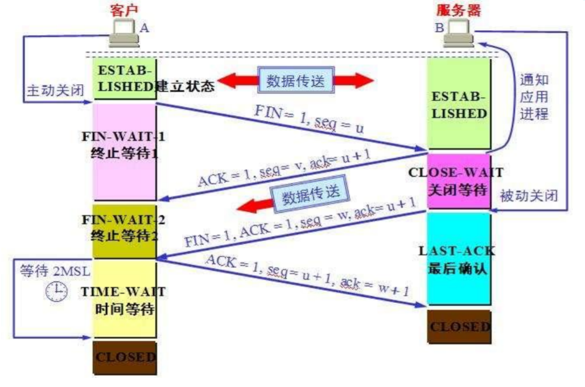

## TCP/IP的三次握手和四次分手

### tcp连接三次握手

客户端发起链接SYN置为1其余5位置为0，并发送序号seq=x，客户端状态从close变为SYN-SENT
服务器端收到客户端的请求返回SYN=1，ACK=1，发送序号seq=y和确认序号ack=x+1，服务器状态由LISTEN变为SYN-RCVD。
客户端收到服务器端的相应后 返回ACK=1,seq=x+1，确认序号ack=y+1,客户端状态从SYN-SENT变为ESTAB-LISHED，服务器端收到客户端的回应后状态也变为ESTAB-LISTHED双方建立链接。

### tcp连接断开时的四次分手

建立连接后，客户端和服务器都处于ESTABLISED状态。这时，客户端发起断开连接的请求：
1) 客户端向服务器发送 FIN 数据包，进入FIN_WAIT_1状态。表示完成任务需要断开连接。

2) 服务器收到数据包后，检测到设置了 FIN 标志位，知道要断开连接，于是向客户端发送“确认包”，进入CLOSE_WAIT状态。

注意：服务器收到请求后并不是立即断开连接，而是先向客户端发送“确认包”，告诉它我知道了，我需要准备一下才能断开连接。

3) 客户端收到“确认包”后进入FIN_WAIT_2状态，等待服务器准备完毕后再次发送数据包。

4) 等待片刻后，服务器准备完毕，可以断开连接，于是再主动向客户端发送 FIN 包，告诉它我准备好了，断开连接吧。然后进入LAST_ACK状态。

5) 客户端收到服务器的 FIN 包后，再向服务器发送 ACK 包，告诉它你断开连接吧。然后进入TIME_WAIT状态。

6) 服务器收到客户端的 ACK 包后，就断开连接，关闭套接字，进入CLOSED状态。

