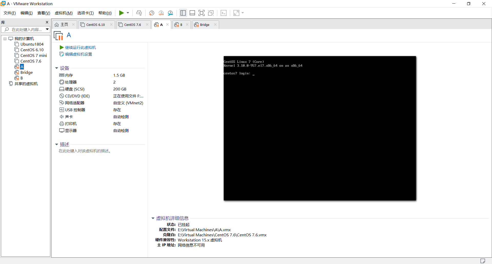
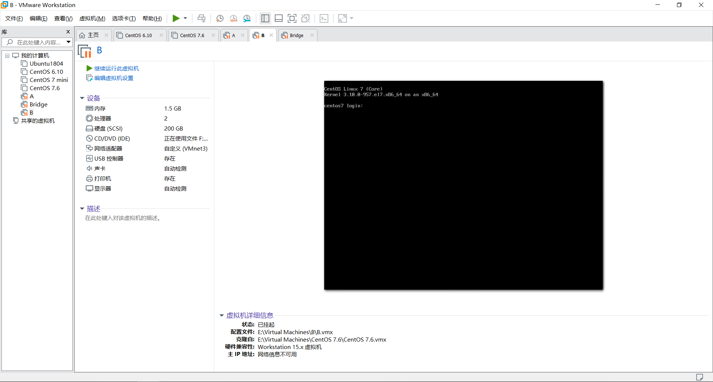
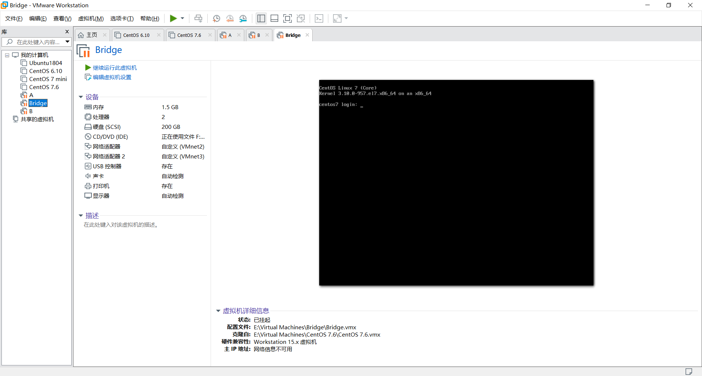

## 网桥bridge

桥接：把一台机器上的若干个网络接口“连接”起来。其结果是，其中一个网口收到的报文会被复制给其他网口并发送出去。以使得网口之间的报文能够互相转发。网桥就是这样一个设备，它有若干个网口，并且这些网口是桥接起来的。与网桥相连的主机就能通过交换机的报文转发而互相通信。

`主机A`发送的报文被送到`交换机S1`的`eth0`口，由于`eth0`与`eth1`、`eth2`桥接在一起，故而报文被复制到`eth1`和`eth2`，并且发送出去，然后被`主机B`和`交换机S2` 接收到。而`S2`又会将报文转发给主机C、D

 

网桥将两个相似的网络连接起来，并对网络数据的流通进行管理。它工作于数据链路层，不但能扩展网络的距离或范围，而且可提高网络的性能、可靠性和安全性。网络1 和网络2 通过网桥连接后，网桥接收网络1 发送的数据包，检查数据包中的地址，如果地址属于网络1 ，它就将其放弃，相反，如果是网络2 的地址，它就继续发送给网络2.这样可利用网桥隔离信息，将同一个网络号划分成多个网段（属于同一个网络号），隔离出安全网段，防止其他网段内的用户非法访问。由于网络的分段，各网段相对独立（属于同一个网络号），一个网段的故障不会影响到另一个网段的运行。

#### `nmcli`实现网桥

1. 创建软件网桥

   ```bash
   nmcli con add con-name mybr0 type bridge con-name br0 ifname br0
   nmcli con modify mybr0 ipv4.addresses 192.168.0.100/24 ipv4.method manual nmcli con add con-name br0-port0 type bridge-slave ifname eth0 master br0
   ```

2. 查看配置文件

   ```bash
   cat /etc/sysconfig/network-scripts/ifcfg-br0
   cat /etc/sysconfig/network-scripts/ifcfg-br0-port0
   ```

#### 网桥实现

将一台Linux主机配置为网桥，将两台在不同了网络，`ip`地址却在同一网段的设备连接起来  

##### 实验准备  

准备3台虚拟机，主机A配置一块网卡，主机B配置一块网卡，主机Bridge配置2块网卡  

主机A在`vmnet2`网络



主机B在`vmnet3`网络



Bridge两个口一个连接`vmnet2`网络，另一个连接`vmnet3`网络



|主机|en33|ens37|
|:-|:-|:-|
|A|192.168.10.10|-|
|B|192.168.10.11|-|
|Bridge|无地址|无地址|
***
##### 一、先分别为主机A和主机B配置`ip`地址  

1. 为主机A网卡配置地址

```bash
[root@centos7 ~]# vim /etc/sysconfig/network-scripts/ifcfg-ens33 
TYPE=Ethernet
BOOTPROTO=static
NAME=ens33
DEVICE=ens33
ONBOOT=yes
IPADDR=192.168.10.10
PREFIX=24
#重启网络服务
[root@centos7 ~]# systemctl restart network
#查看地址是否配置成功
[root@centos7 ~]# ip addr show ens33
2: ens33: <BROADCAST,MULTICAST,UP,LOWER_UP> mtu 1500 qdisc pfifo_fast state UP group default qlen 1000
    link/ether 00:0c:29:0f:f4:54 brd ff:ff:ff:ff:ff:ff
    inet 192.168.10.10/24 brd 192.168.10.255 scope global noprefixroute ens33
       valid_lft forever preferred_lft forever
    inet6 fe80::20c:29ff:fe0f:f454/64 scope link 
       valid_lft forever preferred_lft forever

```
2. 为主机B网卡配置地址

```bash
[root@centos7 ~]# vim /etc/sysconfig/network-scripts/ifcfg-ens33 
TYPE=Ethernet
BOOTPROTO=static
NAME=ens33
DEVICE=ens33
ONBOOT=yes
IPADDR=192.168.10.11
PREFIX=24
#重启网络服务
[root@centos7 ~]# systemctl restart network
#查看网卡配置是否成功
[root@centos7 ~]# ip addr show ens33
2: ens33: <BROADCAST,MULTICAST,UP,LOWER_UP> mtu 1500 qdisc pfifo_fast state UP group default qlen 1000
    link/ether 00:0c:29:48:5f:06 brd ff:ff:ff:ff:ff:ff
    inet 192.168.10.11/24 brd 192.168.10.255 scope global noprefixroute ens33
       valid_lft forever preferred_lft forever
    inet6 fe80::20c:29ff:fe48:5f06/64 scope link 
       valid_lft forever preferred_lft forever
```
3. 此时虽然主机A与主机B在同一个网段，但他们不在同一个物理网络，所以无法连通

```bash
[root@centos7 ~]# ping 192.168.10.11
PING 192.168.10.11 (192.168.10.11) 56(84) bytes of data.
^C
--- 192.168.10.11 ping statistics ---
5 packets transmitted, 0 received, 100% packet loss, time 4001ms

```
##### 二、在主机Bridge上进行桥接设置

```bash
#创建网桥设备br0
[root@centos7 ~]# brctl addbr br0
#将ens33添加入br0
[root@centos7 ~]# brctl addif br0 ens33
#将ens37添加入br0
[root@centos7 ~]# brctl addif br0 ens37
#启用网桥设备br0
[root@centos7 ~]# ip link set br0 up
#查看网桥设备状态，是否已经学习到主机A和B的mac地址
[root@centos7 ~]# brctl showmacs br0
port no	mac addr		is local?	ageing timer
  1	00:0c:29:0f:f4:54	no		 269.63         此为主机A的mac地址
  2	00:0c:29:48:5f:06	no		 273.98         此为主机B的mac地址
  1	00:0c:29:b6:86:9f	yes		   0.00
  1	00:0c:29:b6:86:9f	yes		   0.00
  2	00:0c:29:b6:86:a9	yes		   0.00
  2	00:0c:29:b6:86:a9	yes		   0.00
```
至此网桥已经全部配置完成  

##### 三、测试

```bash
#查看当前主机地址
[root@centos7 ~]# ip a s ens33
2: ens33: <BROADCAST,MULTICAST,UP,LOWER_UP> mtu 1500 qdisc pfifo_fast state UP group default qlen 1000
    link/ether 00:0c:29:0f:f4:54 brd ff:ff:ff:ff:ff:ff
    inet 192.168.10.10/24 brd 192.168.10.255 scope global noprefixroute ens33
       valid_lft forever preferred_lft forever
    inet6 fe80::20c:29ff:fe0f:f454/64 scope link 
       valid_lft forever preferred_lft forever
#ping远程192.168.10.11主机查看是否能连通
[root@centos7 ~]# ping 192.168.10.11
PING 192.168.10.11 (192.168.10.11) 56(84) bytes of data.
64 bytes from 192.168.10.11: icmp_seq=1 ttl=64 time=0.700 ms
64 bytes from 192.168.10.11: icmp_seq=2 ttl=64 time=1.95 ms
64 bytes from 192.168.10.11: icmp_seq=3 ttl=64 time=1.88 ms
^C
--- 192.168.10.11 ping statistics ---
3 packets transmitted, 3 received, 0% packet loss, time 2002ms
rtt min/avg/max/mdev = 0.700/1.514/1.958/0.577 ms
```
***
#### 网桥的删除 

删除网桥需要先禁用网桥然后将网桥上的接口全部删除，最后删除网桥设备  

1.先禁用网桥设备

```bash
[root@centos7 ~]# ip link set br0 down
```
2.删除网桥上接口
```bash
[root@centos7 ~]# brctl delif br0 ens33
[root@centos7 ~]# brctl delif br0 ens37
```
3.将网桥设备`br0`删除

```bash
[root@centos7 ~]# brctl delbr br0
```

