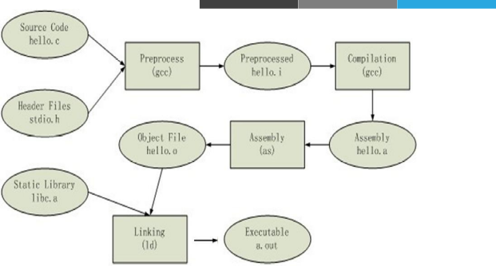

## 软件包管理

在运维工作中，经常需要对软件做一些管理，如安装、卸载、通过软件分析安装列表等等。

在工作中获取到的软件一般有3种形式：

* 源码：这些源码需要将其转换为二进制程序才能进行执行
* 包的方式：将软件的源码编译成二进制程序并将一些相关程序一起打包，不同的公司有不同的打包方式，如`redhat`的`rpm`包、`ubuntu`的`deb`包。这种方式安装便捷，但有依赖性问题。当安装时可能会产生循环依赖。
* `yum`或`dnf`安装：解决了rpm包安装的依赖性问题。`centos7`之前使用`yum`。`centos8`使用`dnf`。

#### 软件运行和编译

`ABI`：Application Binary Interface 

* Windows与Linux不兼容
  * ELF(Executable and Linkable Format)：LINUX
  * PE(Portable Executable) ：Windows
* 库级别的虚拟化：
  * `Linux`: WINE 
  * Windows: Cygwin

`API`：Application Programming Interface 

* `POSIX`：`Portable OS`

程序源代码 --> 预处理 --> 编译 --> 汇编 --> 链接

* 静态编译：.a

* 动态编译：.so

#### C语言编译过程

