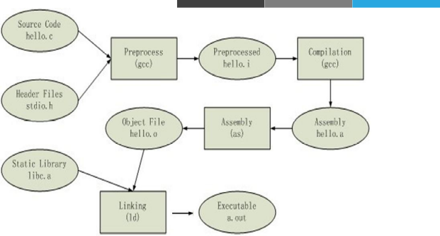
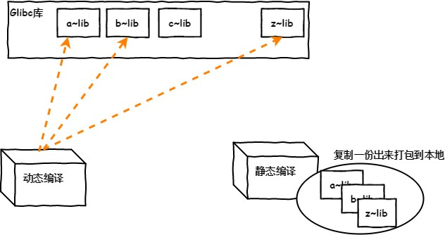

## 软件包管理

在运维工作中，经常需要对软件做一些管理，如安装、卸载、通过软件分析安装列表等等。

在工作中获取到的软件一般有3种形式：

* 源码：这些源码需要将其转换为二进制程序才能进行执行
* 包的方式：将软件的源码编译成二进制程序并将一些相关程序一起打包，不同的公司有不同的打包方式，如`redhat`的`rpm`包、`ubuntu`的`deb`包。这种方式安装便捷，但有依赖性问题。当安装时可能会产生循环依赖。
* `yum`或`dnf`安装：解决了rpm包安装的依赖性问题。`centos7`之前使用`yum`。`centos8`使用`dnf`。

#### 软件运行和编译

`ABI`：Application Binary Interface 

* Windows与Linux不兼容
  * ELF(Executable and Linkable Format)：LINUX
  * PE(Portable Executable) ：Windows
* 库级别的虚拟化：
  * `Linux`: WINE 
  * Windows: Cygwin

`API`：Application Programming Interface 

* `POSIX`：`Portable OS`

程序源代码 --> 预处理 --> 编译 --> 汇编 --> 链接

* 静态编译：.a

* 动态编译：.so

#### C语言编译过程



源码安装程序和二进制安装程序的区别在于，源码安装可以自定义所安装的程序，并且可以跨平台。而以二进制提供的安装程序，只能在特定的系统上运行，且无法实现自定义的安装。

#### 静态和动态链接

链接主要作用是把各个模块之间相互引用的部分处理好，使得各个模块之间能够正确地衔接，分为静态链接和动态链接。

##### 静态链接

- 把程序对应的依赖库复制一份到包
- `libxxx.a`
- 嵌入程序包
- 升级难，需重新编译
- 占用较多空间，迁移容易

##### 动态链接

- 只把依赖加做一个动态链接
- `libxxx.so`
- 连接指向
- 占用较少空间，升级方便



#### 开发语言

系统级开发：`C`、`C++`

应用级开发：`java`、`Python`、`go`、`php`、`perl`、`delphi`、`ruby`

#### 包和包管理器

最初只有`.tar.gz`的打包的源码文件，用户必须编译每个他想在`GNU/Linux`上运行的软件。用户们急需系统提供一种方法来管理这些安装在机器上的软件，当`Debian`诞生时，这样一个管理工具也就应运而生，它被命名为`dpkg`。从而著名的`package`概念第一次出现在`GNU/Linux`系统中， 稍后`Red Hat`才开发自己的`rpm`包管理系统

包的组成：

二进制文件、库文件、配置文件、帮助文件

程序包管理器：

* `debian`：`deb`文件，`dpkg`包管理器

* `redhat`：`rpm`文件，`rpm`包管理器
  * `rpm`：`Redhat Package Manager` 

    ​			`RPM Package Manager`

#### 包命令

源代码：

`name-VERSION.tar.gz|bz2|xz `

`VERSION`: `major.minor.release`

rpm包命名方式：

`name-VERSION-release.arch.rpm `

例：

```bash
bash-4.2.46-19.el7.x86_64.rpm 
```

`VERSION`: `major.minor.release` 

`release`：`release.OS`

常见的arch：

`x86`: i386, i486, i586, i686

`x86_64`: `x64`, `x86_64`, `amd64` 

`powerpc`: `ppc`

跟平台无关: `noarch`

#### 包命名和工具

在系统中每个安装的软件都有其独立的包，对某些较大的软件来说如果将其所有的相关的软件都打入到一个包内，那么这个包的体积是相当大的。如果将来只需要安装其内部的一个特定功能，而将整个包安装到服务器上，那将是极大的浪费。因此Linux上的安装包会将软件进行分类，将一个大软件拆分成多个不同分类不同组的包。

包：分类和拆包

* `Application-VERSION-ARCH.rpm`: 主包

* `Application-devel-VERSION-ARCH.rpm`: 开发子包

* `Application-utils-VERSION-ARHC.rpm`: 其它子包

* `Application-libs-VERSION-ARHC.rpm`: 其它子包

包之间：可能存在依赖关系，甚至循环依赖

解决依赖包管理工具：

* `yum`：rpm包管理器的前端工具

* `apt`：deb包管理器前端工具

* `zypper`：suse上的rpm前端管理工具

* `dnf`：Fedora 18+ rpm包管理器前端管理工具

#### 包管理器

程序包管理器：

功能：将编译好的应用程序的各组成文件打包一个或几个程序包文件，从而方便快捷地实现程序包的安装、卸载、查询、升级和校验等管理操作。

包文件组成 (每个包独有) 

* RPM包内的文件

* RPM的元数据，如名称，版本，依赖性，描述等
* 安装或卸载时运行的脚本

数据库(公共)：`/var/lib/rpm`(此目录一旦被破坏，安装或卸载将出错，安装软件时将自动更新此目录内的数据库内容)

* 程序包名称及版本
* 依赖关系
* 功能说明
* 包安装后生成的各文件路径及校验码信息

#### 程序包的来源

管理程序包的方式：

* 使用包管理器：`rpm`

* 使用前端工具：`yum`, `dnf`

获取程序包的途径：

* 系统发版的光盘或官方的服务器`CentOS`镜像：
  * [https://www.centos.org/download/](http://www.centos.org/download/) 
  * [http://mirrors.aliyun.com](http://mirrors.aliyun.com/) 
  * [http://mirrors.sohu.com](http://mirrors.sohu.com/) 
  * [http://mirrors.163.com](http://mirrors.163.com/)

* 项目官方站点

* 第三方组织：

  * `Fedora-EPEL`: Extra Packages for Enterprise Linux 

  * `Rpmforge`: `RHEL`推荐，包很全

  * 搜索引擎：
    * [http://pkgs.org](http://pkgs.org/) 
    * [http://rpmfind.net](http://rpmfind.net/) 
    * [http://rpm.pbone.net](http://rpm.pbone.net/) 
    * [https://sourceforge.net/](https://sourceforge.net/)

* 自己制作

注意：第三方包建议要检查其合法性来源合法性,程序包的完整