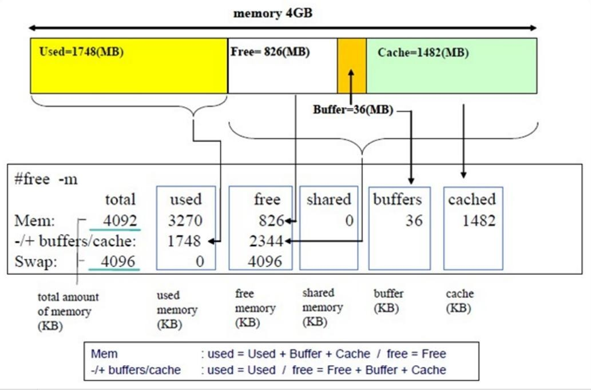

## 系统管理工具

`Linux`系统状态的查看及管理工具：`pstree`, `ps`, `pidof`, `pgrep`, `top`, `htop`, `glance`, `pmap`, `vmstat`, `dstat`, `kill`, `pkill`, `job`, `bg`, `fg`, `nohup`

### `pstree`命令

显示进程树

```bash
pstree [-acglpsStuZ] [ -h | -H PID ] [ -n | -N type ]
       [ -A | -G | -* ] [ PID | USER ]
pstree -V
```

显示子进程和进程号

```
[root@MyLinuxOPS ~]# pstree -ps
systemd(1)─┬─NetworkManager(704)─┬─{NetworkManager}(725)
           │                     └─{NetworkManager}(727)
           ├─agetty(788)
           ├─agetty(790)
           ├─auditd(661)───{auditd}(662)
           ├─chronyd(709)
           ├─crond(783)
           ├─dbus-daemon(689)
           ├─irqbalance(685)───{irqbalance}(711)
           ├─polkitd(703)─┬─{polkitd}(722)
           │              ├─{polkitd}(723)
           │              ├─{polkitd}(728)
           │              ├─{polkitd}(729)
           │              ├─{polkitd}(730)
           │              ├─{polkitd}(732)
           │              └─{polkitd}(775)
           ├─qemu-ga(721)
           ├─rngd(715)─┬─{rngd}(746)
           │           ├─{rngd}(747)
           │           ├─{rngd}(750)
           │           └─{rngd}(751)
           ├─rsyslogd(804)─┬─{rsyslogd}(830)
           │               └─{rsyslogd}(834)
           ├─sshd(745)───sshd(3561)───sshd(3575)───bash(3576)───pstree(3613)
           ├─sssd(702)─┬─sssd_be(766)
           │           └─sssd_nss(777)
           ├─systemd(3564)───(sd-pam)(3566)
           ├─systemd-journal(592)
           ├─systemd-logind(778)
           ├─systemd-udevd(624)
           └─tuned(742)─┬─{tuned}(1022)
                        ├─{tuned}(1024)
                        └─{tuned}(1030)
```

### `ps`命令

`ps`: report a snapshot of the current processes

`Linux`系统各进程的相关信息均保存在`/proc/PID`目录下的各文件中，`ps`命令可以将此目录下的内容直观的展现出来。

#### `ps`输出属性

`VSZ`: `Virtual memory SiZe`，虚拟内存集，线性内存

`RSS`: `ReSident Size`, 常驻内存集

`STAT`：进程状态

* `R`：`running`

* `S`: `interruptable sleeping`

* `D`: `uninterruptable sleeping` 
* `T`: `stopped`

* `Z`: `zombie`

* `+`: 前台进程
* `l`: 多线程进程

* `L`：内存分页并带锁

* `N`：低优先级进程

* `<`: 高优先级进程

* `s`: `session leader`，会话（子进程）发起者

#### `ps`命令格式：

```bash
ps [OPTION]...
```

`ps`命令支 持 三 种 选 项 ：

* UNIX选项 如-A -e 

* BSD选项 如a

* GNU选项  如--help

选项：

* 默认显示当前终端中的进程，其他终端的进程无法查看。

  ```bash
  [root@MyLinuxOPS ~]# ps
      PID TTY          TIME CMD
     3576 pts/0    00:00:00 bash
     3624 pts/0    00:00:00 ps
  ```


* `a`: 选项包括所有终端中的进程

  ```bash
  [root@MyLinuxOPS ~]# ps a
      PID TTY      STAT   TIME COMMAND
      788 tty1     Ss+    0:00 /sbin/agetty -o -p -- \* --noclear tty1 linux
      790 ttyS0    Ss+    0:00 /sbin/agetty -o -p -- \* --keep-baud 115200,38400,9600 ttyS0 vt220
     3576 pts/0    Ss     0:00 -bash
     3625 pts/0    R+     0:00 ps a
  ```

* `x`: 选项包括不链接终端的进程

  ```bash
  # x选项将显示所有和终端无关的进程，此处TTY为？表示没有终端
  [root@MyLinuxOPS ~]# ps x
      PID TTY      STAT   TIME COMMAND
        1 ?        Ss     0:04 /usr/lib/systemd/systemd --switched-root --system --deserialize 17
        2 ?        S      0:00 [kthreadd]
        3 ?        I<     0:00 [rcu_gp]
        4 ?        I<     0:00 [rcu_par_gp]
        6 ?        I<     0:00 [kworker/0:0H]
        8 ?        I      0:00 [kworker/u8:0-events_unbound]
  
  ```

* `u`: 选项显示进程所有者的信息

  ```bash
  # 加上u将显示出更多的内容，进程属主、cpu使用率、内存使用率、虚拟内存、实际使用内存、进程启动时间、进程累计占用的CPU时间。
  [root@MyLinuxOPS ~]# ps aux
  USER         PID %CP* %MEM    VSZ   RSS TTY      STAT START   TIME COMMAND
  root           1  0.0  0.1 242336 10808 ?        Ss   Apr07   0:04 /usr/lib/systemd/systemd --switched-root --system --deserialize 17
  root           2  0.0  0.0      0     0 ?        S    Apr07   0:00 [kthreadd]
  root           3  0.0  0.0      0     0 ?        I<   Apr07   0:00 [rcu_gp]
  root           4  0.0  0.0      0     0 ?        I<   Apr07   0:00 [rcu_par_gp]
  root           6  0.0  0.0      0     0 ?        I<   Apr07   0:00 [kworker/0:0H]
  root           8  0.0  0.0      0     0 ?        I    Apr07   0:00 [kworker/u8:0-events_unbound]
  root           9  0.0  0.0      0     0 ?        I<   Apr07   0:00 [mm_percpu_wq]
  root          10  0.0  0.0      0     0 ?        S    Apr07   0:00 [ksoftirqd/0]
  ```

* `f`:  选项显示进程树,相当于 `--forest`

  ```bash
  # 类似于pstree可以显示进程树。
  [root@MyLinuxOPS ~]# ps auxf
  USER         PID %CP* %MEM    VSZ   RSS TTY      STAT START   TIME COMMAND
  root         745  0.0  0.0  92292  7752 ?        Ss   Apr07   0:00 /usr/sbin/sshd -D -oCiphers=aes256-gcm@openssh.com,chacha20-poly1305@openssh.com,aes256-ctr,aes256-cbc,aes12
  root        3561  0.0  0.1 163704 10528 ?        Ss   15:17   0:00  \_ sshd: root [priv]
  root        3575  0.0  0.0 163704  5764 ?        S    15:17   0:00      \_ sshd: root@pts/0
  root        3576  0.0  0.0  26984  4824 pts/0    Ss   15:17   0:00          \_ -bash
  root        3645  0.0  0.0  58860  4024 pts/0    R+   16:07   0:00              \_ ps auxf
  ```

* `k|--sort`:  属性 对属性排序，属性前加`-`表示倒序

* `o`:  属性… 选项显示定制的信息 `pid`、`cmd`、`%cpu`、`%mem`
  
  * `L`: 显示o选项所支持的属性列表
  
    ```bash
    # ps L 输出的结果第一列为o选项的参数，第二列为ps输出时参数所对应的显示效果。
    [root@Computer01 ~]# ps L
    %cp*         %CPU
    %mem         %MEM
    _left        LLLLLLLL
    _left2       L2L2L2L2
    _right       RRRRRRRR
    ```
  
  * `ps`命令定制信息和输出排序
  
    ```bash
    # 光使用o没有用，还需要配合a和x来显示出和终端有关和无关的所有进程，然后使用o，输出需要关心的内容，k来指定排序的参数，默认从低到高排序
    [root@MyLinuxOPS ~]# ps axo pid,%mem,cmd k %mem
        745  0.0 /usr/sbin/sshd -D -oCiphers=aes256-gcm@openssh.com,chacha20-poly1305@openssh.com,aes256-ctr,aes256-cbc,aes128-gcm@openssh.com,aes128-ctr,aes128-cbc -oMACs=hmac-
        778  0.1 /usr/lib/systemd/systemd-logind
        804  0.1 /usr/sbin/rsyslogd -n
        624  0.1 /usr/lib/systemd/systemd-udevd
       3564  0.1 /usr/lib/systemd/systemd --user
        592  0.1 /usr/lib/systemd/systemd-journald
       3561  0.1 sshd: root [priv]
          1  0.1 /usr/lib/systemd/systemd --switched-root --system --deserialize 17
        702  0.1 /usr/sbin/sssd -i --logger=files
        766  0.1 /usr/libexec/sssd/sssd_be --domain implicit_files --uid 0 --gid 0 --logger=files
        704  0.2 /usr/sbin/NetworkManager --no-daemon
        703  0.3 /usr/lib/polkit-1/polkitd --no-debug
        742  0.3 /usr/libexec/platform-python -Es /usr/sbin/tuned -l -P
        777  0.5 /usr/libexec/sssd/sssd_nss --uid 0 --gid 0 --logger=files
    ```

* `-C cmdlist`: 指定命令，多个命令用，分隔

  ```bash
  # 查看指定命令的进程信息
  [root@MyLinuxOPS ~]# ps -C  bash
      PID TTY          TIME CMD
     3576 pts/0    00:00:00 bash
  ```

* `-L`: 显示线程

  ```bash
  # mysqld主进程中有多个线程。
  [root@MyLinuxOPS ~]# ps -L -C mysqld
      PID     LWP TTY          TIME CMD
     6269    6269 ?        00:00:00 mysqld
     6269    6272 ?        00:00:00 mysqld
     6269    6273 ?        00:00:00 mysqld
     6269    6274 ?        00:00:00 mysqld
     6269    6275 ?        00:00:00 mysqld
     6269    6276 ?        00:00:00 mysqld
     6269    6277 ?        00:00:00 mysqld
     6269    6278 ?        00:00:00 mysqld
     6269    6279 ?        00:00:00 mysqld
  ```

* `-e`: 显示所有进程，相当于`-A`

* `-f`: 显示完整格式程序信息

* `-F`: 显示更完整格式的进程信息

* `-H`: 以进程层级格式显示进程相关信息

* `-* userlist`: 指定有效的用户`ID`或名称，`user`或`euser`

* `-* userlist`: 指定真正的用户`ID`或名称，`ruser`

  ```bash
  # 在Masuri用户中执行passwd命令
  [root@MyLinuxOPS ~]# s* Masuri
  [Masuri@MyLinuxOPS root]$ passwd
  Changing password for user Masuri.
  Current password:
  
  # root下查看passwd的user信息
  [root@MyLinuxOPS ~]# ps o pid,cmd,user,ruser,euser -C passwd
      PID CMD                         USER     RUSER    EUSER
     6408 passwd                      root     Masuri   root
     
  # ruser表示真正运行进程的用户。
  # user和euser表示生效的用户
  ```

* `-g gid`或`groupname`: 指定有效的`gid`或组名称

* `-G gid`或`groupname`: 指定真正的`gid`或组名称

* `-p pid`: 显示指`pid`的进程

* `--ppid pid`: 显示属于`pid`的子进程

* `-M`: 显示`SELinux`信息，相当于`Z`

* `ni`: nice值

  ```bash
  # nice值为-20到19，可以通过nice命令进行调整
  [root@MyLinuxOPS ~]# ps axo pid,cmd,user,ruser,euser,ni
      PID CMD                         USER     RUSER    EUSER     NI
   ...
       45 [khugepaged]                root     root     root      19
       46 [crypto]                    root     root     root     -20
       
  ```

* `pri`: priority 优先级

  ```bash
  # 查看实时优先级
  [root@MyLinuxOPS ~]# ps axo pid,cmd,user,ruser,euser,ni,pri
      PID CMD                         USER     RUSER    EUSER     NI PRI
     6442 ps axo pid,cmd,user,ruser,e root     root     root       0  19
  ```

* `psr`: processor CPU编号

*  `rtprio`: 实时优先级

  ```bash
  [root@MyLinuxOPS ~]# ps o pid,cmd,user,ruser,euser,ni,pri,rtprio  -C passwd
      PID CMD                         USER     RUSER    EUSER     NI PRI RTPRIO
     6444 passwd                      root     Masuri   root     -10  29      -
  # 有nice优先级将不会有实时优先级，所以RTPRIO为-
  
  # 调整实时优先级使用chrt，一般不调整实时优先级。
  ```


#### `ps`命令常用组合和示例

1. `ps -ef`

   ```bash
   # 会显示出父进程ID,C表示cpu利用率
   [root@MyLinuxOPS ~]# ps -ef
   UID          PID    PPID  C STIME TTY          TIME CMD
   root           1       0  0 Apr07 ?        00:00:05 /usr/lib/systemd/systemd --switched-root --system --deserialize 17
   root           2       0  0 Apr07 ?        00:00:00 [kthreadd]
   root           3       2  0 Apr07 ?        00:00:00 [rcu_gp]
   root           4       2  0 Apr07 ?        00:00:00 [rcu_par_gp]
   root           6       2  0 Apr07 ?        00:00:00 [kworker/0:0H]
   root           9       2  0 Apr07 ?        00:00:00 [mm_percpu_wq]
   ```

2. 查询你拥有的所有进程

   ```bash
   ps -x
   ```

3. 显示指定用户名(`RUID`)或用户ID的进程

   ```bash
   ps -f* apache
   ps -f* 48
   ```

4. 显示指定用户名(`EUID`)或用户ID的进程

   ```bash
   ps -f* wang
   ps -f* 1000
   ```

5. 查看以root用户权限（实际和有效ID）运行的每个进程

   ```bash
   ps -* root -* root
   ```
   
6. 列出某个组拥有的所有进程（`实际组ID`：`RGID`或名称） 

   ```bash
   ps -fG nginx
   ```

7. 列出有效组名称（或会话）所拥有的所有进程

   ```bash
   ps -fg mysql
   ps -fg 27
   ```

8. 显示指定的进程ID对应的进程

   ```bash
   ps -fp 1234
   ```

9. 以父进程ID来显示其下所有的进程，如显示父进程为1234的所有进程

   ```bash
   ps -f --ppid 1234
   ```

10. 显示指定`PID`的多个进程

    ```bash
    ps -fp 1204,1239,1263
    ```

11. 要按`tty`显示所属进程

    ```bash
    ps -ft pts/0
    ```

12. 以进程树显示系统中的进程如何相互链接

    ```bash
    ps -e --forest
    ```

13. 以进程树显示指定的进程

    ```bash
    ps -f --forest -C sshd
    ps -ef --forest | grep -v grep | grep sshd
    ```

14. 要显示一个进程的所有线程,将显示`LWP`（轻量级进程）以及`NLWP`（轻量级进程数）列

    ```bash
    ps -fL -C nginx
    ```

15. 要列出所有格式说明符

    ```bash
    ps L
    ```

16. 查看进程的`PID`，`PPID`，用户名和命令

    ```bash
    ps -eo pid,ppid,user,cmd
    ```

17. 自定义格式显示文件系统组，`ni`值开始时间和进程的时间

    ```bash
    ps -p 1234 -o pid,ppid,fgroup,ni,lstart,etime
    ```

18. 使用其`PID`查找进程名称

    ```bash
    ps -p 1244 -o comm=
    ```

19. 要以其名称选择特定进程，显示其所有子进程

    ```bash
    ps -C sshd,bash
    ```

20. 查找指定进程名所有的所属`PID`，在编写需要从std输出或文件读取`PID`的脚本时这个参数很有用

    ```bash
    ps -C httpd,sshd -o pid=
    ```

21. 检查一个进程的执行时间

    ```bash
    ps -eo comm,etime,user | grep nginx
    ```

22. 查找占用最多内存和CPU的进程

    ```bash
    ps -eo pid,ppid,cmd,%mem,%cp* --sort=-%mem | head
    ps -eo pid,ppid,cmd,%mem,%cp* --sort=-%cp* | head
    ```

23. 显示安全信息

    ```bash
    ps -eM
    ps --context
    ```

24. 使用以下命令以用户定义的格式显示安全信息
    ```bash
    ps -eo euser,ruser,suser,fuser,f,comm,label
    ```

25. 使用watch实用程序执行重复的输出以实现对就程进行实时的监视，如下面的命令显示每秒钟的监视

    ```bash
    watch -n 1 'ps -eo pid,ppid,cmd,%mem,%cp* --sort=-%mem | head'
    ```

### 进程优先级调整

静态优先级：100-139

进程默认启动时的nice值为0，优先级为120 只有根用户才能降低nice值（提高优先性）`nice`和`renice`命令

#### `nice`命令

调整程序运行时的nice值，命令格式如下：

```bash
nice [OPTION] [COMMAND [ARG]...]
```

参数：

* `-n`: 指定`nice`值

示例：

```bash
# 指定命令运行时的nice值
[root@MyLinuxOPS ~]# nice -n -5  tail -f /etc/passwd
tss:x:59:59:Account used by the trousers package to sandbox the tcsd daemon:/dev/null:/sbin/nologin
polkitd:x:998:996:User for polkitd:/:/sbin/nologin

# 查看下tail命令的nice值
[Masuri@MyLinuxOPS root]$ ps o pid,cmd,user,euser,ruser,ni,pri -C tail
    PID CMD                         USER     EUSER    RUSER     NI PRI
   6479 tail -f /etc/passwd         root     root     root      -5  24
```

#### `renice`命令

动态调整正在运行的命令的`nice`值，命令格式如下：

```bash
 renice [-n] priority [-g|-p|-u] identifier...
```

示例：

```bash
# 查看实时优先级
[root@MyLinuxOPS ~]# ps axo pid,cmd,user,ruser,euser,ni,pri
    PID CMD                         USER     RUSER    EUSER     NI PRI
   6442 ps axo pid,cmd,user,ruser,e root     root     root       0  19

# 对pri优先级做修改
[root@MyLinuxOPS ~]# renice -10 6444
6444 (process ID) old priority 0, new priority -10
[root@MyLinuxOPS ~]# ps o pid,cmd,user,ruser,euser,ni,pri  -C passwd
    PID CMD                         USER     RUSER    EUSER     NI PRI
   6444 passwd                      root     Masuri   root     -10  29
# pri优先级值越大优先级越高
# nice值越低优先级越高
```

### 搜索进程

使用`ps`和`grep`配合可以实现进程的搜索，不过搜索出的内容不光有进程还有被`grep`所匹配的所有内容。Linux中有命令可以专门用来搜索进程。

#### `pgrep`命令

按预定义的模式搜索

```bash
pgrep [option] pattern
```

选项：

* `-* uid`: effective user，生效者

* `-* uid`: real user，真正发起运行命令者

  ```bash
  # 使用ps+grep来过滤进程
  [root@MyLinuxOPS ~]# ps axo pid,cmd,ruser | grep Masuri
     7065 s* Masuri                   root
     7066 bash                        Masuri
     7091 grep --color=auto Masuri    root
  # 使用pgrep查看Masuri用户的进程
  [root@MyLinuxOPS ~]# pgrep -* Masuri
  7066
  ```

* `-t terminal`: 与指定终端相关的进程

* `-l`: 显示进程名

  ```bash
  [root@MyLinuxOPS ~]# ps axo pid,cmd,ruser | grep Masuri
     7065 s* Masuri                   root
     7066 bash                        Masuri
     7091 grep --color=auto Masuri    root
  # 不是用l只显示进程，使用l后显示进程的名称
  [root@MyLinuxOPS ~]# pgrep -l* Masuri
  7066 bash
  ```

* `-a`: 显示完整格式的进程名

* `-P pid`: 显示指定进程的子进程

  ```bash
  [root@MyLinuxOPS ~]# ps ef
      PID TTY      STAT   TIME COMMAND
     7041 pts/1    Ss     0:00 -bash USER=root LOGNAME=root HOME=/root PATH=/usr/local/sbin:/usr/local/bin:/usr/sbin:/usr/bin SHELL=/bin/bash TERM=xterm XDG_SESSION_ID=
     7065 pts/1    S      0:00  \_ s* Masuri LS_COLORS=rs=0:di=01;34:ln=01;36:mh=00:pi=40;33:so=01;35:do=01;35:bd=40;33;01:cd=40;33;01:or=40;31;01:mi=01;05;37;41:su=37;
     6998 pts/0    Ss     0:00 -bash USER=root LOGNAME=root HOME=/root PATH=/usr/local/sbin:/usr/local/bin:/usr/sbin:/usr/bin SHELL=/bin/bash TERM=xterm XDG_SESSION_ID=
     7099 pts/0    R+     0:00  \_ ps ef LS_COLORS=rs=0:di=01;34:ln=01;36:mh=00:pi=40;33:so=01;35:do=01;35:bd=40;33;01:cd=40;33;01:or=40;31;01:mi=01;05;37;41:su=37;41:s
      790 ttyS0    Ss+    0:00 /sbin/agetty -o -p -- \* --keep-baud 115200,38400,9600 ttyS0 vt220 LANG=en_US.UTF-8 PATH=/usr/local/sbin:/usr/local/bin:/usr/sbin:/usr/bi
      788 tty1     Ss+    0:00 /sbin/agetty -o -p -- \* --noclear tty1 linux PATH=/usr/local/sbin:/usr/local/bin:/usr/sbin:/usr/bin INVOCATION_ID=7773f50e7eaa41f7ad2fd9
  
  # 查看7041进程的子进程是什么
  [root@MyLinuxOPS ~]# pgrep -P 7041
  7065
  ```

#### `pidof`命令

用于列出某个程序对应的进程编号

```bash
pidof program [program..]
```

示例：

```bash
# 查看程序对应的进程编号
[root@MyLinuxOPS ~]# pidof bash
7066 7041 6998

# 如果程序对应的编号不存在，则表示程序没有运行。可以使用在脚本中做判断
[root@MyLinuxOPS ~]# pidof basher
[root@MyLinuxOPS ~]# echo $?
1
```

### 系统监控工具

在系统中`/proc/uptime`中保存两个值，单位为s，其表示系统启动市场，空闲进程的总时间长(按总的CPU核数来计算)

```bash
[root@MyLinuxOPS ~]# cat /proc/uptime
175429.08 700214.96
```

直接查看此文件不方便，系统中提供了专用的用具可以来查看。

#### `uptime`和`w`命令

显示当前时间，系统已启动的时间、当前上线人数，系统平均负载（1、5、10 分钟的平均负载，一般不会超过1）

系统平均负载:

* 指在特定时间间隔内运行队列中的平均进程数

* 通常每个CPU内核的当前活动进程数不大于3，那么系统的性能良好。如果每个CP*  内核的任务数大于5，那么此主机的性能有严重问题。

* 如果`linux`主机是1个双核CPU，当`Load Average`为6的时候说明机器已经被充分使用

##### `uptime`命令示例：

```bash
[root@MyLinuxOPS ~]# uptime
 10:37:43 up 2 days, 47 min,  2 users,  load average: 0.00, 0.00, 0.00

# 10:37:43 当前时间
# up 2 days, 47 min, 系统已经启动的时长
# 2 users 当前系统上有2个用户登录
# load average: 0.00, 0.00, 0.00  系统平均负载
```

##### `w`命令示例：

```bash
[root@MyLinuxOPS ~]# w
 10:37:45 up 2 days, 47 min,  2 users,  load average: 0.00, 0.00, 0.00
USER     TTY      FROM             LOGIN@   IDLE   JCP*   PCP* WHAT
root     pts/0    172.16.11.61     09:49    1.00s  0.21s  0.01s w
root     pts/1    172.16.11.61     10:10   26:41   0.13s  0.05s bash

# w命令在uptime的基础上增加了用户所执行的命令
```

#### `top`命令

 `top`命令是一个不断监控进程的程序，它有许多内置命令

内置指令：

* 排序：
  * P：以占据的CPU百分比，`%CPU` 
  * M：占据内存百分比，`%MEM`
  * T：累积占据CPU时长，`TIME+`

* 首部 信 息 显 示 ：
  * `uptime`信息：`l`命令
  * `tasks`及`cpu`信息：`t`命令
  * `cpu`分别显示：`1` (数字) 
  * `memory`信息：`m`命令

* 退出命令：`q`

* 修改刷新时间间隔：`s` 

* 终止指定进程：`k`

* 保存文件：`W`

栏位信息简介:

* `us`: 用户空间

* `sy`: 内核空间，系统空间

* `ni`: 调整nice时间

* `id`:  空 闲

* `wa`: 等待IO时间

* `hi`: 硬中断，如鼠标点击了下。

* `si`: 软中断（模式切换），

* `st`: 虚拟机偷走的时间

选项：

* `-d #`: 指定刷新时间间隔，默认为3秒

* `-b`: 全部显示所有进程

* `-n #`: 刷新多少次后退出

* `-H` : 线程模式，

  ```bash
  top -H -p `pidof mysqld`
  ```

#### `htop`命令

功能类似于`top`，比top功能更加强大，`EPEL`源内提供

选项：

* `-d #`: 指定延迟时间；

* `-* UserName`: 仅显示指定用户的进程

* `-s COLUME`: 以指定字段进行排序

子命令：

* `s`: 跟踪选定进程的系统调用
* `l`: 显示选定进程打开的文件列表 
* `a`: 将选定的进程绑定至某指定CPU核心
* `t`: 显示进程树

### 内存查看工具

#### `free`命令

内存空间使用状态。

```bash
free [OPTION]
```

选项：

* `-b` 以字节为单位

* `-m` 以`MB`为单位

* `-g` 以`GB`为单位

* `-h` 易读格式

* `-o` 不显示`-/+buffers/cache`行

* `-t`  显示`RAM + swap`的总和

* `-s n` 刷新间隔为n秒

* `-c n` 刷新n次后即退出



#### `vmstat`命令

`vmstat`可以显示虚拟内存的使用情况

```bash
vmstat [options] [delay [count]]
```

选项：

* `-s`: 显示内存的统计数

##### `vmstat`使用示例：

```bash
# 每隔2秒显示一次一共显示5次数
vmstat 2 5
```

##### `vmstat`输出内容

```bash
[root@MyLinuxOPS ~]# vmstat
procs -----------memory---------- ---swap-- -----io---- -system-- ------cpu-----
 r  b   swpd   free   buff  cache   si   so    bi    bo   in   cs us sy id wa st
 0  0      0 7006120  55304 751992    0    0     0     1   23   38  0  0 100  0  0
```

* `procs`:
  * r：可运行（正运行或等待运行）进程的个数，和核心数有关
  * b：处于不可中断睡眠态的进程个数(被阻塞的队列的长度)

* `memory`：
  * `swpd`: 交换内存的使用总量
  * `free`: 空闲物理内存总量
  * `buffer`: 用于buffer的内存总量
  * `cache`: 用于cache的内存总量

* `swap`:

  * `si`: 从磁盘交换进内存的数据速率(`kb/s`)

  * `so`: 从内存交换至磁盘的数据速率(`kb/s`)

* `io`：
  * `bi`: 从块设备读入数据到系统的速率(`kb/s`)
  * `bo`: 保存数据至块设备的速率

* system：
  * `in`: `interrupts`中断速率，包括时钟
  * `cs`: `context switch`进程切换速率

* `cpu`：
  * `us`:Time spent running non-kernel code 
  * `sy`: Time spent running kernel code
  * `id`: Time spent idle. Linux 2.5.41前,包括IO-wait time. 
  * `wa`: Time spent waiting for IO. 2.5.41前，包括in idle.
  * `st`: Time stolen from a virtual machine.  2.6.11前, unknown.

### 磁盘IO查看

#### `iostat`命令

`iostat`：统计CPU和设备IO信息示例：

```bash
iostat [option]
```

`iostat`输出

```bash
[root@MyLinuxOPS ~]# iostat
Linux 4.18.0-240.el8.x86_64 (MyLinuxOPS)        04/09/2021      _x86_64_        (4 CPU)

avg-cpu:  %user   %nice %system %iowait  %steal   %idle
           0.06    0.01    0.10    0.02    0.05   99.77

Device             tps    kB_read/s    kB_wrtn/s    kB_read    kB_wrtn
vda               0.19         1.42         4.88     266925     917878
vdb               0.00         0.02         0.00       4186          0
scd0              0.00         0.01         0.00       1041          0

# kB_read/s 每秒钟读取速度
# kB_wrtn/s 每秒钟写入磁盘速度
# kB_read 总计读取   
# kB_wrtn 总计写入
```

### 网络IO查看

#### `iftop`命令

`iftop`：显示带宽使用情况，`EPEL`源

示例：

```bash
iftop -n -i eth1
```

### 内存和进程对应关系

进程在内存中占用了哪块空间可以查看`/proc/PID/maps`这个文件

```bash
cat /proc/PID/maps
```

在这文件中还可以看到程序所调用的共享库，以及共享库所调用的空间。不过这种查看方法比较难以理解，可以使用`pmap`工具来显示。

#### `pmap`命令

`pmap`命令：进程对应的内存映射。可以查看程序是否发生了内存泄漏。

```bash
pmap [options] pid [...]
```

选项：

* `-x`: 显示详细格式的信息

示例：

```bash
# 使用pmap不仅可以看到内存占用位置，还可以查看到其占用的内存空间的总大小。
[root@MyLinuxOPS ~]# pmap 1
1:   /usr/lib/systemd/systemd --switched-root --system --deserialize 17
0000560224940000   1280K r-x-- systemd
0000560224c7f000    272K r---- systemd
0000560224cc3000      4K rw--- systemd
0000560226304000   3832K rw---   [ anon ]
00007f81ac000000    132K rw---   [ anon ]
00007f81ac021000  65404K -----   [ anon ]
00007f81b4000000    132K rw---   [ anon ]
00007f81b4021000  65404K -----   [ anon ]
00007f81bb445000      4K -----   [ anon ]
00007f81bb446000   8192K rw---   [ anon ]
00007f81bbc46000      4K -----   [ anon ]
00007f81bbc47000   8192K rw---   [ anon ]
00007f81bc447000   1540K r-x-- libm-2.28.so
00007f81bc5c8000   2044K ----- libm-2.28.so
00007f81bc7c7000      4K r---- libm-2.28.so
00007f81bc7c8000      4K rw--- libm-2.28.so
00007f81bc7c9000    580K r-x-- libudev.so.1.6.11
```

### 系统监控工具

`glances`工具是一个综合性的工具，其继承了以上所有程序的功能，还能基于C/S架构进行远程系统监控，要求服务器系统相同。

#### glances命令

命令格式：

```bash
glances [-bdehmnrsvyz1] [-B bind] [-c server] [-C conffile] [-p port] [-P password] [--password] [-t refresh] [-f file] [-o output]
```

内建命令：

| 命令 | 说明                            | 命令 | 说明                             |
| ---- | ------------------------------- | ---- | -------------------------------- |
| a    | Sort pro4cesses automatically   | l    | Show/hide logs                   |
| c    | Sort processes by CPU%          | b    | Bytes or bits for network I/O    |
| m    | Sort processes by MEM%          | w    | Delete warning logs              |
| p    | Sort processes by name          | x    | Delete warning and critical logs |
| i    | Sort processes by I/O rate      | 1    | Global CP* or per-CP* stats      |
| d    | Show/hide disk I/O stats        | h    | Show/hide this help screen       |
| n    | Show/hide network stats         | u    | View cumulative network I/O      |
| s    | Show/hide sensors stats         | q    | Quit (Esc and Ctrl-C also work)  |
| y    | Show/hide hddtemp stats         | f    | Show/hide file system stats      |
| t    | View network I/O as combination |      |                                  |

常用选项：

* `-b`: 以Byte为单位显示网卡数据速率
* `-d`: 关闭磁盘I/O模块
* `-f /path/to/somefile`: 设定输入文件位置
* `-o {HTML|CSV}`: 输出格式
* `-m`: 禁用mount模块
* `-n`: 禁用网络模块
* `-t #`: 延迟时间间隔
* `-1`: 每个CPU的相关数据单独显示

C/S模式下运行glances命令

* 服务器模式：

  ```bash
  glances -s -B IPADDR
  # IPADDR: 指明监听的本机哪个地址
  ```

* 客户端模式：

  ```bash
  glances -c IPADDR 
  # IPADDR：要连入的服务器端地址
  ```

#### `dstat`命令

系统资源统计，可以代替`vmstat`,`iostat`

命令格式：

```bash
dstat [-afv] [options..] [delay [count]]
```

选项：

* `-c`: 显示cpu相关信息

* `-C`: #,#,...,total

* `-d`: 显示disk相关信息

* `-D`: total,`sda`,`sdb`,...

* `-g`: 显示page相关统计数据

* `-m`: 显示memory相关统计数据

* `-n`: 显示network相关统计数据

* `-p`: 显示process相关统计数据

* `-r `: 显示io请求相关的统计数据

* `-s`: 显示swapped相关的统计数据

* `--tcp`

* `--udp`

* `--unix`

* `--raw`

* `--socket`

* `--ipc`

* `--top-cpu`: 显示最占用CPU的进程

* `--top-io`: 显示最占用io的进程

* `--top-mem`: 显示最占用内存的进程

* `--top-latency`: 显示延迟最大的进程

#### `iotop`命令

`iotop`命令是一个用来监视磁盘I/O使用状况的`top`类工具`iotop`具有与`top`相似的`UI`，其中包括

`PID`、用户、`I/O`、进程等相关信息，可查看每个进程是如何使用`IO`。

##### `iotop`输出内容

* 第一行：Read和Write速率总计 

* 第二行：实际的Read和Write速率

* 第三行：参数如下：
  * `TID`: 线程ID（按p切换为进程ID）
  * `PRIO`: 优先级
  * `USER`: 用户
  * `DISK READ`: 磁盘读速率
  * `DISK WRITE`: 磁盘写速率
  * `SWAPIN`: swap交换百分比
  * `IO>`: IO等待所占的百分比
  * `COMMAND`: 线程/进程命令

##### 常用参数：

* `-o`,`--only`: 只显示正在产生I/O的进程或线程，除了传参，可以在运行过程中按`o`生效

* `-b`,`--batch`: 非交互模式，一般用来记录日志

* `-n NUM`,`--iter=NUM`: 设置监测的次数，默认无限。在非交互模式下很有用

* `-d SEC`,`--delay=SEC`: 设置每次监测的间隔，默认1秒，接受非整形数据例如1.1

* `-p PID`,`--pid=PID`: 指定监测的进程/线程

* `-u USER`,`--user=USER`: 指定监测某个用户产生的I/O

* `-P`,`--processes`: 仅显示进程，默认iotop显示所有线程

* `-a`,`--accumulated`: 显示累积的I/O，而不是带宽

* `-k`,`--kilobytes`使用kB单位，而不是对人友好的单位。在非交互模式下，脚本编程有用

* `-t`,`--time` 加上时间戳，非交互非模式

* `-q`,`--quiet` 禁止头几行，非交互模式，有三种指定方式
  * `-q`: 只在第一次监测时显示列名
  * `-qq`: 永远不显示列名
  * `-qqq`: 永远不显示I/O汇总

##### 交互按键

* left和right方向键：改变排序
* `r`: 反向排序
* `o`: 切换至选项--only    
* `p`: 切换至--processes选项
* `a`: 切换至--accumulated选项
* `q`: 退出

* `i`: 改变线程的优先级

#### `nload`命令

`nload`是一个实时监控网络流量和带宽使用情况，以数值和动态图展示进出的流量情况(EPEL源)

##### 界面操作

上下方向键、左右方向键、enter键或者tab键都就可以切换查看多个网卡的流量情况

按`F2`显示选项窗口

按`q`或者`Ctrl+C`退出`nload`

##### 示例：

```bash
# 默认只查看第一个网卡的流量进出情况
nload

# 指定网卡，可以查看多个网卡
nload eth0 eth1

# 设置刷新间隔：默认刷新间隔是100毫秒，可通过 -t命令设置刷新时间（单位是毫秒）
nload -t 500 eth0

# 设置单位：显示两种单位一种是显示Bit/s、一种是显示Byte/s，默认是以Bit/s，也可不显示/s
# -u h|b|k|m|g|H|B|K|M|G 表示的含义： 
# h:auto, b:Bit/s, k:kBit/s, m:MBit/s, H:auto, B:Byte/s, K:kByte/s, M:MByte/s
nload -u M eth0
```

#### `lsof`命令

`lsof`: list open files查看当前系统文件的工具。在`linux`环境下，一切皆文件， 用户通过文件不仅可以访问常规数据，还可以访问网络连接和硬件如传输控制协议 (`TCP`) 和用户数据报协议 (`UDP`)套接字等，系统在后台都为该应用程序分配了一个文件描述符

##### 命令参数:

* `-a`: 列出打开文件存在的进程

* `-c<进程名>`: 列出指定进程所打开的文件

* `-g`: 列出`GID`号进程详情

* `-d<文件号>`: 列出占用该文件号的进程

* `+d<目录>`: 列出目录下被打开的文件

* `+D<目录>`: 递归列出目录下被打开的文件

*  `-n<目录>`: 列出使用NFS的文件

* `-i<条件>`: 列出符合条件的进程(4、6、协议、:端口、 `@ip` )

*  `-p<进程号>` : 列出指定进程号所打开的文件

* `-u`: 列出`UID`号进程详情

* `-h`: 显示帮助信息

* `-v`: 显示版本信息。

* `-n`: 不反向解析网络名字

##### 示例：

进程管理

```bash
# 查看由登陆用户启动而非系统启动的进程
lsof /dev/pts/1

# 指定进程号，可以查看该进程打开的文件
lsof -p 9527
```

文件管理

```bash
# 查看指定程序打开的文件
lsof -c httpd

# 查看指定用户打开的文件
lsof -u root | more

# 查看指定目录下被打开的文件
lsof +D /var/log/
lsof +d /var/log/
#参数+D为递归列出目录下被打开的文件，参数+d为列出目录下被打开的文件
```

查看所有网络连接

```bash
lsof -i –n
lsof -i@127.0.0.1
# 通过参数-i查看网络连接的情况，包括连接的ip、端口等以及一些服务的连接情况，例如： sshd等。也可以通过指定ip查看该ip的网络连接情况
```

查看端口连接情况

```bash
# 通过参数-i:端口可以查看端口的占用情况，-i参数还有查看协议，ip的连接情况等
lsof -i :80 -n
```

查看指定进程打开的网络连接

```bash
# 参数-i、-a、-p等，-i查看网络连接情况，-a查看存在的进程，-p指定进程
lsof -i –n -a -p 9527
```

查看指定状态的网络连接

```bash
# -n:no host names, -P:no port names,-i TCP指定协议，-s指定协议状态通过多个参数可以清晰的查看网络连接情况、协议连接情况等
lsof -n -P -i TCP -s TCP:ESTABLISHED
```

##### `lsof`恢复删除文件

`lsof`恢复删除文件必须建立在被删除文件还在被占用，没有完全被删除的前提下。

1. 在第一个终端中打开一个文件

```bash
[root@MyLinuxOPS ~]# tail -f /var/log/messages
```

2. 另启一个终端，将文件删除然后恢复

```bash
# 使用lsof来搜索关键字被删除的文件名或者deleted
[root@MyLinuxOPS ~]# lsof | grep "/var/log/message"
rsyslogd   804                   root    5w      REG              253,2   279277    4458389 /var/log/messages (deleted)
rsyslogd   804  830 in:imjour    root    5w      REG              253,2   279277    4458389 /var/log/messages (deleted)
rsyslogd   804  834 rs:main      root    5w      REG              253,2   279277    4458389 /var/log/messages (deleted)
tail      9865                   root    3r      REG              253,2   279277    4458389 /var/log/messages (deleted)

# 这里可以看到被tail这个进程还没有释放/var/log/messages
# 进入到这个进程的fd内，将删除的文件恢复
[root@MyLinuxOPS ~]# cd /proc/`pidof tail`/fd
[root@MyLinuxOPS fd]# ll
total 0
lrwx------ 1 root root 64 Apr  9 16:56 0 -> /dev/pts/0
lrwx------ 1 root root 64 Apr  9 16:56 1 -> /dev/pts/0
lrwx------ 1 root root 64 Apr  9 16:56 2 -> /dev/pts/0
lr-x------ 1 root root 64 Apr  9 16:56 3 -> '/var/log/messages (deleted)'
lr-x------ 1 root root 64 Apr  9 16:56 4 -> anon_inode:inotify

# 将被删除的文件进行重定向
[root@MyLinuxOPS fd]# cat 3 > /var/log/messages

# 文件被找回，注意先决条件。
```

