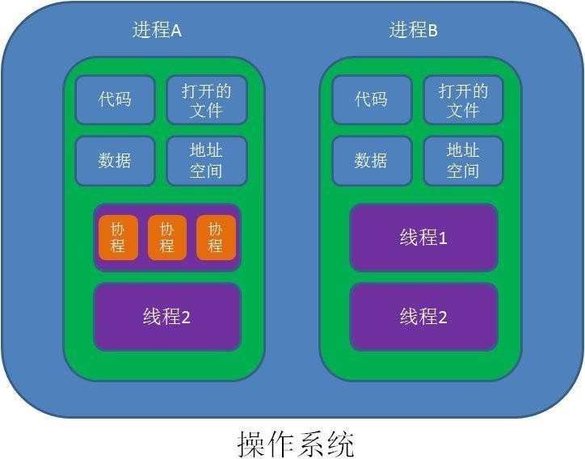

## 进程和系统性能

### 进程相关的概念

Linux是一个操作系统的内核：

* 内核功用：进程管理、文件系统、网络功能、内存管理、驱动程序、安全功能等

#### 什么是进程？

进程和程序之间是不同的，程序是磁盘上的一个文件，如`/bin/cat`。磁盘上的文件若想真正生效，则需要将其放入内存中，但一个可执行文件加载到内存中后，其就变为一个正在运行中的进程。

进程是一个资源使用的单位，当一个软件执行后系统就会将其从磁盘上读入到内存中，并且系统会在内存中分配给其一个独立的内存空间。

系统在读取磁盘上的程序时会先将其读入到内核中，当内核读取完程序后会将其复制到应用程序的内存空间中，在系统中内存空间分为两块，一块为内核，另一块为用户的内存空间。

用户的内存空间内的所有应用程序只能看到自己所分配的内存，所以他们都默认为自己占有了所有的内存，从而起到了隔离的效果。

进程在运行时，系统还会分配一些资源给他，比如使用内存空间，`PID`号，当进程运行结束时`PID`号将回收。

程序在运行时，其还会有自己的缓冲区，有自己使用的文件的资源。

所以进程其实就是一个被载入内存的一个指令的集合。而进程中真正干活的则是线程(`thread`)。

#### 进程和线程的区别

进程包括各种资源，如内存空间、数据、程序和线程。可以将进程想象为一个工厂，工厂如果要生产则需要各种原材料(数据)、有工人(线程)。

一个进程中必须要有一个线程。在复杂的场景下，但个线程无法处理多个任务，这时候一个进程还可以存在多个线程。

进程和线程之间为包含的关系，一个进程中可能有多个线程，但必须存在一个线程。

#### 进程的生命周期

进程是存在生命周期的，一个软件运行是有结束的时候，如`cat`命令执行完毕后其生命周期即结束。有些命令则生命期很长，开机运行就一直存在着，如内核中的`init`进程其长期驻留内存。

根据其生命周期其可以分为2种任务：

* 一次性执行完毕推出的任务也叫`前台任务`。

* 长期执行的任务叫做`后台任务`。

#### 任务结构(`task struct`)

Linux会将各种程序的进程存放在一个数据结构内，也叫任务结构。

任务的结构可以将其想象为进程的各种资源，如`PID`、`UID`、数据、程序本身、线程等等。

#### 任务列表(`task list`)

系统内是存在多个进程的，进程和进程之间是使用链表来构成的。有些进程和进程之间还存在父子关系。

#### 进程总结

`Process`（进程）: 运行中的程序的一个副本，是被载入内存的一个指令集合

* 进程ID(`Process ID`，`PID`)号码被用来标记各个进程
* `UID`、`GID`和`SELinux`语境决定对文件系统的存取和访问权限
* 通常从执行进程的用户来继承
* 存在生命周期

`task struct`：Linux内核存储进程信息的数据结构格式

`task list`：多个任务的的`task struct`组成的链表

进程创建：

* `init`：第一个进程

* 进程：都由其父进程创建，父子关系，`CoW`，`fork()`, `clone()`

#### 进程、线程和协程

协程可以将其想象成命令执行过程中的一些代码块或多个命令的集合如函数。多个命令的集合构成一个完整的线程。

线程的运行顺序是由内核来调度的。

#### 上下文切换

CPU在运行时会切分成众多小的时间片，将每个时间片分给各个线程，而同一时间内只有一个线程在运行，当线程1的时间片使用完毕后立即切换到线程2。但此时线程1执行的任务并没有完成，需要将其进行保存，等下一次轮到他的时间片时继续执行，等线程1保存完毕后接着继续执行线程2，这个过程叫做上下文切换。

上下文切换会带来资源的损耗，如保存状态需要时间，资源的来回切换需要花费时间。更重要的是缓存，当上下文切换时，若2个线程是毫不相关的两个程序时，CPU需要清空缓存去读取另一个程序的数据，这样会造成缓存失效，这个代价是非常巨大的。所以要尽可能的减少进程间的上下文切换。