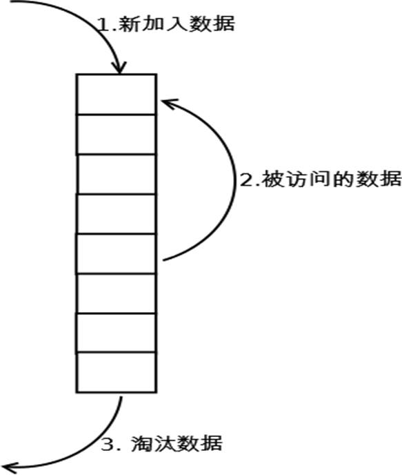

## 进程和系统性能

### 进程相关的概念

Linux是一个操作系统的内核：

* 内核功用：进程管理、文件系统、网络功能、内存管理、驱动程序、安全功能等

#### 什么是进程？

进程和程序之间是不同的，程序是磁盘上的一个文件，如`/bin/cat`。磁盘上的文件若想真正生效，则需要将其放入内存中，但一个可执行文件加载到内存中后，其就变为一个正在运行中的进程。

进程是一个资源使用的单位，当一个软件执行后系统就会将其从磁盘上读入到内存中，并且系统会在内存中分配给其一个独立的内存空间。

系统在读取磁盘上的程序时会先将其读入到内核中，当内核读取完程序后会将其复制到应用程序的内存空间中，在系统中内存空间分为两块，一块为内核，另一块为用户的内存空间。

用户的内存空间内的所有应用程序只能看到自己所分配的内存，所以他们都默认为自己占有了所有的内存，从而起到了隔离的效果。

进程在运行时，系统还会分配一些资源给他，比如使用内存空间，`PID`号，当进程运行结束时`PID`号将回收。

程序在运行时，其还会有自己的缓冲区，有自己使用的文件的资源。

所以进程其实就是一个被载入内存的一个指令的集合。而进程中真正干活的则是线程(`thread`)。

#### 进程和线程的区别

进程包括各种资源，如内存空间、数据、程序和线程。可以将进程想象为一个工厂，工厂如果要生产则需要各种原材料(数据)、有工人(线程)。

一个进程中必须要有一个线程。在复杂的场景下，但个线程无法处理多个任务，这时候一个进程还可以存在多个线程。

进程和线程之间为包含的关系，一个进程中可能有多个线程，但必须存在一个线程。

#### 进程的生命周期

进程是存在生命周期的，一个软件运行是有结束的时候，如`cat`命令执行完毕后其生命周期即结束。有些命令则生命期很长，开机运行就一直存在着，如内核中的`init`进程其长期驻留内存。

根据其生命周期其可以分为2种任务：

* 一次性执行完毕推出的任务也叫`前台任务`。

* 长期执行的任务叫做`后台任务`。

#### 任务结构(`task struct`)

Linux会将各种程序的进程存放在一个数据结构内，也叫任务结构。

任务的结构可以将其想象为进程的各种资源，如`PID`、`UID`、数据、程序本身、线程等等。

#### 任务列表(`task list`)

系统内是存在多个进程的，进程和进程之间是使用链表来构成的。有些进程和进程之间还存在父子关系。

#### 进程总结

`Process`（进程）: 运行中的程序的一个副本，是被载入内存的一个指令集合

* 进程ID(`Process ID`，`PID`)号码被用来标记各个进程
* `UID`、`GID`和`SELinux`语境决定对文件系统的存取和访问权限
* 通常从执行进程的用户来继承
* 存在生命周期

`task struct`：Linux内核存储进程信息的数据结构格式

`task list`：多个任务的的`task struct`组成的链表

进程创建：

* `init`：第一个进程

* 进程：都由其父进程创建，父子关系，`CoW`，`fork()`, `clone()`

#### 进程、线程和协程

协程可以将其想象成命令执行过程中的一些代码块或多个命令的集合如函数。多个命令的集合构成一个完整的线程。

线程的运行顺序是由内核来调度的。

#### 上下文切换

CPU在运行时会切分成众多小的时间片，将每个时间片分给各个线程，而同一时间内只有一个线程在运行，当线程1的时间片使用完毕后立即切换到线程2。但此时线程1执行的任务并没有完成，需要将其进行保存，等下一次轮到他的时间片时继续执行，等线程1保存完毕后接着继续执行线程2，这个过程叫做上下文切换。

上下文切换会带来资源的损耗，如保存状态需要时间，资源的来回切换需要花费时间。更重要的是缓存，当上下文切换时，若2个线程是毫不相关的两个程序时，CPU需要清空缓存去读取另一个程序的数据，这样会造成缓存失效，这个代价是非常巨大的。所以要尽可能的减少进程间的上下文切换。

#### 内存相关概念

* `Page Frame`：进程要使用内存，内存用到的空间叫页。一页(Page)为`4k`。`Page`为内存中存储数据的最小单位。

* `MMU`: `Memory Management Unit`负责转换线性和物理地址

* `TLB`: `Translation Lookaside Buffer` 翻译后备缓冲器用于保存虚拟地址和物理地址映射关系的缓存

* `LRU`: `Least Recently Used`近期最少使用算法,释放内存

##### 物理地址空间和线性地址空间

在每个应用程序眼中所看到的内存自以为是整个内存空间，所以其为虚拟内存。而物理上操作系统只是分配了一小块内存空间，这就叫做物理内存。

物理内存和虚拟内存之间存在一个对应的关系，这两者之间的对应关系需要有一个转换，这个转换由`MMU`来负责。

虚拟内存和物理内存之间做转换时需要进行计算，而计算的过程比较慢，所以提供了一个缓存`TLB`，用来将计算后的结果缓存下来，当下次再次使用到时可以无需再计算。

而`LRU`的目的是为了更好的使用内存，内存的容量较硬盘小的多。当内存不够使用时会将内存中不常用的数据导出到硬盘的交换分区内，以腾出内存空间。

##### `LRU`算法

假设序列为 4 3 4 2 3 1 4 2 物理块有3个，则:

1. 第1轮 4调入内存 4
2. 第2轮 3调入内存 3 4
3. 第3轮 4调入内存 4 3
4. 第4轮 2调入内存 2 4 3
5. 第5轮 3调入内存 3 2 4
6. 第6轮 1调入内存 1 3 2
7. 第7轮 4调入内存 4 1 3
8. 第8轮 2调入内存 2 4 1

##### 用户和内核空间

#### 进程的基本状态和转换

##### 进程的基本状态

* 创建状态：进程在创建时需要申请一个空白`PCB`(process control block进程控制块)，向其中填写控制和管理进程的信息，完成资源分配。如果创建工作无法完成，比如资源无法满足，就无法被调度运行，把此时进程所处状态称为创建状态

* 就绪状态：进程已准备好，已分配到所需资源，只要分配到CPU就能够立即运行

* 执行状态：进程处于就绪状态被调度后，进程进入执行状态

* 阻塞状态：正在执行的进程由于某些事件（I/O请求，申请缓存区失败）而暂时无法运行，进程受到阻塞。在满足请求时进入就绪状态等待系统调用

* 终止状态：进程结束，或出现错误，或被系统终止，进入终止状态。无法再执行

##### 状态之间转换六种情况

* 运行—>就绪
	1. 主要是进程占用CPU的时间过长，而系统分配给该进程占用CPU的时间是有限的；
    2. 在采用抢先式优先级调度算法的系统中,当有更高优先级的进程要运行时，该进程就被迫让出CPU，该进程便由执行状态转变为就绪状态
* 就绪—>运行
  * 运行的进程的时间片用完，调度就转到就绪队列中选择合适的进程分配CPU。
* 运行—>阻塞
* 正在执行的进程因发生某等待事件而无法执行，则进程由执行状态变为阻塞状态，如发生了I/O请求。
* 阻塞—>就绪
  *  进程所等待的事件已经发生，就进入就绪队列

以下两种状态是不可能发生的：

* 阻塞—>运行
* 即使给阻塞进程分配CPU，也无法执行，操作系统在进行调度时不会从阻塞队列进行挑选，而是从就绪队列中选取。
* 就绪—>阻塞
  * 就绪态根本就没有执行，谈不上进入阻塞态。

#### `IPC`进程间通信

进程和进程之间是可以通信的，虽然在每个进程眼中整个世界都是他的，但是他也可以实现进程间通信，如使用以下技术：

* 用一主机内进程间通讯：
  * `pipe`: 管道
  * `socket`: 套接字文件
  * `signal`: 信号
  * `shm`: shared memory
  * `semaphore`: 信号量，一种计数器

* 不同主机间的进程间通信：
  * `socket`: `IP`和端口
  * `RPC`: `remotes procedure call`远程过程调用
  * `MQ`: 消息队列，如：`Kafka`，`RabbitMQ`，`ActiveMQ`

#### 进程优先级

进程是有优先级的，而优先级又分为两类，实时优先级和非实时优先级。

进程优先级

* 系统优先级：数字越小，优先级越高
  * 0-139：各有140个运行队列和过期队列
* 实时优先级：99-0 值最大优先级最高
* nice值：-20到19，对应系统优先级100-139

`Big O`：时间复杂度，用时和规模的关系。

* `O(1)`，`O(logn)`，`O(n)`线性，`O(n^2)`

##### 进程状态

Linux内核：抢占式多任务

进程类型：

* 守护进程: daemon，在系统引导过程中启动的进程，和终端无关进程
* 前台进程：跟终端相关，通过终端启动的进程

* 注意：两者可相互转化

进程状态：

* 运行态：`running` 
* 就 绪 态 ：`ready `
* 睡眠态：
  * 可中断：`interruptable`
  * 不可中断：`uninterruptable`

* 停止态：`stopped`，暂停于内存，但不会被调度，除非手动启动
* 僵死态：`zombie`，结束进程，父进程结束前，子进程不关闭

进程的分类：

* `CPU-Bound`: CPU密集型，非交互。大量消耗CPU，如编译、计算

* `IO-Bound`: IO密集型，交互。涉及到网络吞吐、磁盘IO